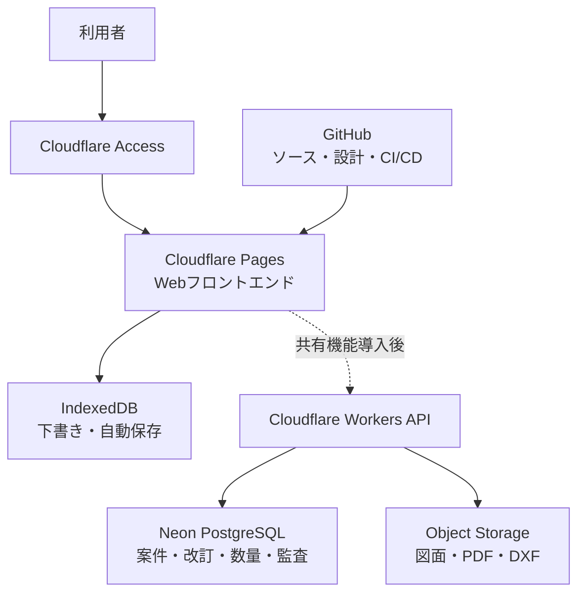
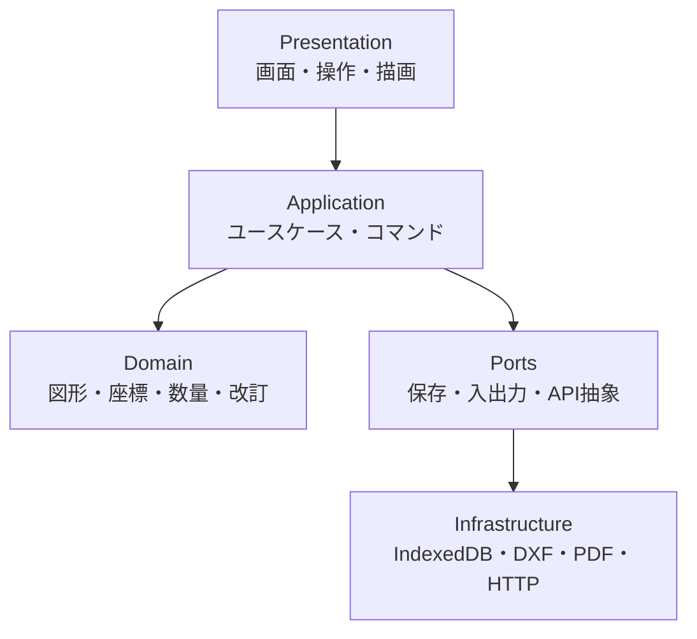
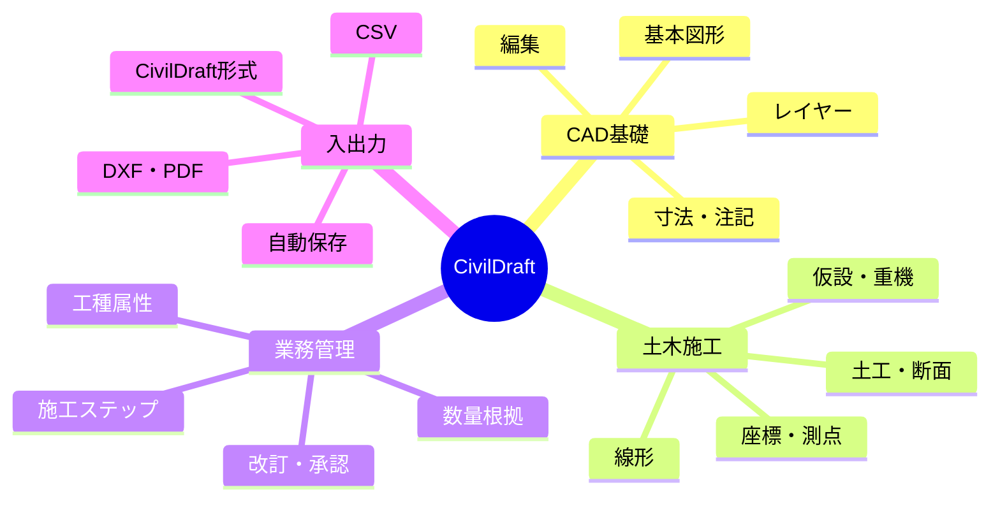
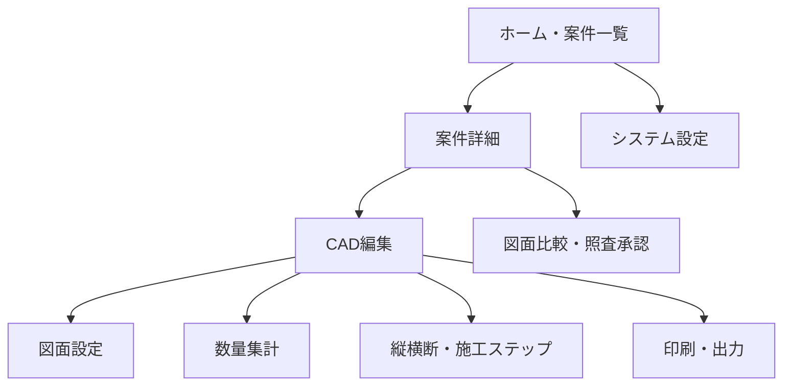
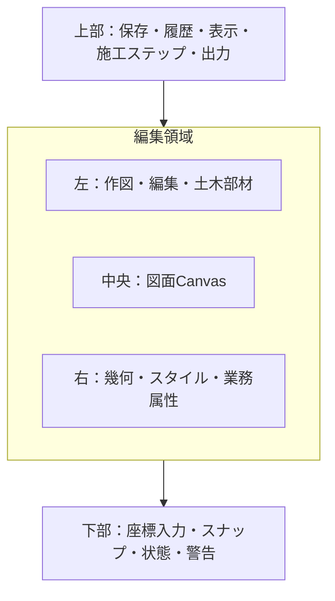
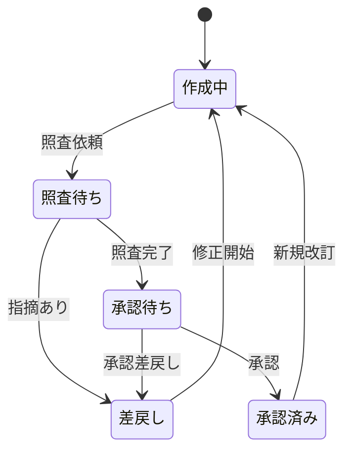
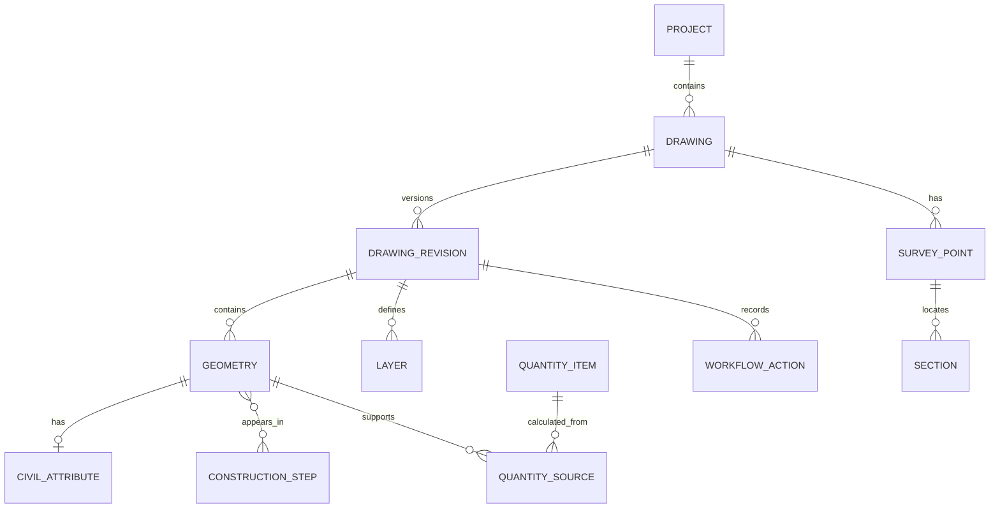
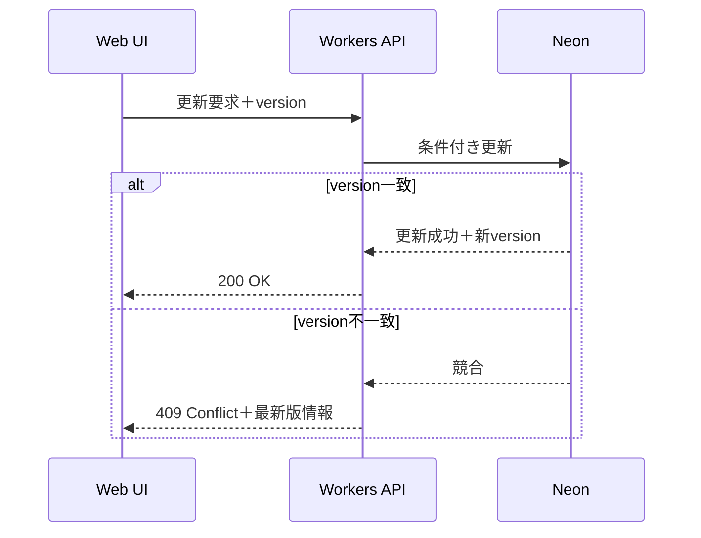
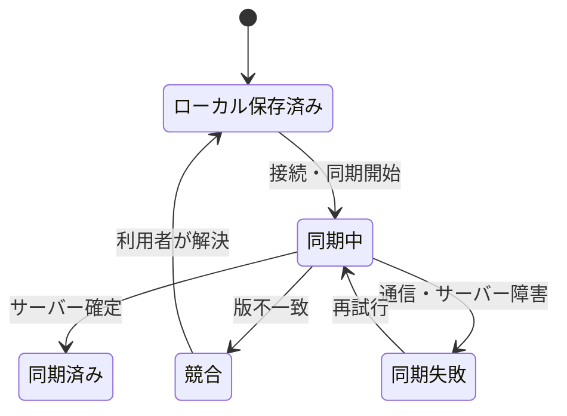

# CivilDraft 基本設計書

| 文書項目 | 内容 |
| --- | --- |
| 文書名 | CivilDraft 基本設計書 |
| 対象システム | Civil施工図CAD（CivilDraft） |
| リポジトリ名 | `CivilDraft-Web-CAD` |
| 文書版数 | 1.0 |
| 作成日 | 2026年7月14日 |
| 上位文書 | `CivilDraft_要件定義書_20260714.md` |
| 下位文書 | `CivilDraft_詳細設計仕様書_20260714.md` |
| 文書状態 | 初版・基本設計レビュー用 |

---

## 1. 本書の目的

本書は、CivilDraftの要件をどのようなシステム構成、画面、機能配置、データ、APIおよび運用方式で実現するかを定義する。個別クラス、関数、型、SQL、計算アルゴリズム等は詳細設計仕様書で定義する。

### 1.1 文書間の役割

| 文書 | 定義する内容 |
| --- | --- |
| 要件定義書 | 何を、なぜ、どこまで実現するか |
| 本基本設計書 | どのような構成・画面・機能・データ・API方式で実現するか |
| 詳細設計仕様書 | どのようなコード、型、処理、DB、API、テストで実装するか |
| README | 利用者・関係者向けの製品案内、導入、基本操作、開発入口 |

### 1.2 設計原則

- **段階導入**：Phase 1はローカル完結、共有が必要になった時点でクラウド共有を追加する。
- **ドメイン中心**：図形だけでなく、工種、規格、測点、数量、施工ステップを中核データとして扱う。
- **疎結合**：CADコア、土木業務、数量、入出力、保存、UIを分離する。
- **ローカルファースト**：作図中はネットワーク状態に左右されず、IndexedDBへ安全に保存する。
- **根拠追跡**：数量から対象図形へ、図形から数量・改訂・施工ステップへたどれるようにする。
- **安全な境界**：施工計画を支援するが、測量・構造・安全上の正式判断を自動代替しない。
- **正本の明確化**：GitHubをソース・文書の正本、共有版ではNeonを業務メタデータの正本とする。

---

## 2. 対象システムの全体像



### 2.1 段階別構成

| 段階 | 構成 | データ正本 | 主目的 |
| --- | --- | --- | --- |
| Phase 0～1 | Pages＋ブラウザ＋IndexedDB | 利用者が明示保存したCivilDraftファイル | 単独作図と基礎検証 |
| Phase 2～5 | 上記＋座標・数量・断面機能 | CivilDraftファイル、編集中はIndexedDB | 土木業務機能の実証 |
| Phase 6・共有版 | Access＋Pages＋Workers＋Neon＋Object Storage | NeonとObject Storage | 案件共有、改訂、照査・承認、監査 |

### 2.2 論理レイヤー



| レイヤー | 責務 | 禁止事項 |
| --- | --- | --- |
| Presentation | UI、Canvas描画、入力受付、表示状態 | 数量計算や永続化処理を直接実装しない |
| Application | ユースケース、操作単位、トランザクション、権限確認 | CanvasやDB固有APIへ直接依存しない |
| Domain | 幾何、座標、土木属性、数量、改訂ルール | React、Konva、HTTP、IndexedDBへ依存しない |
| Infrastructure | 保存、通信、ファイル変換、ログ | 業務ルールを独自に持たない |

---

## 3. 技術構成

| 区分 | 採用技術・方式 | 役割 |
| --- | --- | --- |
| フロントエンド | React 18、TypeScript、Vite | SPA、画面、ビルド |
| Canvas | Konva.js | 2D描画、イベント、レイヤー表現 |
| 状態管理 | Zustand | 編集状態、選択、ツール、表示状態 |
| ローカル保存 | IndexedDB | 下書き、自動保存、復旧候補、設定 |
| 単体・結合テスト | Vitest | ドメイン、ユースケース、変換処理 |
| E2Eテスト | Playwright | 主要業務、ブラウザ、保存・出力 |
| フロント公開 | Cloudflare Pages | 検証・公開フロントエンド |
| API | Cloudflare Workers | 認証連携、認可、検証、共有処理 |
| DB | Neon PostgreSQL | 案件、図面メタデータ、改訂、数量、監査 |
| バイナリ保存 | Object Storage候補 | 図面スナップショット、DXF、PDF、添付 |
| 開発・文書 | Claude Code on Linux、GitHub | 開発作業、正本、Issue、PR、CI/CD |

新たな依存ライブラリは、必要性、保守状況、サイズ、ライセンス、脆弱性をADRに記録して採用する。

---

## 4. 機能構成



### 4.1 サブシステム

| サブシステムID | 名称 | 主な責務 | 主な要件 |
| --- | --- | --- | --- |
| SS-01 | 案件・図面管理 | 案件、工区、図面、用紙、表題欄 | FR-PROJ-* |
| SS-02 | CAD編集 | 基本図形、編集、スナップ、レイヤー、計測 | FR-DRAW-* |
| SS-03 | 座標・測量 | 測点、座標、方位角、CSV、基準点 | FR-SURV-* |
| SS-04 | 線形 | 中心線、単曲線、測点配置、オフセット | FR-ALIGN-* |
| SS-05 | 土工・造成 | 切盛土、法面、掘削、面積、簡易土量 | FR-EW-* |
| SS-06 | 仮設・安全 | 仮設材、重機、クレーン、搬入経路 | FR-TEMP-* |
| SS-07 | 縦横断 | 断面、現況・計画、測点関連、断面積 | FR-SEC-* |
| SS-08 | 数量 | 業務属性、集計、根拠、CSV、丸め | FR-QTY-* |
| SS-09 | 施工ステップ | 段階、表示、数量、出力 | FR-STEP-* |
| SS-10 | 改訂・ワークフロー | 差分、照査、承認、確定版 | FR-REV-* |
| SS-11 | 入出力 | 独自形式、DXF、PDF、CSV、印刷 | FR-IO-* |
| SS-12 | 保存・同期 | 自動保存、復旧、競合、共有同期 | FR-SAVE-* |

---

## 5. 画面設計

### 5.1 画面遷移



### 5.2 画面一覧

| 画面ID | 名称 | 主利用者 | 主要機能 |
| --- | --- | --- | --- |
| SCR-001 | ホーム・案件一覧 | 全利用者 | 最近の図面、案件検索、新規作成、復旧候補 |
| SCR-002 | 案件詳細 | 作成者、管理者 | 案件、工区、図面、状態、メンバー |
| SCR-003 | CAD編集 | 作成者、照査者 | 作図、編集、属性、レイヤー、座標、数量 |
| SCR-004 | 図面設定 | 作成者 | 用紙、縮尺、単位、原点、座標系、表題欄 |
| SCR-005 | 測点・座標一覧 | 作成者 | 座標編集、CSV、図面強調、検査結果 |
| SCR-006 | 土木部材パレット | 作成者 | 仮設、重機、安全設備、土工テンプレート |
| SCR-007 | 数量集計 | 作成者、照査者 | 集計、絞込、根拠、差異、CSV |
| SCR-008 | 縦横断管理 | 作成者、照査者 | 測点別断面、現況・計画、面積 |
| SCR-009 | 施工ステップ | 作成者、閲覧者 | ステップ定義、表示、数量、出力 |
| SCR-010 | 図面比較 | 照査者、承認者 | 新旧差分、変更箇所、改訂概要 |
| SCR-011 | 照査・承認 | 照査者、承認者 | コメント、差戻し、照査、承認 |
| SCR-012 | 印刷・出力 | 全利用者 | プレビュー、PDF、DXF、CSV、警告 |
| SCR-013 | システム設定 | 管理者 | マスター、テンプレート、権限、監査 |

### 5.3 CAD編集画面



#### 基本操作方針

- 選択中ツール、スナップ、レイヤー、施工ステップ、保存状態を常時確認できる。
- 作図操作は「ツール選択→Canvas指示→数値確定」を基本とする。
- 選択図形の共通属性は右パネルで一括編集できる。
- 長時間処理は進捗とキャンセル可否を表示する。
- 数量に影響する変更後は、再計算中・未確定・確定済みを表示する。
- 保存失敗、未対応DXF、自己交差等は、画面下部と該当対象の双方で示す。

### 5.4 レスポンシブ方針

- 主対象は横向きのPC画面とする。
- 最小実用幅は詳細な性能・UI検証後に確定する。
- 狭い画面では左右パネルを折りたたむ。
- スマートフォンは閲覧補助を将来検討し、初期の作図対象外とする。

---

## 6. ユースケース設計

### 6.1 新規施工図作成

| 項目 | 内容 |
| --- | --- |
| アクター | 作成者 |
| 事前条件 | 利用可能な環境へアクセス済み |
| 基本フロー | 案件選択→図面作成→用紙・縮尺・座標設定→作図→保存→プレビュー→PDF出力 |
| 代替フロー | テンプレートまたはDXFから開始 |
| 事後条件 | 図面と復旧可能な自動保存データが存在する |
| 関連要件 | FR-PROJ-*、FR-DRAW-*、FR-IO-*、FR-SAVE-* |

### 6.2 測点CSVから施工平面図作成

| 項目 | 内容 |
| --- | --- |
| アクター | 作成者 |
| 基本フロー | CSV選択→列割当→検査→プレビュー→取込→測点配置→中心線生成→左右オフセット |
| 例外 | 欠損、重複、非数値、範囲外、文字コード不明は行別に表示 |
| 事後条件 | 原データ、補正内容、取込結果を確認できる |
| 関連要件 | FR-SURV-*、FR-ALIGN-* |

### 6.3 数量根拠作成

| 項目 | 内容 |
| --- | --- |
| アクター | 作成者、照査者 |
| 基本フロー | 図形選択→工種・規格・単位付与→算出区分選択→再計算→集計確認→根拠図形強調→CSV出力 |
| 例外 | 閉領域不成立、単位不整合、属性欠損、自己交差は未確定として警告 |
| 事後条件 | 数量値から対象図形、式、内部値、丸め結果を追跡できる |
| 関連要件 | FR-QTY-*、FR-EW-004～006 |

### 6.4 照査・承認



承認済み改訂は不変とし、修正時は新規改訂を作成する。状態変更は権限確認と監査記録を伴う。

---

## 7. データ基本設計

### 7.1 エンティティ関連



### 7.2 データ配置

| データ | ローカル版 | 共有版 | 正本 |
| --- | --- | --- | --- |
| 編集中図面 | IndexedDB | IndexedDB＋同期状態 | 作業中は端末、同期後はサーバー版を明示 |
| 明示保存図面 | CivilDraftファイル | Object Storage候補 | 保存・版確定ルールに従う |
| 案件・図面メタデータ | ファイル内 | Neon | Neon |
| 数量集計 | ファイル内 | Neon＋改訂スナップショット | 確定改訂に紐づく値 |
| PDF・DXF | 利用者保存先 | Object Storage候補 | 出力物。図面データとは区別 |
| 監査ログ | 対象外 | Neonまたはログ基盤 | サーバー側記録 |

### 7.3 CivilDraftファイルの基本構造

独自形式は論理的に以下を保持する。拡張子・圧縮方式は詳細設計で確定する。

```text
manifest
├─ schemaVersion
├─ applicationVersion
├─ createdAt / updatedAt
├─ project
├─ drawing
├─ revision
├─ layers[]
├─ geometries[]
├─ surveyPoints[]
├─ alignments[]
├─ sections[]
├─ constructionSteps[]
├─ quantityItems[]
└─ checksums
```

### 7.4 座標・単位方針

- 内部幾何座標と表示座標を分離する。
- 図面単位、実寸単位、縮尺を混同しない。
- 画面座標は左上原点の描画系、ドメイン座標は設計で定める土木座標系として変換する。
- 長さ、面積、体積は単位種別を伴う値として扱う。
- 計算は丸め前の内部値で行い、表示・出力時に規則を適用する。

### 7.5 データ品質

| 検査対象 | 主な検査 |
| --- | --- |
| CSV | 文字コード、ヘッダー、列割当、必須値、数値、重複、異常桁 |
| DXF | バージョン、要素、レイヤー、単位、文字、未対応要素 |
| 図形 | ゼロ長、閉領域、自己交差、NaN、無限値、参照切れ |
| 数量 | 単位、算出区分、対象図形、丸め、未確定、手動補正 |
| 改訂 | 版番号、状態遷移、確定版不変、差分、実施者 |

---

## 8. API基本設計

APIは共有版導入時に実装する。ベースパスは`/api/v1`とし、JSONを基本とする。

### 8.1 APIグループ

| グループ | 代表エンドポイント | 役割 |
| --- | --- | --- |
| Projects | `/projects`、`/projects/{projectId}` | 案件一覧、作成、更新、アーカイブ |
| Drawings | `/projects/{projectId}/drawings` | 図面メタデータ管理 |
| Revisions | `/drawings/{drawingId}/revisions` | 改訂作成、取得、確定 |
| Content | `/revisions/{revisionId}/content` | 図面スナップショットの取得・保存 |
| Quantities | `/revisions/{revisionId}/quantities` | 数量スナップショット・集計 |
| Workflow | `/revisions/{revisionId}/workflow-actions` | 提出、照査、差戻し、承認 |
| Exports | `/revisions/{revisionId}/exports` | PDF、DXF、CSV出力要求・履歴 |
| Masters | `/masters/*` | 工種、規格、記号、テンプレート |
| Audit | `/audit-logs` | 権限付き監査検索 |

### 8.2 API共通仕様

- 認証情報はCloudflare Access等の信頼できる認証コンテキストから検証する。
- すべての案件データ操作で案件所属とロールをサーバー側判定する。
- 更新APIは楽観的ロック用の版番号またはETagを受け取る。
- エラー応答は`code`、`message`、`correlationId`、必要に応じて`details`を返す。
- 一覧はページング、検索、状態フィルター、並べ替えを備える。
- 長時間出力は非同期ジョブ化を検討する。
- API仕様はOpenAPIで管理し、フロントエンド型生成または整合検査に利用する。

### 8.3 更新競合



---

## 9. ローカル保存・同期設計

### 9.1 自動保存

- 主要操作完了後に保存要求をデバウンスする。
- 最長60秒以内に未保存変更を保存する。
- 保存中、保存済み、保存失敗、復旧候補ありを画面へ表示する。
- 一時レコードへ保存し、整合性確認後に現行レコードとして確定する。
- 復旧候補は図面ID、保存日時、スキーマ版、チェック情報を持つ。

### 9.2 共有版同期



自動マージは図形ID単位で安全性を確認できる範囲に限定し、同一図形の競合や削除競合は利用者へ選択を求める。

---

## 10. 入出力基本設計

### 10.1 DXF

- 取込は解析、変換、検証、結果表示の4段階とする。
- 対応要素、部分対応、非対応を互換性表で管理する。
- 非対応要素は黙って破棄せず、種類、件数、影響を表示する。
- 元のDXFは必要に応じて保持し、取込結果と関連付ける。
- 出力時はCivilDraft固有属性をDXFへ完全保存できない場合、その制限を表示する。

### 10.2 CSV

- 取込前に文字コード、区切り、ヘッダー、列割当をプレビューする。
- 正常行、警告行、エラー行を区別する。
- 出力はUTF-8 BOM付き等、Excelで扱いやすい既定値を採用し、設定可能とする。
- 数量CSVには図面番号、改訂、工種、規格、値、単位、丸め、根拠IDを含める。

### 10.3 PDF・印刷

- Canvas表示と印刷座標を分離し、用紙実寸と縮尺から出力座標を生成する。
- 図面枠、表題欄、線幅、色、フォント、凡例をプレビューする。
- 用紙外図形、欠落フォント、未確定数量、未対応要素を警告する。
- 出力物に図面番号、改訂、出力日時、必要に応じて状態を表示する。

---

## 11. 認証・認可基本設計

### 11.1 認証境界

- 検証入口はCloudflare Accessで制御する。
- 共有APIはAccess通過だけでなく、API側で利用者識別子を検証する。
- ブラウザから渡された利用者ID・ロールを信用しない。
- 認証方式の最終決定は共有版の運用主体・ID基盤と合わせて行う。

### 11.2 認可

- システムロールと案件ロールを分ける。
- 案件メンバーでない利用者は案件内容を取得できない。
- 作成者、照査者、承認者の兼務可否は案件設定で制御する。
- 承認済み版は管理者を含め直接更新できない。
- 監査閲覧とシステム設定は通常の案件権限から分離する。

---

## 12. セキュリティ基本設計

| 領域 | 設計方針 |
| --- | --- |
| Secret | Cloudflare等のSecret管理を使用し、フロント・Git・ログへ含めない |
| 通信 | HTTPSのみ。外部通信先を限定し、CORSを必要最小限にする |
| 入力 | スキーマ、サイズ、件数、MIME、拡張子、値域を検証する |
| ファイル | 能動コンテンツを実行せず、Object Storageは非公開を基本とする |
| 認可 | APIごとに案件・対象・操作を検証する |
| ログ | Secret、認証情報、図面本文を原則記録しない |
| 依存関係 | CIで脆弱性・ライセンスを検査し、SBOMを生成する |
| ブラウザ | CSP、適切なSecurity Headers、XSS対策を適用する |
| DB | パラメータ化クエリ、最小権限、接続情報のSecret化を行う |

### 12.1 脅威上の重点

- 不正なDXF・CSV・独自形式によるメモリ枯渇や解析例外。
- 他案件IDの推測による水平権限昇格。
- 署名付きURLや図面ファイルの過剰共有。
- 承認状態の不正変更と監査ログの欠落。
- ブラウザ保存データを共有端末上に残すことによる情報露出。

---

## 13. 性能・容量基本設計

### 13.1 性能目標

| 項目 | 目標 |
| --- | --- |
| 標準最大図形数 | 10,000図形 |
| 通常描画 | 中央値30fps以上、最大60fpsを目標 |
| 主要操作反映 | 95パーセンタイル200ms以内 |
| 標準試験図面読込 | 10秒以内 |
| 自動保存 | 主要操作後、遅くとも60秒以内 |

### 13.2 性能方式

- Konvaレイヤーを背景、図形、選択・ガイド、UIオーバーレイに分離する。
- 変更のないレイヤーを再描画しない。
- 表示範囲外図形の描画抑制と空間索引を導入する。
- 複雑ハッチングや文字はズームレベルに応じて簡略化する。
- 大量処理はチャンク化し、必要に応じてWeb Workerを利用する。
- 性能基準図面を固定し、CIまたは定期試験で回帰を検出する。

---

## 14. エラー・メッセージ基本設計

### 14.1 エラー区分

| 区分 | 例 | 利用者への対応 |
| --- | --- | --- |
| 入力エラー | 必須欠損、非数値、範囲外 | 該当欄と修正方法を表示 |
| データ警告 | 自己交差、単位不明、未確定数量 | 継続可否と影響を表示 |
| 保存エラー | 容量不足、IndexedDB失敗 | 未保存を明示し、エクスポートを案内 |
| 互換性エラー | 未対応DXF、旧スキーマ | 対象、件数、代替方法を表示 |
| 認証・認可 | セッション切れ、権限不足 | 再認証または管理者確認を案内 |
| 競合 | サーバー版更新済み | 比較、再読込、別名保存を提示 |
| システムエラー | 予期しない例外 | 相関IDと安全な再試行方法を表示 |

### 14.2 メッセージ方針

- 「何が起きたか」「何に影響するか」「次に何をするか」を日本語で示す。
- 内部スタック、SQL、Secret、個人情報を表示しない。
- 一時的通知、要確認警告、処理を止めるエラーを視覚的に区別する。
- エラーコードは詳細設計で一元管理する。

---

## 15. 監査・ログ基本設計

| ログ | 目的 | 主な項目 |
| --- | --- | --- |
| クライアント診断 | 障害解析 | 時刻、アプリ版、操作種別、エラーコード、端末・ブラウザ概要 |
| APIアクセス | 稼働・障害 | 時刻、経路、結果、所要時間、相関ID、利用者ID |
| 監査ログ | 誰が何をしたか | 利用者、案件、対象、操作、前後状態、結果、日時 |
| ジョブログ | 出力等の追跡 | ジョブID、種類、開始・終了、結果、相関ID |

図面本文、Secret、トークンをログへ記録しない。診断ログの利用者出力時は内容を確認できるようにする。

---

## 16. テスト基本設計

### 16.1 品質ゲート


### 16.2 重点テスト

- 幾何・座標・数量は既知解、境界値、異常値を自動テストする。
- Undo・Redo後も図形、属性、数量、保存状態の整合性を確認する。
- DXFは対応要素ごとのゴールデンファイルで往復変換を試験する。
- PDFは主要用紙・縮尺の画像または構造比較を行う。
- IndexedDBは保存中断、容量不足、旧スキーマ、復旧を試験する。
- 権限は全ロール×主要操作の許可・拒否を試験する。
- 性能は固定条件で計測し、数値と環境を記録する。

---

## 17. CI/CD・環境設計

### 17.1 環境

| 環境 | 用途 | データ |
| --- | --- | --- |
| Local | 開発、単体・結合、手動確認 | 合成・匿名化データのみ |
| Preview | Pull Request単位のUI・機能確認 | 合成データ、Access制御 |
| Validation | UAT、性能、運用確認 | 承認済み検証データ |
| Production候補 | 正式運用 | 別途本番移行判定後 |

### 17.2 CI/CD方針

- Pull Requestでlint、型検査、テスト、ビルド、依存関係検査を実施する。
- PreviewはCloudflare Access配下とする。
- 本番相当環境への反映は承認ゲートを設ける。
- 環境変数・Secretは環境別に分離する。
- DBマイグレーションは前方互換を考慮し、適用とロールバックを記録する。
- Gitのコミット、デプロイ識別子、アプリ表示版を関連付ける。

---

## 18. バックアップ・復旧基本設計

| 対象 | バックアップ・復旧方針 |
| --- | --- |
| ローカル下書き | IndexedDB自動保存＋利用者によるCivilDraftファイル出力 |
| GitHub | ソース・文書正本。ブランチ保護と履歴を利用 |
| Neon | 導入時にバックアップ方式、RPO、RTO、保持期間を確定 |
| Object Storage | バージョンまたは不変キー、削除保護、保持期間を検討 |
| 設定・Secret | 手順・所有者を管理し、平文バックアップを禁止 |

バックアップが存在するだけで完了とせず、代表データを使ったリストア試験を定期実施する。

---

## 19. 運用設計

### 19.1 運用主体

| 項目 | 主担当 |
| --- | --- |
| 製品方針・優先順位 | プロジェクト責任者、土木技術代表 |
| アプリ・インフラ | IT・DX部門 |
| 図面テンプレート・工種マスター | 土木技術担当＋案件管理者 |
| 照査・承認運用 | 各案件の責任者 |
| セキュリティ・監査 | IT・DX部門＋管理責任者 |

### 19.2 監視対象

- Pages・Workersの可用性とエラー率。
- API応答時間、保存失敗、競合、出力ジョブ失敗。
- Neon接続、容量、遅いクエリ、バックアップ状態。
- Object Storage容量、失敗、期限切れデータ。
- クライアント側の復旧・保存エラー集計。

---

## 20. 要件との対応

| 要件群 | 基本設計の主章 | 詳細設計で具体化する内容 |
| --- | --- | --- |
| FR-PROJ | 4、5、6、7 | 型、ストア、画面項目、DB、API |
| FR-DRAW | 4、5、13 | 図形型、コマンド、スナップ、描画最適化 |
| FR-SURV・ALIGN | 6、7 | 座標変換、方位角、曲線、CSV検証 |
| FR-EW・TEMP・SEC | 4、6、7 | パラメトリック生成、閉領域、断面モデル |
| FR-QTY | 6、7、10 | 算出関数、単位、丸め、根拠関連 |
| FR-STEP・REV | 6、7、8 | 状態遷移、差分、権限、監査 |
| FR-IO・SAVE | 7、9、10 | ファイル構造、IndexedDB、変換、復旧 |
| NFR-* | 11～19 | セキュリティ設定、性能実装、テスト、運用値 |

---

## 21. 基本設計上の未決事項

| ID | 未決事項 | 決定文書・時期 |
| --- | --- | --- |
| BD-TBD-001 | 独自形式の拡張子と圧縮方式 | 詳細設計・Phase 1 |
| BD-TBD-002 | DXFの対応バージョン・要素 | 互換性設計・Phase 0～1 |
| BD-TBD-003 | 内部座標軸、角度正方向、精度 | 詳細設計・Phase 1～2 |
| BD-TBD-004 | 正式な認証方式 | 共有版基本設計の改訂時 |
| BD-TBD-005 | Object Storage製品と保持方式 | 共有版基本設計の改訂時 |
| BD-TBD-006 | RPO、RTO、稼働率、保持期間 | 運用設計時 |
| BD-TBD-007 | 工種・規格マスターの標準体系 | Phase 4要件レビュー |

---

## 22. 承認欄

| 役割 | 氏名 | 判定 | 日付 | コメント |
| --- | --- | --- | --- | --- |
| プロジェクト責任者 |  | 承認／条件付承認／差戻し |  |  |
| 土木技術代表 |  | 承認／条件付承認／差戻し |  |  |
| IT・DX責任者 |  | 承認／条件付承認／差戻し |  |  |

