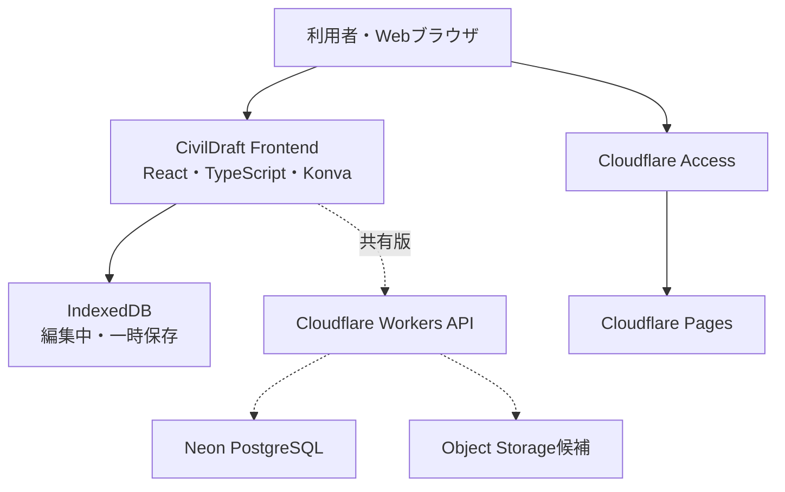

# CivilDraft 要件定義書

| 文書項目 | 内容 |
| --- | --- |
| 文書名 | CivilDraft 要件定義書 |
| 対象システム | Civil施工図CAD（CivilDraft） |
| リポジトリ名 | `CivilDraft-Web-CAD` |
| 文書版数 | 1.0 |
| 作成日 | 2026年7月14日 |
| 文書状態 | 初版・開発着手前レビュー用 |
| 想定読者 | プロジェクト責任者、開発者、土木技術者、施工管理者、照査者、運用管理者 |

---

## 1. プロジェクト概要

| 項目 | 内容 |
| --- | --- |
| 日本語名 | **Civil施工図CAD** |
| 英語名 | **Civil Construction Drawing CAD** |
| 製品名・略称 | **CivilDraft** |
| GitHubリポジトリ名 | `CivilDraft-Web-CAD` |
| システム種別 | Webベース2D CAD |
| 主な対象 | 土木施工図、仮設計画図、施工ヤード図、土工・断面図、数量根拠図 |
| 既存資産 | `Civil-Draw` |
| 開発基盤 | Claude Code on Linux＋GitHub＋Cloudflare＋Neon |

### 1.1 製品概要

CivilDraftは、土木工事の日常業務で使用する施工図や計画図を、Webブラウザ上で作成・編集・照査する2D CADシステムである。

一般的な作図機能に加え、以下の土木施工向け機能を統合する。

- 測点・土木座標管理
- 施工ヤード・仮設設備配置
- 土工・法面・断面作図
- 重機作業範囲・搬入経路作図
- 工種・規格等の図形属性管理
- 数量集計・数量根拠図作成
- 施工ステップごとの表示切替
- 図面改訂・照査・承認管理

### 1.2 背景と課題

汎用CADは高機能である一方、施工計画や数量根拠作成では、図形の作成、工種情報の記入、数量集計、改訂管理を別々に行うことが多い。その結果、次の課題が発生する。

- 図形と工種・規格・数量根拠の対応が人の記憶や注記に依存する。
- 施工ステップごとに図面ファイルが増え、最新版の判別が難しくなる。
- 重機範囲、仮設設備、安全設備等の定型図形を毎回作成している。
- 図面上の数量と集計表の不整合を目視で確認している。
- 現場説明用の図面作成に、専門CADの操作習熟が必要となる。
- 照査・改訂・承認の経緯が図面データから追跡しにくい。

CivilDraftは、図形に土木施工上の意味を持たせ、作図・数量・説明・照査を一つのデータモデルで扱うことで、これらの課題を軽減する。

### 1.3 目的

1. 土木施工図、仮設計画図および数量根拠図の作成時間を短縮する。
2. 図形と工種・規格・数量の対応をデータとして管理し、転記ミスを減らす。
3. 施工段階ごとの状態を一つの図面で管理し、説明と協議を分かりやすくする。
4. Webブラウザから利用できる、導入負荷の低い施工図作成環境を提供する。
5. `Civil-Draw`の基礎技術を活用しつつ、土木施工向けのデータモデルを再設計する。
6. 初期はローカル完結型とし、必要性を検証してから共有・承認型へ段階的に拡張する。

### 1.4 成功指標（KPI）

基準値はPoC開始時に現行業務を計測して確定する。

| ID | 指標 | 目標 |
| --- | --- | --- |
| KPI-01 | 定型的な施工・仮設計画図の作成時間 | 現行比30%以上削減 |
| KPI-02 | 数量集計表への手入力項目数 | 現行比50%以上削減 |
| KPI-03 | 図面と数量集計の不整合件数 | UAT期間中に重大不整合0件 |
| KPI-04 | 主要操作の習得時間 | 基本操作説明後、代表利用者が60分以内に課題図面を作成できる |
| KPI-05 | 自動保存からの復旧成功率 | 主要ブラウザで99%以上 |
| KPI-06 | UAT合格率 | 必須シナリオ100%、重要シナリオ95%以上 |

---

## 2. 名称および既存製品との位置付け

製品名には **CivilDraft** を採用する。`CivilDraw`が「図を描く」という汎用的な印象であるのに対し、`CivilDraft`は「技術図面・施工図を作成する」という専門性を表現できる。

| 名称 | 位置付け |
| --- | --- |
| `Civil-Draw` | 既存2D CADエンジン・技術検証版・参照元 |
| `CivilDraft` | 土木施工図作成に特化した新製品 |
| `CivilDraft-Web-CAD` | 新製品のGitHubリポジトリ |

既存の`Civil-Draw`は削除または名称変更せず、基礎CADエンジン、技術的参照元、比較対象として維持する。新製品には、ライセンス、品質、依存関係、保守性を確認したコンポーネントのみを選択的に継承する。

既存リポジトリ：<https://github.com/Kensan196948G/Civil-Draw.git>

---

## 3. 製品コンセプト

CivilDraftはAutoCADやJw_cadの完全な代替を目標としない。汎用CADでは手作業になりやすい施工計画、現場説明、数量算出および照査を効率化する「土木施工業務のためのWeb CAD」とする。

### 3.1 主な対象図面

- 施工ヤード計画図
- 仮設計画図
- 重機配置図
- クレーン作業計画図
- 搬入・搬出経路図
- 安全設備配置図
- 掘削・埋戻し範囲図
- 土工平面図・断面図
- 簡易構造図
- 数量根拠図
- 協議・施工説明用図面

### 3.2 基本方針

- 図形、土木属性、数量根拠、施工ステップおよび改訂を関連付ける。
- 初期版は施工計画支援に集中し、専門設計CAD相当の高度解析は後期検討とする。
- 計算結果は根拠、単位、算出方法を確認できる形で表示する。
- 自動計算結果を最終判断とせず、利用者による確認・確定を必須とする。
- ブラウザ内の編集を基本とし、通信障害時にも編集中データを失いにくい構成とする。
- クラウド共有は、単独利用版の有効性と運用要件を確認してから導入する。

---

## 4. 適用範囲

### 4.1 対象範囲

| 区分 | 対象 |
| --- | --- |
| 作図 | 基本図形、寸法、文字、土木記号、ハッチング、定型・パラメトリック図形 |
| 座標 | 図面ローカル座標、測点、座標表、距離・方位角入力、簡易中心線・オフセット |
| 土工 | 切土・盛土・法面、掘削・埋戻し範囲、平面・簡易断面、面積・簡易土量 |
| 仮設・施工 | 仮設設備、安全設備、重機範囲、クレーン半径、搬入経路、資材置場 |
| 数量 | 延長、面積、周長、個数、簡易体積、工種・レイヤー・規格別集計 |
| 管理 | 案件、図面、表題欄、改訂、施工ステップ、将来の照査・承認・監査 |
| 入出力 | CivilDraft形式、DXF、PDF、印刷、座標CSV、数量CSV |

### 4.2 初期対象外

以下は初期リリースの対象外とし、将来要件として別途評価する。

- AutoCAD、Jw_cad等との完全なファイル・表示互換性
- 3D CAD、BIM/CIMモデルの作成および高度な3D編集
- 道路・鉄道線形の正式な設計計算
- 複雑な座標系変換、測量網平均計算、誤差配分
- 構造計算、安定計算、照査計算
- クレーン能力、地耐力、離隔等の安全可否を自動判定する機能
- 電子納品成果品の完全自動生成
- 積算基準に基づく正式な工事費積算
- リアルタイム共同編集
- ネイティブデスクトップアプリおよびモバイル専用アプリ

### 4.3 前提条件・制約

- 開発作業台はLinux上のClaude Codeとする。
- ソースコード、設計書およびREADMEの正本はGitHubとする。
- Linuxローカル、Docker volume、SQLiteおよび`.env`を正本にしない。
- `.env`はGit管理せず、`.env.example`のみを管理する。
- 検証公開はCloudflare Pagesを基本とし、Cloudflare Accessで入口を制御する。
- 共有データが必要となるまではIndexedDBを利用し、Neon導入を必須にしない。
- Neon導入後は案件、図面メタデータ、数量、改訂および監査ログの正本をPostgreSQLとする。
- 図面ファイルやPDF等の大容量バイナリはPostgreSQLへ直接格納せず、Object Storageの採用を検討する。
- 利用するOSS、フォント、記号、テンプレートはライセンスと再配布条件を確認する。

---

## 5. 利用者と役割

| ロール | 主な利用目的 | 主な権限 |
| --- | --- | --- |
| 作成者 | 図面作成、属性登録、数量確認、改訂作成 | 担当図面の作成・編集・提出 |
| 照査者 | 図面、数量、変更箇所の確認 | 閲覧、コメント、差戻し、照査完了 |
| 承認者 | 最終成果の承認 | 閲覧、承認、差戻し |
| 閲覧者 | 現場説明、協議、参照 | 承認済み図面の閲覧・出力 |
| 案件管理者 | 案件、工区、メンバー、図面様式の管理 | 案件内の管理権限 |
| システム管理者 | 全体設定、マスター、監査、障害対応 | システム全体の管理権限 |

Phase 1のローカル完結版では、作成者機能を優先し、複数利用者の認証・権限・承認ワークフローはクラウド共有導入時に有効化する。

---

## 6. 業務フロー

```mermaid
flowchart TD
    A["案件・図面を作成"] --> B["基準座標・縮尺・用紙を設定"]
    B --> C["図形・土木部材を作図"]
    C --> D["工種・規格・測点等を付与"]
    D --> E["数量・根拠を確認"]
    E --> F["施工ステップ・印刷表示を確認"]
    F --> G["照査依頼"]
    G --> H{"照査結果"}
    H -->|差戻し| C
    H -->|適合| I["承認・版確定"]
    I --> J["PDF・DXF・CSVを出力"]
```



### 6.1 標準業務手順

1. 案件および工区を登録する。
2. 図面種類、用紙、縮尺、単位、座標原点および表題欄を設定する。
3. DXF等の既存図面を取り込む、または新規作図する。
4. 測点、中心線、仮設設備、重機範囲、土工範囲等を作図する。
5. 対象図形に工種、種別、細別、規格、単位、測点および施工ステップを付与する。
6. 数量を集計し、対象図形と算出根拠を確認する。
7. 施工ステップ、印刷範囲、縮尺および表題欄を確認する。
8. 共有版では照査・承認を実施し、承認済み版を確定する。
9. PDF、DXF、座標CSVまたは数量CSVを出力する。

---

## 7. 既存`Civil-Draw`から継承する基礎資産

### 7.1 技術基盤

- React 18
- TypeScript
- Vite
- Konva.jsによるCanvas描画
- Zustandによる状態管理
- Vitestによる単体・結合テスト
- PlaywrightによるE2Eテスト

### 7.2 作図機能

- 線、矩形、円、円弧、楕円、ポリライン、スプライン
- 文字、寸法線、引出線、平行線、改訂雲
- ハッチング10種類、土木記号30種類
- レイヤー管理、スナップ、座標直接入力

### 7.3 編集・計測機能

- トリム、オフセット、回転、ミラー
- 距離、面積、周長の計測

### 7.4 入出力・性能

- DXF入出力、PDF出力、高解像度印刷
- ローカル自動保存
- 10,000図形・60fpsを想定した描画最適化

### 7.5 継承判定基準

各資産は、Phase 0で以下を確認して継承可否を決定する。

| 判定観点 | 確認内容 |
| --- | --- |
| 権利 | 自作・第三者コードの区分、OSSライセンス、フォント・素材の利用条件 |
| 品質 | テスト有無、既知不具合、例外処理、型安全性 |
| 保守性 | モジュール分割、依存関係、可読性、拡張性 |
| セキュリティ | 依存パッケージ脆弱性、危険な入出力、機密情報混入 |
| 性能 | 10,000図形時の操作性、メモリ使用量、保存・読込時間 |
| 適合性 | CivilDraftの新データモデルと整合するか |

---

## 8. 機能要件

優先度は、**Must＝初期または指定フェーズで必須、Should＝重要、Could＝余力・後期候補**とする。

### 8.1 案件・図面管理

| ID | 要件 | 優先度 | 対応フェーズ |
| --- | --- | --- | --- |
| FR-PROJ-001 | 案件番号、工事名、工区、発注者等の案件情報を登録・編集できること | Must | Phase 1 |
| FR-PROJ-002 | 図面番号、図面名称、図面種別、作成日、改訂番号を管理できること | Must | Phase 1 |
| FR-PROJ-003 | A0～A4、縦横、縮尺、単位、図面原点を設定できること | Must | Phase 1 |
| FR-PROJ-004 | 図面枠および表題欄テンプレートを選択・編集できること | Must | Phase 1 |
| FR-PROJ-005 | 案件・図面の複製、名称変更、アーカイブができること | Should | Phase 1 |
| FR-PROJ-006 | 図面の作成者、照査者、承認者および状態を管理できること | Must | Phase 6・共有版 |

### 8.2 基本作図・編集

| ID | 要件 | 優先度 | 対応フェーズ |
| --- | --- | --- | --- |
| FR-DRAW-001 | 線、矩形、円、円弧、楕円、ポリライン、スプラインを作図できること | Must | Phase 1 |
| FR-DRAW-002 | 文字、寸法線、引出線、平行線、改訂雲を作図できること | Must | Phase 1 |
| FR-DRAW-003 | 移動、複写、削除、回転、ミラー、トリム、オフセットを実行できること | Must | Phase 1 |
| FR-DRAW-004 | 端点、中点、交点、中心、直交、グリッド等へスナップできること | Must | Phase 1 |
| FR-DRAW-005 | 座標、長さ、角度、半径等を数値入力して作図・編集できること | Must | Phase 1 |
| FR-DRAW-006 | Undo・Redoを行え、操作履歴によって図面整合性が崩れないこと | Must | Phase 1 |
| FR-DRAW-007 | レイヤーの作成、表示、非表示、ロック、色、線種、印刷可否を設定できること | Must | Phase 1 |
| FR-DRAW-008 | 距離、面積、周長を計測し、単位と精度を表示できること | Must | Phase 1 |

### 8.3 土木座標・測量

| ID | 要件 | 優先度 | 対応フェーズ |
| --- | --- | --- | --- |
| FR-SURV-001 | 測点番号、X・Y・標高、備考を登録できること | Must | Phase 2 |
| FR-SURV-002 | X・Y座標または距離・方位角から点を配置できること | Must | Phase 2 |
| FR-SURV-003 | 図面ローカル座標の原点、回転角、単位を管理できること | Must | Phase 2 |
| FR-SURV-004 | 世界測地系、平面直角座標系番号等を属性として保持できること | Should | Phase 2 |
| FR-SURV-005 | 測点および座標値を一覧表示し、CSV入出力できること | Must | Phase 2 |
| FR-SURV-006 | トラバース、測線、中心線、左右オフセット、幅杭を生成できること | Should | Phase 2 |
| FR-SURV-007 | 基準点、水準点、仮BMおよび標高値の記号・注記を配置できること | Must | Phase 2 |
| FR-SURV-008 | 座標CSV取込時に列対応、数値形式、重複、欠損を検証し、エラー行を示すこと | Must | Phase 2 |

### 8.4 線形・道路作図

| ID | 要件 | 優先度 | 対応フェーズ |
| --- | --- | --- | --- |
| FR-ALIGN-001 | 直線と単曲線による簡易道路中心線を作成できること | Must | Phase 2 |
| FR-ALIGN-002 | 測点ピッチに従い測点を配置できること | Must | Phase 2 |
| FR-ALIGN-003 | 中心線から左右へ指定距離の幅員線を生成できること | Must | Phase 2 |
| FR-ALIGN-004 | 路肩、側溝、法面境界線を中心線との関係を保って生成できること | Should | Phase 3 |
| FR-ALIGN-005 | 曲線半径、接線長、交角等を表示し、簡易諸元表を出力できること | Should | Phase 3 |
| FR-ALIGN-006 | 簡易クロソイド曲線を作成できること | Could | Phase 5以降 |

### 8.5 土工・造成

| ID | 要件 | 優先度 | 対応フェーズ |
| --- | --- | --- | --- |
| FR-EW-001 | 切土、盛土、法肩、法尻、掘削、埋戻しの範囲を作図できること | Must | Phase 3 |
| FR-EW-002 | `1:0.5`、`1:1.0`等の法勾配を直接入力できること | Must | Phase 3 |
| FR-EW-003 | 法面記号、土工ハッチング、段切りおよび小段を作図できること | Must | Phase 3 |
| FR-EW-004 | 閉領域の掘削・盛土面積を算出できること | Must | Phase 4 |
| FR-EW-005 | 算出式を明示した簡易土量を計算できること | Should | Phase 5 |
| FR-EW-006 | 土工断面テンプレートから標準断面を生成できること | Should | Phase 5 |

### 8.6 構造物・仮設・安全計画

| ID | 要件 | 優先度 | 対応フェーズ |
| --- | --- | --- | --- |
| FR-TEMP-001 | 擁壁、側溝、管渠、桝、杭等の土木部材を配置できること | Must | Phase 3 |
| FR-TEMP-002 | 矢板、腹起し、切梁、仮囲い、バリケード、カラーコーンを配置できること | Must | Phase 3 |
| FR-TEMP-003 | 敷鉄板、覆工板、足場、作業帯、立入禁止範囲を作図できること | Must | Phase 3 |
| FR-TEMP-004 | 機種、中心点、半径等から重機旋回範囲を生成できること | Must | Phase 3 |
| FR-TEMP-005 | 中心、作業半径、角度範囲からクレーン作業範囲を生成できること | Must | Phase 3 |
| FR-TEMP-006 | 幅、長さ、高さ、規格等の入力値からパラメトリック図形を生成できること | Must | Phase 3 |
| FR-TEMP-007 | 資材置場、搬入・搬出経路、進行方向を表示できること | Must | Phase 3 |
| FR-TEMP-008 | 重機範囲等は説明支援用であり、安全可否を保証しない旨を表示できること | Must | Phase 3 |

### 8.7 縦断・横断

| ID | 要件 | 優先度 | 対応フェーズ |
| --- | --- | --- | --- |
| FR-SEC-001 | 横断図および縦断図のテンプレートを作成・選択できること | Must | Phase 5 |
| FR-SEC-002 | 現況線、計画線、地盤高、計画高、距離および勾配を表示できること | Must | Phase 5 |
| FR-SEC-003 | 切土・盛土領域を識別して色分けできること | Must | Phase 5 |
| FR-SEC-004 | 閉じた横断領域の面積を算出できること | Must | Phase 5 |
| FR-SEC-005 | 測点ごとに複数断面を管理できること | Must | Phase 5 |
| FR-SEC-006 | 平面図上の測点と対応断面を相互に参照できること | Must | Phase 5 |

### 8.8 業務属性・数量計算

| ID | 要件 | 優先度 | 対応フェーズ |
| --- | --- | --- | --- |
| FR-QTY-001 | 図形に工種、種別、細別、規格、単位、算出区分、案件番号、工区、測点、施工ステップを付与できること | Must | Phase 4 |
| FR-QTY-002 | 延長、面積、周長、個数および簡易体積を集計できること | Must | Phase 4 |
| FR-QTY-003 | レイヤー、工種、規格、測点、施工ステップ等で数量を絞り込み・集計できること | Must | Phase 4 |
| FR-QTY-004 | 集計値から対象図形を選択・強調表示できること | Must | Phase 4 |
| FR-QTY-005 | 図形変更時に影響する数量を再計算し、未確定状態を明示できること | Must | Phase 4 |
| FR-QTY-006 | 数量、単位、算出方法、対象図形IDをCSV出力できること | Must | Phase 4 |
| FR-QTY-007 | Excelで取り込める文字コード・列構成のCSVを出力できること | Must | Phase 4 |
| FR-QTY-008 | 丸め前の内部値と表示値を分離し、丸め規則を設定・記録できること | Must | Phase 4 |
| FR-QTY-009 | 手動補正値には理由と実施者を記録できること | Should | Phase 6・共有版 |

### 8.9 施工ステップ

| ID | 要件 | 優先度 | 対応フェーズ |
| --- | --- | --- | --- |
| FR-STEP-001 | 施工前、掘削時、仮設設置時、構造物施工時、埋戻し時、完成時を標準ステップとして提供すること | Must | Phase 5 |
| FR-STEP-002 | ステップの追加、名称変更、並べ替えができること | Should | Phase 5 |
| FR-STEP-003 | 図形ごとに表示開始・終了ステップまたは対象ステップを設定できること | Must | Phase 5 |
| FR-STEP-004 | 選択した施工ステップの図形、数量および凡例だけを表示・出力できること | Must | Phase 5 |
| FR-STEP-005 | 全ステップ共通図形を指定できること | Must | Phase 5 |

### 8.10 改訂・照査・承認

| ID | 要件 | 優先度 | 対応フェーズ |
| --- | --- | --- | --- |
| FR-REV-001 | 改訂番号、改訂日、変更概要、作成者を記録できること | Must | Phase 6 |
| FR-REV-002 | 任意の確定版を保持し、過去版を改変せず参照できること | Must | Phase 6・共有版 |
| FR-REV-003 | 新旧図面の追加、削除、変更図形を識別して強調表示できること | Must | Phase 6 |
| FR-REV-004 | 作成中、照査待ち、差戻し、承認待ち、承認済み、廃止の状態を管理できること | Must | Phase 6・共有版 |
| FR-REV-005 | 照査・承認時に実施者、日時、結果、コメントを記録できること | Must | Phase 6・共有版 |
| FR-REV-006 | 承認済み版を直接上書きできず、変更時は新たな改訂を作成すること | Must | Phase 6・共有版 |

### 8.11 入出力・印刷

| ID | 要件 | 優先度 | 対応フェーズ |
| --- | --- | --- | --- |
| FR-IO-001 | CivilDraft独自形式で図面全体を保存・読込できること | Must | Phase 1 |
| FR-IO-002 | DXFを読み込み、未対応要素と変換結果を報告できること | Must | Phase 1・6 |
| FR-IO-003 | 対応範囲の図形をDXF出力できること | Must | Phase 1・6 |
| FR-IO-004 | 用紙、縮尺、線幅、色、図面枠を反映してPDF出力できること | Must | Phase 1 |
| FR-IO-005 | 印刷前に用紙範囲、縮尺、欠落要素をプレビューできること | Must | Phase 1 |
| FR-IO-006 | 座標をCSV入出力し、数量をCSV出力できること | Must | Phase 2・4 |
| FR-IO-007 | 入力ファイルの形式、容量、件数を検査し、不正データで処理を継続しないこと | Must | Phase 1 |

### 8.12 保存・復旧・共有

| ID | 要件 | 優先度 | 対応フェーズ |
| --- | --- | --- | --- |
| FR-SAVE-001 | 編集内容をIndexedDBへ定期的かつ主要操作後に自動保存すること | Must | Phase 1 |
| FR-SAVE-002 | 異常終了後に復旧候補、保存日時、元図面を表示して利用者が復元を選択できること | Must | Phase 1 |
| FR-SAVE-003 | 明示保存、別名保存、エクスポートを区別できること | Must | Phase 1 |
| FR-SAVE-004 | 保存データのスキーマ版数を保持し、互換性のないデータを安全に移行または拒否できること | Must | Phase 1 |
| FR-SAVE-005 | 共有版ではサーバー保存とローカル下書きの状態を明示し、競合を検出すること | Must | クラウド共有導入時 |
| FR-SAVE-006 | 通信断時に編集中データを失わず、再接続後に利用者確認を経て同期できること | Should | クラウド共有導入時 |

---

## 9. 非機能要件

### 9.1 性能・容量

| ID | 要件 |
| --- | --- |
| NFR-PERF-001 | 10,000図形の標準試験図面において、パン・ズーム・選択操作が実務上支障のない応答を維持すること |
| NFR-PERF-002 | 目標描画性能は対応端末で最大60fpsとし、通常操作時の中央値30fps以上を受入目安とすること |
| NFR-PERF-003 | 10,000図形の図面読込は標準端末・標準試験データで10秒以内を目標とすること |
| NFR-PERF-004 | 通常の作図・属性変更は95パーセンタイルで200ms以内に画面反映すること |
| NFR-PERF-005 | 性能試験に用いる端末、ブラウザ、図形構成、ファイル容量を試験成績書へ記録すること |

### 9.2 可用性・信頼性・復旧

| ID | 要件 |
| --- | --- |
| NFR-REL-001 | 編集中データは主要操作後および60秒以内の間隔で自動保存すること |
| NFR-REL-002 | 保存処理は一時領域への書込みと整合性確認後に確定し、途中失敗で直前の正常データを破損しないこと |
| NFR-REL-003 | 復旧データには図面ID、スキーマ版、保存日時、チェック情報を保持すること |
| NFR-REL-004 | クラウド共有版の目標稼働率、RPO、RTOは運用設計時に別途確定すること |
| NFR-REL-005 | Neon導入後はバックアップだけでなく、定期的なリストア試験を行うこと |

### 9.3 セキュリティ

| ID | 要件 |
| --- | --- |
| NFR-SEC-001 | 検証環境はCloudflare Accessで許可された利用者だけがアクセスできること |
| NFR-SEC-002 | APIキー、DB接続情報、トークン等をブラウザコード、GitHub、ログへ含めないこと |
| NFR-SEC-003 | 秘密情報はCloudflareまたは利用基盤のSecret機能で管理すること |
| NFR-SEC-004 | サーバー側APIは認証・認可を毎回検証し、ブラウザのロール表示だけを信用しないこと |
| NFR-SEC-005 | 入力ファイル名、内容、MIME型、容量を検証し、スクリプト等の能動コンテンツを実行しないこと |
| NFR-SEC-006 | 依存パッケージの脆弱性、ライセンスおよび更新状況をCIで検査すること |
| NFR-SEC-007 | 本番相当データを用いる前に、機密区分、保存場所、保持期間、削除手順を承認すること |
| NFR-SEC-008 | 監査ログに認証情報、Secret、図面本文等の不要な機密情報を記録しないこと |

### 9.4 互換性・利用環境

| ID | 要件 |
| --- | --- |
| NFR-COMP-001 | サポートブラウザは原則として最新および一つ前の安定版のMicrosoft Edge、Google Chromeとすること |
| NFR-COMP-002 | 主対象はWindows 11のデスクトップまたはノートPCとし、キーボード・マウス操作を基本とすること |
| NFR-COMP-003 | 推奨画面解像度、メモリ、GPU要件はPhase 1性能試験後にREADMEへ明記すること |
| NFR-COMP-004 | DXF互換性は対応バージョン、対応要素、制限事項を互換性表で公開すること |
| NFR-COMP-005 | CivilDraft独自形式はスキーマ版管理し、少なくとも直前の正式版から移行できること |

### 9.5 操作性・アクセシビリティ

| ID | 要件 |
| --- | --- |
| NFR-UX-001 | 作図領域、ツール、レイヤー、属性、数量を役割ごとに整理し、主要機能へ3操作以内を目安に到達できること |
| NFR-UX-002 | CAD経験者向けの主要ショートカットを提供し、一覧と変更可否を示すこと |
| NFR-UX-003 | 危険な削除、破棄、上書きは確認またはUndo可能とすること |
| NFR-UX-004 | 色だけに依存せず、線種、記号、ラベル等でも状態を識別できること |
| NFR-UX-005 | エラーは原因、影響、利用者が行う対処を日本語で表示すること |

### 9.6 保守性・品質

| ID | 要件 |
| --- | --- |
| NFR-MNT-001 | TypeScriptのstrict設定を基本とし、型エラーを残した状態で正式ビルドしないこと |
| NFR-MNT-002 | CADコア、業務属性、数量計算、入出力、UIを疎結合なモジュールとして構成すること |
| NFR-MNT-003 | 数量計算および座標計算はUIから分離した純粋関数を基本とし、境界値を自動テストすること |
| NFR-MNT-004 | Pull Requestでlint、型検査、単体テスト、主要E2E、ビルド、依存関係検査を実行すること |
| NFR-MNT-005 | ADR、要件定義書、設計書、データ辞書、テスト仕様書、READMEをコード変更と同期して更新すること |

### 9.7 監査・ログ

| ID | 要件 |
| --- | --- |
| NFR-AUD-001 | 共有版ではログイン、案件・図面の作成・更新・削除、版確定、照査、承認、出力を監査対象とすること |
| NFR-AUD-002 | 監査ログに日時、利用者、操作、対象ID、結果、相関IDを記録すること |
| NFR-AUD-003 | 監査ログの保持期間、閲覧権限、エクスポート、削除方法を運用設計で定めること |
| NFR-AUD-004 | ブラウザの診断ログは利用者が内容を確認したうえで出力できること |

---

## 10. データ要件

### 10.1 中核エンティティ

| エンティティ | 主な項目 | 備考 |
| --- | --- | --- |
| Project | 案件ID、案件番号、工事名、工区、発注者、状態 | 共有版ではNeonを正本とする |
| Drawing | 図面ID、図面番号、名称、種別、用紙、縮尺、座標設定 | 案件に所属 |
| DrawingRevision | 改訂ID、改訂番号、状態、作成者、作成日時、変更概要 | 確定版は不変 |
| Geometry | 図形ID、図形種別、座標、スタイル、レイヤーID | CAD描画の中核 |
| CivilAttribute | 工種、種別、細別、規格、単位、工区、測点 | 図形に関連付ける |
| Layer | レイヤーID、名称、表示、ロック、色、線種、印刷可否 | 図面に所属 |
| SurveyPoint | 測点ID、測点番号、X、Y、Z、座標系、備考 | 図面・線形と関連 |
| Alignment | 線形ID、構成要素、測点設定、左右オフセット | 簡易線形 |
| Section | 断面ID、測点、現況線、計画線、面積 | 平面図の測点と関連 |
| ConstructionStep | ステップID、名称、順序、状態 | 図形表示・数量に利用 |
| QuantityItem | 数量ID、算出区分、値、単位、丸め、対象図形 | 根拠を追跡可能にする |
| ParametricObject | 種類、入力パラメータ、生成図形ID | 仮設・重機等 |
| WorkflowAction | 実施者、状態遷移、コメント、日時 | 共有版のみ |
| AuditLog | 利用者、操作、対象、結果、日時、相関ID | 共有版のみ |

### 10.2 データ設計原則

- すべての中核データに一意なIDを付与する。
- 表示用の図面番号や測点番号を内部IDの代用にしない。
- 座標と数量の内部値は十分な精度で保持し、表示時に丸める。
- 単位は値と分離せず、単位体系と換算規則を明示する。
- 図形から数量、断面、施工ステップ、改訂を追跡できる参照関係を保持する。
- 削除済みデータが承認済み改訂や監査記録の整合性を壊さない設計とする。
- JSON、CSV、DXF等の取込データは検証・正規化してから内部モデルへ変換する。
- 将来のスキーマ変更に備え、データ形式に`schemaVersion`を保持する。

### 10.3 データクレンジング要件

- CSVの空白、全角・半角、改行、数値区切り、文字コードを検査・正規化する。
- 測点番号の重複、座標欠損、非数値、異常桁、単位不明を検出する。
- 自己交差ポリゴン、閉じていない数量対象、ゼロ長図形、重複図形を警告する。
- DXFの未対応要素は黙って破棄せず、件数、種類、影響を取込結果へ表示する。
- 補正・除外を行った場合は、元データ、処理内容および理由を確認できるようにする。

---

## 11. システム構成



### 11.1 構成要素

| 構成要素 | 役割 |
| --- | --- |
| Claude Code on Linux | 開発、テスト、ビルドを行う作業環境 |
| GitHub | ソースコード、設計書、README、Issue、CI/CDの正本 |
| Cloudflare Pages | モックおよびフロントエンドの検証公開 |
| Cloudflare Workers | 将来のAPI、認可、入力検証、サーバー処理 |
| Cloudflare Access | 検証環境の入口制御 |
| Neon PostgreSQL | 案件、図面メタデータ、数量、改訂、ワークフロー、監査ログの正本 |
| IndexedDB | 編集中図面、下書き、自動保存、復旧データの保持 |
| Object Storage | 図面ファイル、PDF、DXF、添付資料の保存候補 |

### 11.2 段階的クラウド対応

Phase 1ではDBを必須とせず、IndexedDBを利用したローカル完結型を維持する。次の要件が具体化した段階でNeon PostgreSQLとWorkers APIを導入する。

- 複数利用者による案件共有
- 図面メタデータの一元管理
- 改訂履歴と確定版管理
- 作成・照査・承認ワークフロー
- 数量集計結果の共有
- 監査ログ

---

## 12. 権限・認証要件

### 12.1 ローカル完結版

- ブラウザ内の下書きにはアプリ内ユーザー認証を必須としない。
- 検証サイトへの到達はCloudflare Accessで制御する。
- ローカルデータは端末・ブラウザプロファイルに依存する旨を明示する。

### 12.2 クラウド共有版

| 操作 | 作成者 | 照査者 | 承認者 | 閲覧者 | 案件管理者 | システム管理者 |
| --- | :---: | :---: | :---: | :---: | :---: | :---: |
| 図面閲覧 | ○ | ○ | ○ | ○ | ○ | ○ |
| 図面編集 | ○ | △ | － | － | ○ | ○ |
| 照査・差戻し | － | ○ | △ | － | ○ | ○ |
| 承認・差戻し | － | － | ○ | － | △ | ○ |
| 案件メンバー管理 | － | － | － | － | ○ | ○ |
| システム設定 | － | － | － | － | － | ○ |

`△`は案件設定または兼務時のみ許可する。権限は最小権限を原則とし、案件単位で判定する。

---

## 13. 外部インターフェース要件

| IF-ID | インターフェース | 方向 | 主なデータ | 要件 |
| --- | --- | --- | --- | --- |
| IF-001 | DXF | 入出力 | 図形、レイヤー、文字、寸法等 | 対応範囲・変換制限・未対応要素を明示する |
| IF-002 | PDF | 出力 | 図面、表題欄、凡例 | 用紙、縮尺、線幅、高解像度に対応する |
| IF-003 | 座標CSV | 入出力 | 測点番号、X、Y、Z、備考 | 列割当、文字コード、エラー行を確認できる |
| IF-004 | 数量CSV | 出力 | 工種、規格、数量、単位、根拠ID | Excelで扱える列構成とする |
| IF-005 | Workers API | 双方向 | 案件、図面、改訂、数量、監査 | バージョン化、認証、認可、入力検証を行う |
| IF-006 | Object Storage | 双方向 | 図面、PDF、DXF、添付 | 署名付きアクセス等で無制限公開しない |

---

## 14. 画面要件

| 画面ID | 画面名 | 主な機能 | 対応フェーズ |
| --- | --- | --- | --- |
| SCR-001 | ホーム・案件一覧 | 案件検索、新規作成、最近の図面、復旧候補 | Phase 1 |
| SCR-002 | 案件詳細 | 案件情報、工区、図面一覧、メンバー | Phase 1・共有版 |
| SCR-003 | CAD編集 | 作図、編集、レイヤー、属性、座標、ステップ | Phase 1～5 |
| SCR-004 | 図面設定 | 用紙、縮尺、単位、原点、座標系、表題欄 | Phase 1～2 |
| SCR-005 | 測点・座標一覧 | 測点登録、編集、CSV、図面上の強調 | Phase 2 |
| SCR-006 | 土木部材パレット | 仮設、重機、安全設備、土工テンプレート | Phase 3 |
| SCR-007 | 数量集計 | 集計、絞込、根拠図形、CSV出力 | Phase 4 |
| SCR-008 | 縦横断管理 | 測点別断面、現況・計画、面積 | Phase 5 |
| SCR-009 | 施工ステップ | ステップ編集、表示切替、数量確認 | Phase 5 |
| SCR-010 | 図面比較 | 新旧差分、変更箇所、改訂概要 | Phase 6 |
| SCR-011 | 照査・承認 | 状態、コメント、差戻し、承認 | Phase 6・共有版 |
| SCR-012 | 印刷・出力 | プレビュー、PDF、DXF、CSV、警告 | Phase 1～6 |
| SCR-013 | システム設定 | マスター、テンプレート、権限、監査 | 共有版 |

### 14.1 CAD編集画面の基本レイアウト

- 上部：ファイル、保存、Undo・Redo、表示倍率、施工ステップ、出力。
- 左側：作図・編集ツールおよび土木部材パレット。
- 中央：Canvas作図領域、用紙範囲、座標表示。
- 右側：選択図形の幾何情報、スタイル、土木属性、数量属性。
- 下部：座標入力、ステータス、スナップ状態、警告・処理結果。
- 補助パネル：レイヤー、測点一覧、数量集計、履歴。

---

## 15. 開発フェーズと完了条件

| フェーズ | 主な実施内容 | 完了条件 |
| --- | --- | --- |
| Phase 0 | `Civil-Draw`棚卸し、ライセンス、未完機能、依存関係、再利用範囲確認 | 継承・改修・廃止・再設計の一覧、ADR、リスク台帳が承認されている |
| Phase 1 | 名称・UI刷新、図面データモデル、案件、表題欄、基本作図、保存、印刷 | ローカル環境で新規作成、編集、自動保存、復旧、PDF出力ができる |
| Phase 2 | 土木座標、測点、方位角、中心線、オフセット | 座標CSVから測点を取り込み、座標を用いた施工平面図を作成できる |
| Phase 3 | 仮設、重機、安全設備、土工記号のパラメトリック作図 | 指定パラメータから施工・仮設計画図を効率的に作成できる |
| Phase 4 | 工種属性、数量集計、CSV出力、数量根拠表示 | 図形変更が数量へ反映され、対象図形と算出根拠を追跡できる |
| Phase 5 | 縦横断、簡易土量、施工ステップ | 平面・断面・施工段階を関連付け、ステップ別表示・数量確認ができる |
| Phase 6 | DXF互換性強化、図面比較、照査・承認、UAT、検証公開 | 代表利用者によるUATが合格し、既知制限・運用手順が文書化されている |

### 15.1 MVPの定義

最初の実務評価可能版はPhase 1～3の完了時点とし、以下をMVP必須範囲とする。

- 案件・図面の新規作成、保存、復旧、複製
- 基本図形、寸法、文字、レイヤー、スナップ、主要編集
- 図面枠、表題欄、用紙・縮尺設定、PDF出力
- 測点登録、座標入力、座標CSV、中心線、左右オフセット
- 仮設設備、安全設備、重機範囲、搬入経路、土工記号
- 主要なCivilDraft形式およびDXF入出力
- 必須の自動テスト、エラー処理、利用手順、既知制限

数量集計、縦横断、施工ステップ、照査・承認はMVP後に段階導入する。

---

## 16. テスト・受入要件

### 16.1 テスト区分

| テスト | 対象 |
| --- | --- |
| 単体テスト | 幾何計算、座標計算、数量計算、丸め、データ変換、バリデーション |
| 結合テスト | 作図と属性、図形と数量、平面と断面、保存と復旧、APIとDB |
| E2Eテスト | 新規作成から保存・再読込・印刷・出力までの主要業務 |
| 互換性テスト | DXF要素、ブラウザ、画面解像度、フォント、PDF |
| 性能テスト | 1,000・5,000・10,000図形、複雑ハッチング、大容量DXF |
| セキュリティテスト | 認証・認可、入力ファイル、Secret、依存関係、ログ |
| 復旧テスト | ブラウザ異常終了、タブ終了、容量不足、通信断、競合 |
| UAT | 施工図、仮設計画図、数量根拠図を使った代表利用者評価 |

### 16.2 主要受入基準

| ID | 受入基準 |
| --- | --- |
| AC-001 | 新規図面を作成し、基本図形、寸法、文字、土木記号を配置して再読込後も同一内容を保持できる |
| AC-002 | 10,000図形の標準試験図面で、定めた性能基準と保存・読込基準を満たす |
| AC-003 | 測点CSVの正常データを取り込み、不正行は行番号・理由付きで除外または修正要求できる |
| AC-004 | 距離・方位角、中心線、左右オフセットの既知解に対し許容誤差内の結果を得る |
| AC-005 | パラメータ変更によって重機範囲、クレーン半径、仮設部材が正しく再生成される |
| AC-006 | 図形変更後に数量が再計算され、集計値から根拠図形を特定できる |
| AC-007 | 施工ステップ切替によって対象図形と数量だけが表示・出力される |
| AC-008 | 承認済み版が直接変更されず、新規改訂として履歴を保持できる |
| AC-009 | PDF出力の用紙、縮尺、図面枠、文字、線幅が印刷プレビューと一致する |
| AC-010 | 対応DXF要素は往復変換試験に合格し、未対応要素は処理結果に漏れなく表示される |
| AC-011 | 異常終了後に直近の正常な自動保存データを選択して復旧できる |
| AC-012 | 必須UATシナリオ100%が合格し、重大度Critical・Highの未解決不具合が0件である |

### 16.3 計算精度の扱い

- 座標・距離・面積・体積ごとに内部精度、表示桁、丸め方式、許容誤差を詳細設計で定める。
- 既知解、境界値、ゼロ、負値、極小・極大値、自己交差等を試験する。
- 正式な測量・設計・安全計算を代替しない機能には、適用範囲と免責的注意を画面・出力へ表示する。
- 数量の手動補正は元の自動計算値を消去せず、差分と理由を保持する。

---

## 17. 移行・導入要件

### 17.1 `Civil-Draw`資産の移行

1. ソース、依存パッケージ、テスト、未完機能、既知不具合を棚卸しする。
2. コンポーネントごとに「そのまま継承」「改修して継承」「参考のみ」「廃止」を判定する。
3. 図形、状態管理、入出力、描画最適化に回帰テストを追加する。
4. 新データモデルとの変換境界を定義し、既存モデルを中核へ持ち込まない。
5. ライセンスおよび著作権表示を確認する。
6. 性能比較を行い、継承による劣化がないことを確認する。

### 17.2 新プロジェクトで再設計するデータ

- 図形データ
- 土木属性
- 案件・工区・測点
- 数量算出条件
- 平面図・断面図の関連
- 施工ステップ
- 図面改訂履歴

### 17.3 導入手順

- 開発者向けローカル検証
- Cloudflare Access配下の限定モック
- IT・DX担当による機能検証
- 施工管理者・土木技術者による少人数UAT
- 対象図面を限定したパイロット利用
- KPI、障害、操作性、運用負荷を評価
- 継続、改善、クラウド共有化または停止を判定

---

## 18. 運用・保守要件

- 障害、改善要望、仕様質問を分類して管理する。
- リリースごとに変更点、影響、既知制限、ロールバック方法を記載する。
- データ形式変更時は移行手順、互換性、バックアップ手順を提供する。
- 対応ブラウザ、DXF互換性表、図形・数量の制限事項を継続更新する。
- 依存パッケージと脆弱性を定期点検し、緊急度に応じて更新する。
- クラウド共有版では稼働監視、APIエラー率、保存失敗、DB容量、ストレージ容量を監視する。
- 問い合わせ時に、図面内容を不用意に収集せず診断可能なログ設計とする。
- 廃止時に図面、数量、改訂履歴を標準的な形式でエクスポートできるようにする。

---

## 19. リスクと対策

| ID | リスク | 影響 | 対策 |
| --- | --- | --- | --- |
| R-001 | 既存コードを丸ごと継承し、旧データモデルへ依存する | 数量・断面・改訂が後付けになる | Phase 0で境界を決め、中核モデルを先に再設計する |
| R-002 | DXF完全互換を早期に求める | 開発範囲が肥大化する | 対応要素とバージョンを限定し、互換性表を公開する |
| R-003 | 数量計算結果が誤って利用される | 積算・施工判断への影響 | 根拠表示、単位・丸め管理、既知解試験、人による確定を必須化する |
| R-004 | 座標系・軸方向・単位の解釈違い | 図面位置や数量の誤り | 図面設定に明示し、取込時確認とサンプル点照合を行う |
| R-005 | 高密度図面やハッチングで性能低下 | 操作不能、保存失敗 | レイヤー差分描画、空間索引、LOD、性能回帰試験を導入する |
| R-006 | IndexedDB削除・ブラウザ変更で下書きを失う | データ消失 | エクスポート、復旧候補、保存先説明、共有版への移行方針を用意する |
| R-007 | 承認機能だけ先行し、運用責任が不明確 | 形式だけの承認になる | ロール、状態遷移、責任、保持期間を運用設計で確定する |
| R-008 | 重機範囲等が安全保証と誤認される | 安全上の重大影響 | 支援機能であることを明示し、正式照査を必須とする |
| R-009 | OSS・図形素材・フォントの権利が不明 | 公開・配布停止 | Phase 0でSBOMとライセンス台帳を作成する |
| R-010 | 開発フェーズ間で文書と実装が乖離する | 誤実装、試験漏れ | 要件IDをIssue、設計、テスト、PRへ関連付ける |

---

## 20. 要件トレーサビリティ

各要件は次の流れで関連付ける。


- GitHub Issueの本文に対象要件IDを記載する。
- 詳細設計には実現する要件IDと非機能要件IDを記載する。
- テストケースには検証対象の要件IDと期待結果を記載する。
- 仕様変更時は要件定義書、設計、テスト、READMEの影響を確認する。
- フェーズ完了時に未実装・部分実装・対象外となった要件を一覧化する。

---

## 21. 未決事項・要確認事項

| ID | 確認事項 | 決定時期 |
| --- | --- | --- |
| TBD-001 | `Civil-Draw`のソース、OSS、記号、フォントのライセンスと継承可否 | Phase 0 |
| TBD-002 | 対応するDXFバージョンと必須要素 | Phase 0～1 |
| TBD-003 | CivilDraft独自ファイル形式の拡張子、JSON構造、圧縮方式 | Phase 1詳細設計 |
| TBD-004 | 内部座標の軸方向、単位、原点、精度、許容誤差 | Phase 1～2詳細設計 |
| TBD-005 | 数量の丸め規則、単位換算、手動補正ルール | Phase 4要件レビュー |
| TBD-006 | 標準図面枠、表題欄、土木記号、仮設部材テンプレート | 各対応フェーズ |
| TBD-007 | NeonおよびObject Storageの導入時期とデータ保持方針 | 共有版企画時 |
| TBD-008 | 認証方式、利用者同期、案件権限の管理方式 | 共有版要件定義時 |
| TBD-009 | 監査ログ、図面、改訂、添付の保持期間 | 運用設計時 |
| TBD-010 | UAT参加者、実案件相当の匿名化試験データ、合格判定者 | Phase 5まで |

---

## 22. 開発成果物

| 区分 | 必須成果物 |
| --- | --- |
| 企画・要件 | 本要件定義書、対象範囲一覧、用語集、リスク台帳 |
| 設計 | 基本設計書、詳細設計書、画面設計、データモデル、API仕様、権限設計、ADR |
| 品質 | テスト計画、テスト仕様、試験成績書、UAT計画・結果、互換性表、SBOM |
| 運用 | 運用設計、監視設計、バックアップ・リストア手順、障害対応、リリース・ロールバック手順 |
| 利用者向け | README、セットアップ、操作マニュアル、クイックスタート、FAQ、既知制限 |

READMEは非エンジニアにも理解しやすい表現とし、概要、対象図面、スクリーンショット、構成図、セットアップ、基本操作、データ保存場所、注意事項、制限事項を記載する。

---

## 23. 最終決定

```text
日本語名：
Civil施工図CAD

英語名：
Civil Construction Drawing CAD

製品名：
CivilDraft

GitHubリポジトリ名：
CivilDraft-Web-CAD

概要：
土木施工図、仮設計画図、施工ヤード図、土工・断面図、
数量根拠図の作成、数量算出、図面照査および施工ステップ管理に
対応するWebベース2D CADシステム。
```

CivilDraftの開発方針は、次の一文に集約する。

> `Civil-Draw`のWeb CAD基盤を選択的に継承し、土木座標、施工・仮設計画、数量算出、断面、施工ステップを統合した「土木施工業務のためのWeb CAD」へ発展させる。

---

## 24. 承認欄

| 役割 | 氏名 | 判定 | 日付 | コメント |
| --- | --- | --- | --- | --- |
| プロジェクト責任者 |  | 承認／条件付承認／差戻し |  |  |
| 土木技術代表 |  | 承認／条件付承認／差戻し |  |  |
| 施工管理代表 |  | 承認／条件付承認／差戻し |  |  |
| IT・DX責任者 |  | 承認／条件付承認／差戻し |  |  |

