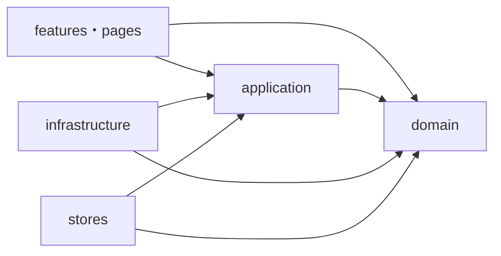
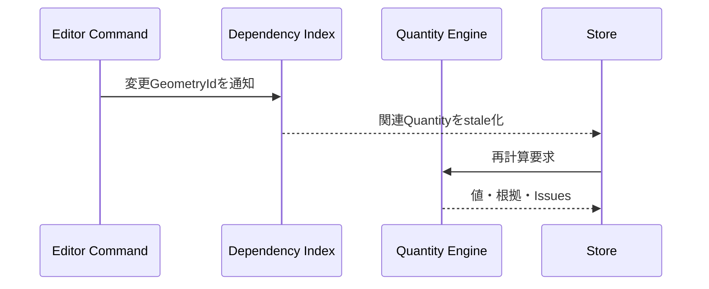
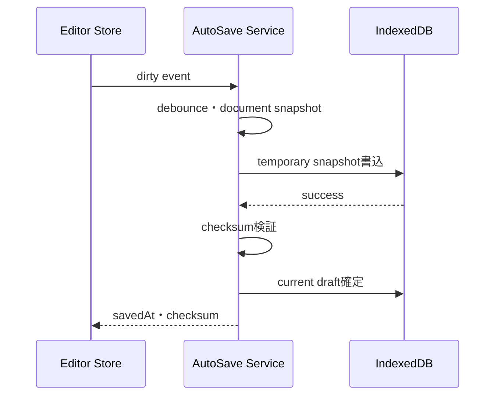
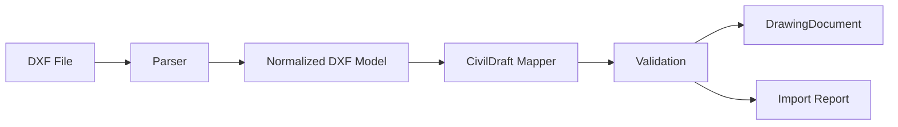

# CivilDraft 詳細設計仕様書

| 文書項目 | 内容 |
| --- | --- |
| 文書名 | CivilDraft 詳細設計仕様書 |
| 対象システム | Civil施工図CAD（CivilDraft） |
| リポジトリ名 | `CivilDraft-Web-CAD` |
| 文書版数 | 1.0 |
| 作成日 | 2026年7月14日 |
| 上位文書 | `CivilDraft_要件定義書_20260714.md`、`CivilDraft_基本設計書_20260714.md` |
| 文書状態 | 初版・実装着手前レビュー用 |

> 本書の型名、パス、APIおよびDB定義は初期実装の基準である。Phase 0の`Civil-Draw`棚卸しで既存実装との差異を確認し、変更する場合はADR、要件ID、テストへの影響を記録する。

---

## 1. 目的と適用範囲

本書は、CivilDraftを実装するためのリポジトリ構成、モジュール、TypeScript型、状態管理、幾何・座標・数量処理、IndexedDB、独自ファイル、Neon PostgreSQL、Workers API、エラー、セキュリティ、性能およびテストの詳細仕様を定義する。

### 1.1 実装優先順位

1. Phase 0で`Civil-Draw`資産を棚卸しする。
2. ドメイン型、座標、単位、ファイルスキーマを先に確定する。
3. CADコアを選択的に継承し、回帰テストを追加する。
4. IndexedDB保存・復旧を作図機能と同時に実装する。
5. 土木座標、仮設、数量、断面、施工ステップを順次追加する。
6. ローカル版の価値検証後にWorkers・Neon・承認を追加する。

---

## 2. リポジトリ・ディレクトリ構成

```text
CivilDraft-Web-CAD/
├─ .github/
│  ├─ workflows/
│  ├─ ISSUE_TEMPLATE/
│  └─ pull_request_template.md
├─ docs/
│  ├─ requirements/
│  ├─ design/
│  ├─ adr/
│  ├─ api/
│  ├─ testing/
│  └─ operations/
├─ public/
│  ├─ symbols/
│  ├─ templates/
│  └─ fonts/
├─ src/
│  ├─ app/
│  │  ├─ router/
│  │  ├─ providers/
│  │  └─ bootstrap/
│  ├─ features/
│  │  ├─ projects/
│  │  ├─ drawing-editor/
│  │  ├─ survey/
│  │  ├─ alignment/
│  │  ├─ earthwork/
│  │  ├─ temporary-works/
│  │  ├─ sections/
│  │  ├─ quantities/
│  │  ├─ construction-steps/
│  │  ├─ revisions/
│  │  └─ exports/
│  ├─ domain/
│  │  ├─ geometry/
│  │  ├─ coordinates/
│  │  ├─ units/
│  │  ├─ civil-attributes/
│  │  ├─ quantities/
│  │  ├─ revisions/
│  │  └─ validation/
│  ├─ application/
│  │  ├─ commands/
│  │  ├─ queries/
│  │  ├─ ports/
│  │  └─ services/
│  ├─ infrastructure/
│  │  ├─ indexeddb/
│  │  ├─ files/
│  │  ├─ dxf/
│  │  ├─ pdf/
│  │  ├─ csv/
│  │  ├─ api/
│  │  └─ logging/
│  ├─ stores/
│  │  ├─ editor/
│  │  ├─ project/
│  │  └─ preferences/
│  ├─ components/
│  │  ├─ cad/
│  │  ├─ forms/
│  │  ├─ feedback/
│  │  └─ layout/
│  ├─ pages/
│  ├─ shared/
│  │  ├─ types/
│  │  ├─ constants/
│  │  ├─ errors/
│  │  ├─ utils/
│  │  └─ schemas/
│  └─ workers/
├─ tests/
│  ├─ unit/
│  ├─ integration/
│  ├─ e2e/
│  ├─ fixtures/
│  ├─ golden/
│  └─ performance/
├─ migrations/
├─ scripts/
├─ README.md
├─ package.json
├─ tsconfig.json
├─ vite.config.ts
├─ vitest.config.ts
├─ playwright.config.ts
└─ wrangler.toml
```

### 2.1 依存方向



- `domain`はReact、Konva、Zustand、IndexedDB、HTTPへ依存しない。
- `application/ports`に保存・API・ファイル変換の抽象インターフェースを置く。
- `infrastructure`がPortを実装する。
- `features`は別機能の内部ファイルを直接参照せず、公開APIまたはdomain/applicationを利用する。

---

## 3. コーディング規約

| 項目 | 規約 |
| --- | --- |
| 言語 | TypeScript。`strict: true`を基本とする |
| 命名 | 型・コンポーネントはPascalCase、関数・変数はcamelCase、定数はUPPER_SNAKE_CASE |
| ID | UUID相当の衝突しにくい文字列。表示番号と分離する |
| 日時 | API・保存形式はUTCのISO 8601。画面で利用者時刻へ変換する |
| 数値 | `NaN`、`Infinity`をドメインへ入れない。境界で検証する |
| 金額 | 本システム初期対象外 |
| エラー | 例外を握りつぶさず、型付きアプリケーションエラーへ変換する |
| コメント | 処理内容より、設計上の理由・制約・数式根拠を記載する |
| Export | 機能・モジュールの公開面を`index.ts`で限定する |
| テスト | 要件ID・設計IDをテスト名またはメタ情報に関連付ける |

### 3.1 不変性

- ドメインオブジェクトは原則として直接変更せず、新しい値を返す。
- Zustand更新は対象SliceのActionから行う。
- 承認済み`DrawingRevision`は更新不可とする。
- 数量計算結果は入力図形・算出規則の版と関連付ける。

---

## 4. 共通型

```ts
export type Brand<T, B extends string> = T & { readonly __brand: B };

export type ProjectId = Brand<string, "ProjectId">;
export type DrawingId = Brand<string, "DrawingId">;
export type RevisionId = Brand<string, "RevisionId">;
export type GeometryId = Brand<string, "GeometryId">;
export type LayerId = Brand<string, "LayerId">;
export type SurveyPointId = Brand<string, "SurveyPointId">;
export type QuantityItemId = Brand<string, "QuantityItemId">;
export type ConstructionStepId = Brand<string, "ConstructionStepId">;

export interface AuditFields {
  readonly createdAt: string;
  readonly createdBy?: string;
  readonly updatedAt: string;
  readonly updatedBy?: string;
}
```

### 4.1 単位付き数値

```ts
export type LengthUnit = "mm" | "cm" | "m";
export type AreaUnit = "mm2" | "cm2" | "m2";
export type VolumeUnit = "mm3" | "cm3" | "m3";
export type AngleUnit = "deg" | "rad" | "gon";

export interface LengthValue {
  readonly value: number;
  readonly unit: LengthUnit;
}

export interface AreaValue {
  readonly value: number;
  readonly unit: AreaUnit;
}

export interface VolumeValue {
  readonly value: number;
  readonly unit: VolumeUnit;
}
```

ドメイン内部の基準単位はPhase 1詳細レビューで確定し、変換は`domain/units`へ集約する。値だけの`number`を機能間APIで受け渡さない。

### 4.2 結果型

```ts
export type Result<T, E> =
  | { readonly ok: true; readonly value: T }
  | { readonly ok: false; readonly error: E };

export interface ValidationIssue {
  readonly code: string;
  readonly severity: "info" | "warning" | "error";
  readonly field?: string;
  readonly entityId?: string;
  readonly message: string;
}
```

利用者入力、ファイル解析、幾何検査など、想定内の失敗は`Result`で扱う。予期しない障害のみ例外境界へ送る。

---

## 5. 案件・図面ドメイン

```ts
export interface Project extends AuditFields {
  readonly id: ProjectId;
  readonly projectNumber: string;
  readonly name: string;
  readonly clientName?: string;
  readonly workSections: readonly WorkSection[];
  readonly status: "active" | "archived";
}

export interface WorkSection {
  readonly id: string;
  readonly code: string;
  readonly name: string;
}

export type PaperSize = "A0" | "A1" | "A2" | "A3" | "A4";
export type Orientation = "portrait" | "landscape";

export interface DrawingSettings {
  readonly paperSize: PaperSize;
  readonly orientation: Orientation;
  readonly scaleDenominator: number;
  readonly drawingUnit: LengthUnit;
  readonly coordinateSystem: CoordinateSystemSettings;
  readonly titleBlockTemplateId?: string;
}

export interface Drawing extends AuditFields {
  readonly id: DrawingId;
  readonly projectId: ProjectId;
  readonly drawingNumber: string;
  readonly name: string;
  readonly drawingType: string;
  readonly settings: DrawingSettings;
  readonly activeRevisionId: RevisionId;
  readonly status: "active" | "archived";
}
```

### 5.1 検証規則

- `projectNumber`、`name`、`drawingNumber`、`Drawing.name`は空白だけを許可しない。
- `scaleDenominator`は0より大きい有限値とする。
- 案件内の図面番号重複は警告またはエラーとし、運用方針で確定する。
- アーカイブ済み案件では新規図面・新規改訂を禁止する。

---

## 6. 図形データモデル

### 6.1 基底型

```ts
export interface Point2D {
  readonly x: number;
  readonly y: number;
}

export interface GeometryStyle {
  readonly strokeColor: string;
  readonly strokeWidth: number;
  readonly lineType: "continuous" | "dashed" | "dashDot" | "double";
  readonly fillColor?: string;
  readonly opacity: number;
  readonly printable: boolean;
}

export interface GeometryBase {
  readonly id: GeometryId;
  readonly layerId: LayerId;
  readonly type: GeometryType;
  readonly style: GeometryStyle;
  readonly civilAttributeId?: string;
  readonly constructionStepIds: readonly ConstructionStepId[];
  readonly locked: boolean;
  readonly createdAt: string;
  readonly updatedAt: string;
}

export type GeometryType =
  | "line" | "rectangle" | "circle" | "arc" | "ellipse"
  | "polyline" | "spline" | "text" | "dimension"
  | "leader" | "hatch" | "symbol" | "parametricObject";
```

### 6.2 判別共用体

```ts
export interface LineGeometry extends GeometryBase {
  readonly type: "line";
  readonly start: Point2D;
  readonly end: Point2D;
}

export interface CircleGeometry extends GeometryBase {
  readonly type: "circle";
  readonly center: Point2D;
  readonly radius: number;
}

export interface PolylineGeometry extends GeometryBase {
  readonly type: "polyline";
  readonly points: readonly Point2D[];
  readonly closed: boolean;
}

export interface TextGeometry extends GeometryBase {
  readonly type: "text";
  readonly anchor: Point2D;
  readonly text: string;
  readonly height: number;
  readonly rotationDeg: number;
  readonly horizontalAlign: "left" | "center" | "right";
}

export type Geometry =
  | LineGeometry
  | CircleGeometry
  | PolylineGeometry
  | TextGeometry
  | ArcGeometry
  | RectangleGeometry
  | EllipseGeometry
  | DimensionGeometry
  | LeaderGeometry
  | HatchGeometry
  | SymbolGeometry
  | ParametricGeometry;
```

各図形固有型は判別プロパティ`type`を必須とし、`switch`の網羅性検査を利用する。

### 6.3 レイヤー

```ts
export interface DrawingLayer {
  readonly id: LayerId;
  readonly name: string;
  readonly order: number;
  readonly visible: boolean;
  readonly locked: boolean;
  readonly printable: boolean;
  readonly defaultStyle: GeometryStyle;
}
```

- 削除対象レイヤーに図形がある場合は、移動先指定または図形同時削除の確認を必須とする。
- ロック済みレイヤーの図形は選択表示できるが変更できない。
- 非表示レイヤーの図形は数量集計対象か否かを別設定で判定し、単純に画面表示へ連動させない。

---

## 7. コマンド・Undo／Redo設計

### 7.1 コマンド型

```ts
export interface EditorCommand<TPayload = unknown> {
  readonly id: string;
  readonly type: string;
  readonly occurredAt: string;
  readonly payload: TPayload;
  execute(document: DrawingDocument): DrawingDocument;
  undo(document: DrawingDocument): DrawingDocument;
}
```

代表コマンド：

- `AddGeometryCommand`
- `UpdateGeometryCommand`
- `DeleteGeometriesCommand`
- `TransformGeometriesCommand`
- `UpdateCivilAttributesCommand`
- `UpdateLayerCommand`
- `UpdateDrawingSettingsCommand`
- `CreateParametricObjectCommand`
- `RegenerateParametricObjectCommand`

### 7.2 履歴規則

- 1回の利用者操作を1コマンドとする。
- ドラッグ中の連続座標は履歴化せず、確定時に1コマンドへまとめる。
- コマンド確定後に数量依存関係を無効化し、再計算を要求する。
- Undo後に新規操作を行った場合はRedo履歴を破棄する。
- ファイル読込、改訂切替、競合解決時は履歴境界を明示する。
- 履歴上限は件数と推定メモリ量の双方で制御し、値は性能試験で確定する。

---

## 8. Zustand状態管理

### 8.1 Store構成

```ts
export interface EditorStore
  extends DocumentSlice,
    SelectionSlice,
    ToolSlice,
    ViewportSlice,
    LayerSlice,
    HistorySlice,
    SaveStatusSlice,
    ValidationSlice,
    QuantitySlice,
    ConstructionStepSlice {}
```

| Slice | 状態 | 主なAction |
| --- | --- | --- |
| DocumentSlice | 現在の図面・改訂・図形 | load、applyCommand、replaceDocument |
| SelectionSlice | 選択図形、ホバー、選択枠 | select、toggle、clear、selectByQuery |
| ToolSlice | 現在ツール、作図途中点 | activate、updateDraft、commit、cancel |
| ViewportSlice | pan、zoom、表示範囲 | panTo、zoomAt、fitToPaper、fitToSelection |
| LayerSlice | 現在レイヤー、表示設定 | setActive、toggleVisible、toggleLock |
| HistorySlice | Undo・Redoスタック | push、undo、redo、clear |
| SaveStatusSlice | dirty、saving、saved、failed | markDirty、saveStarted、saveSucceeded、saveFailed |
| ValidationSlice | 警告・エラー | validate、dismiss、focusTarget |
| QuantitySlice | 再計算状態、集計、フィルター | invalidate、recalculate、filter、highlightSource |
| ConstructionStepSlice | 現在ステップ、表示 | setCurrent、showAll、editSteps |

### 8.2 セレクター

- 大きな図形配列全体をコンポーネントへ渡さず、表示範囲・レイヤー・施工ステップで絞る。
- 派生集計はメモ化し、同一入力で再計算しない。
- ReactコンポーネントからStoreの内部更新関数を直接組み立てず、Actionを呼ぶ。

---

## 9. Canvas・描画設計

### 9.1 Konvaレイヤー

| レイヤー | 内容 | 再描画方針 |
| --- | --- | --- |
| BackgroundLayer | 用紙、グリッド、背景DXF | 設定・表示範囲変更時 |
| GeometryLayer | 通常図形、文字、ハッチング | 図形・表示条件変更時 |
| SelectionLayer | 選択枠、ハンドル、強調 | 選択・ポインター操作時 |
| GuideLayer | スナップ候補、作図途中、座標ガイド | ポインター移動時 |
| OverlayLayer | 処理中、警告、印刷範囲 | 必要時 |

### 9.2 座標変換

変換経路を次に固定する。

```text
screen point
  ↕ viewport transform（pan・zoom）
canvas point
  ↕ drawing transform（原点・軸方向・回転）
domain point
```

描画コードで独自変換式を使わず、`CoordinateTransformer`を介する。

### 9.3 選択・ヒットテスト

- 小規模図面ではKonvaのヒットテストを利用する。
- 大規模図面では図形の境界矩形を空間索引へ登録し、候補を絞る。
- 線・円弧等は画面上の許容ピクセルをドメイン距離へ変換して判定する。
- ロック・非表示・施工ステップ対象外は選択候補から除外する。

### 9.4 描画簡略化

- ズームアウト時は細かなハッチング、文字、寸法補助線を段階的に簡略化する。
- 簡略表示は出力データや数量へ影響させない。
- 印刷・PDFでは画面LODを使用せず、出力用描画規則を適用する。

---

## 10. スナップ設計

```ts
export type SnapType =
  | "endpoint" | "midpoint" | "intersection" | "center"
  | "quadrant" | "perpendicular" | "nearest" | "grid";

export interface SnapCandidate {
  readonly type: SnapType;
  readonly point: Point2D;
  readonly sourceGeometryIds: readonly GeometryId[];
  readonly screenDistancePx: number;
  readonly priority: number;
}
```

### 10.1 選択規則

1. 表示範囲近傍の図形候補を空間索引から取得する。
2. 有効なスナップ種別ごとに候補点を生成する。
3. 画面上の距離が許容値以内の候補だけを残す。
4. 優先度、画面距離、安定性の順に並べる。
5. 最上位候補をガイド表示し、クリック確定する。

既定優先度は端点・交点・中心を高くするが、設定で変更可能とする。候補が頻繁に切り替わらないよう、現在候補にヒステリシスを設ける。

---

## 11. 幾何計算

### 11.1 数値許容差

```ts
export interface GeometryTolerance {
  readonly coordinateEpsilon: number;
  readonly angleEpsilonRad: number;
  readonly areaEpsilon: number;
  readonly snapTolerancePx: number;
}
```

固定値を各関数へ散在させず、図面単位と表示倍率に応じた設定を`GeometryTolerance`から供給する。

### 11.2 基本式

- 2点間距離：$d=\sqrt{(x_2-x_1)^2+(y_2-y_1)^2}$
- ポリライン長：各線分長の総和。
- 円周：$L=2\pi r$
- 円面積：$A=\pi r^2$
- ポリゴン面積：靴紐公式を用い、向きと絶対値を区別する。
- 点から線分までの距離：射影係数を`[0,1]`へ制限して最近点を求める。
- 線分交差：平行・共線・端点一致を許容差込みで分類する。

### 11.3 ポリゴン検査

```ts
export interface PolygonValidationResult {
  readonly closed: boolean;
  readonly selfIntersecting: boolean;
  readonly zeroLengthEdgeIndexes: readonly number[];
  readonly signedArea: number;
  readonly issues: readonly ValidationIssue[];
}
```

数量対象の面積計算は、閉じている、頂点数3以上、自己交差なし、面積が許容差より大きい場合のみ確定値とする。

### 11.4 オフセット

- 線分とポリラインに対応する。
- 結合方式は`miter`、`bevel`、`round`を設計候補とする。
- 鋭角で異常に長いmiterを防ぐため、miter limitを設定する。
- 自己交差や反転が生じた場合は警告し、結果を自動確定しない。

### 11.5 トリム

- トリム対象と切断境界の交点を求める。
- 利用者が指示した側に最も近い区間を除去する。
- 交点なし、接するだけ、複数候補の場合はプレビューまたは理由を表示する。

---

## 12. 土木座標・測量処理

### 12.1 座標設定

```ts
export interface CoordinateSystemSettings {
  readonly mode: "local" | "jgd-attribute";
  readonly origin: Point2D;
  readonly rotationDeg: number;
  readonly axisConvention: "east-north" | "custom";
  readonly planeRectangularZone?: number;
  readonly verticalDatum?: string;
}

export interface SurveyPoint {
  readonly id: SurveyPointId;
  readonly pointNumber: string;
  readonly x: number;
  readonly y: number;
  readonly elevation?: number;
  readonly code?: string;
  readonly note?: string;
}
```

初期版の`jgd-attribute`は座標系属性を保持するだけとし、複雑な測地変換は行わない。

### 12.2 距離・方位角からの点算出

方位角の基準方向と回転方向は画面と設定で明示する。北基準・時計回りを採用する場合の例は次のとおり。

$$
X_2=X_1+L\sin\theta
$$

$$
Y_2=Y_1+L\cos\theta
$$

内部では角度をラジアンへ変換し、入力単位、軸規約、図面回転を`CoordinateTransformer`で吸収する。

### 12.3 測点CSV取込

```ts
export interface SurveyCsvMapping {
  readonly pointNumberColumn: string;
  readonly xColumn: string;
  readonly yColumn: string;
  readonly elevationColumn?: string;
  readonly codeColumn?: string;
  readonly noteColumn?: string;
}

export interface ImportRowResult<T> {
  readonly rowNumber: number;
  readonly source: Readonly<Record<string, string>>;
  readonly normalized?: T;
  readonly issues: readonly ValidationIssue[];
}
```

処理順：文字コード判定→CSV解析→ヘッダー正規化→列割当→空白・全半角正規化→数値変換→必須・重複・範囲検査→プレビュー→確定。

### 12.4 中心線・測点

- 中心線は直線・円弧セグメントの連続列として保持する。
- 累加距離`station`を線形上の位置として用いる。
- 測点ピッチ配置では開始・終了・曲線境界を重複なく生成する。
- 左右オフセットの左右は中心線進行方向に対して定義する。

---

## 13. 線形・単曲線

```ts
export type AlignmentSegment = LineAlignmentSegment | ArcAlignmentSegment;

export interface Alignment {
  readonly id: string;
  readonly name: string;
  readonly startStation: number;
  readonly segments: readonly AlignmentSegment[];
}
```

### 13.1 単曲線

入力候補：始点、接線方向、半径、交角、曲線方向。または3点指定。計算結果として中心、半径、始角、終角、弧長、接線長を保持する。

$$
T=R\tan\left(\frac{\Delta}{2}\right)
$$

$$
L=R\Delta
$$

ここで$\Delta$はラジアンとする。ゼロ半径、ほぼ0度、180度近傍、接続不連続を検査する。

### 13.2 簡易クロソイド

Phase 5以降の機能とし、採用前に入力パラメータ、計算精度、用途限定、試験既知解を別ADRで確定する。Phase 1～4のモデルへ無理に組み込まない。

---

## 14. 土木属性

```ts
export interface CivilAttribute {
  readonly id: string;
  readonly workType?: string;
  readonly category?: string;
  readonly subcategory?: string;
  readonly specification?: string;
  readonly unit?: QuantityUnit;
  readonly quantityMethod?: QuantityMethod;
  readonly projectNumber?: string;
  readonly workSectionId?: string;
  readonly station?: string;
  readonly tags: readonly string[];
}

export type QuantityUnit = "m" | "m2" | "m3" | "count" | "set" | "custom";
export type QuantityMethod = "length" | "area" | "perimeter" | "count" | "volume" | "manual";
```

- マスター値と自由入力値を区別する。
- マスター変更で過去改訂の表示が変わらないよう、確定改訂には表示名をスナップショットする。
- 複数図形一括編集では、変更対象フィールドだけを明示するPatch型を利用する。
- 属性欠損は作図自体を禁止せず、数量確定・照査提出時に検査する。

---

## 15. パラメトリック図形

```ts
export interface ParametricObjectDefinition<TParams> {
  readonly definitionId: string;
  readonly version: number;
  validate(params: TParams): readonly ValidationIssue[];
  generate(params: TParams, context: GenerationContext): readonly Geometry[];
}

export interface ParametricGeometry extends GeometryBase {
  readonly type: "parametricObject";
  readonly definitionId: string;
  readonly definitionVersion: number;
  readonly parameters: Readonly<Record<string, unknown>>;
  readonly generatedGeometryIds: readonly GeometryId[];
}
```

### 15.1 対象テンプレート

| 定義ID例 | パラメータ | 生成物 |
| --- | --- | --- |
| `heavy-machine-radius` | 中心、旋回半径、機種名 | 円・塗り・注記 |
| `crane-working-sector` | 中心、最小・最大半径、開始・終了角 | 扇形・注記 |
| `steel-plate-array` | 原点、幅、長さ、行列、間隔 | 敷鉄板群 |
| `temporary-fence` | 経路、高さ属性、支柱間隔 | 線・支柱記号 |
| `barricade-line` | 経路、配置間隔 | バリケード記号列 |
| `slope-pattern` | 法肩・法尻、勾配、記号間隔 | 法面記号・注記 |
| `traffic-route` | 経路、幅、矢印間隔 | 搬入路・方向矢印 |

### 15.2 再生成規則

- パラメータを正本とし、生成図形は派生物として扱う。
- 生成図形を個別編集する場合は「パラメトリック解除」を要求する。
- 定義版を保持し、定義更新で既存図形が無断変更されないようにする。
- 重機・クレーン図形は安全能力を判定しない旨を属性と出力へ含める。

---

## 16. 土工・断面

### 16.1 法勾配

法勾配入力`1:n`は、鉛直1に対する水平$n$として解析する。入力文字列は空白、全角記号を正規化し、`n>0`を必須とする。

```ts
export interface SlopeRatio {
  readonly vertical: 1;
  readonly horizontal: number;
}
```

表示文字列と内部値を保持し、利用者が入力した表記を可能な範囲で再現する。

### 16.2 断面

```ts
export interface SectionPoint {
  readonly offset: number;
  readonly elevation: number;
}

export interface Section {
  readonly id: string;
  readonly surveyPointId: SurveyPointId;
  readonly station: number;
  readonly existingGround: readonly SectionPoint[];
  readonly plannedGround: readonly SectionPoint[];
  readonly cutArea?: number;
  readonly fillArea?: number;
}
```

- `offset`は中心線進行方向に対し左負・右正等、規約を明記して統一する。
- 現況線・計画線の交点を挿入して区間を分割し、切土・盛土領域を分類する。
- 自己交差、同一offset重複、線分不足の場合は面積未確定とする。

### 16.3 簡易土量

平均断面法を初期候補とする。

$$
V=\frac{A_1+A_2}{2}\times L
$$

- 切土と盛土を別々に計算する。
- 断面間距離、対象断面、採用式、丸め前値を根拠として保持する。
- 中間断面の急変等を自動判断しないため、簡易計算であることを表示する。

---

## 17. 数量計算

### 17.1 数量モデル

```ts
export interface QuantitySource {
  readonly geometryId: GeometryId;
  readonly contributionRaw: number;
}

export interface RoundingRule {
  readonly mode: "halfUp" | "halfEven" | "floor" | "ceil" | "truncate";
  readonly decimalPlaces: number;
}

export interface QuantityItem {
  readonly id: QuantityItemId;
  readonly revisionId: RevisionId;
  readonly groupKey: string;
  readonly workType?: string;
  readonly specification?: string;
  readonly method: QuantityMethod;
  readonly unit: QuantityUnit;
  readonly rawValue: number;
  readonly roundedValue: number;
  readonly roundingRule: RoundingRule;
  readonly sources: readonly QuantitySource[];
  readonly status: "valid" | "stale" | "invalid" | "manuallyAdjusted";
  readonly manualAdjustment?: ManualAdjustment;
}
```

### 17.2 算出規則

| method | 対象 | 算出 |
| --- | --- | --- |
| length | 線、ポリライン、円弧、管渠等 | 各図形の実寸長 |
| perimeter | 閉図形 | 外周長。穴の扱いは別途定義 |
| area | 円、矩形、閉ポリゴン、ハッチ領域 | 実寸面積 |
| count | 記号、部材、パラメトリック図形 | 対象個数 |
| volume | 面積×厚さ、断面間土量 | 明示した式による簡易体積 |
| manual | 自動算出不可 | 値・理由・実施者を必須とする |

### 17.3 再計算



- 図形、属性、単位、施工ステップ、丸め規則の変更を依存入力とする。
- `stale`の数量は照査提出・確定版作成を禁止する。
- 集計は丸め前値を合計してから集計単位で丸めるか、明細丸め後に合計するかを規則として明示する。
- 浮動小数点誤差が業務表示に露出しないよう、丸め処理を一か所へ集約する。

### 17.4 手動補正

```ts
export interface ManualAdjustment {
  readonly originalValue: number;
  readonly adjustedValue: number;
  readonly reason: string;
  readonly adjustedBy: string;
  readonly adjustedAt: string;
}
```

自動値を上書き消去せず、元値、補正値、差、理由、実施者、日時を保持する。

---

## 18. 施工ステップ

```ts
export interface ConstructionStep {
  readonly id: ConstructionStepId;
  readonly code: string;
  readonly name: string;
  readonly order: number;
  readonly standard: boolean;
}
```

標準値：`before`、`excavation`、`temporaryWorks`、`structure`、`backfill`、`completed`。

- 図形は0個以上の対象ステップを持つ。空配列は全ステップ共通と解釈する。
- 表示フィルターと数量フィルターは同じ判定サービスを利用する。
- ステップ削除時は関連図形数を表示し、移行先指定を必須とする。
- 順序変更はIDを変えず、`order`だけを変更する。

---

## 19. 改訂・ワークフロー

```ts
export type RevisionStatus =
  | "draft" | "inReview" | "returned"
  | "pendingApproval" | "approved" | "obsolete";

export interface DrawingRevision extends AuditFields {
  readonly id: RevisionId;
  readonly drawingId: DrawingId;
  readonly revisionNumber: string;
  readonly status: RevisionStatus;
  readonly changeSummary: string;
  readonly basedOnRevisionId?: RevisionId;
  readonly contentVersion: number;
  readonly contentChecksum: string;
}
```

### 19.1 状態遷移表

| 現在 | 操作 | 遷移先 | 実行可能ロール | 前提 |
| --- | --- | --- | --- | --- |
| draft | submitReview | inReview | 作成者 | 必須検査合格、stale数量なし |
| returned | resumeEditing | draft | 作成者 | 差戻し理由あり |
| inReview | return | returned | 照査者 | コメント必須 |
| inReview | completeReview | pendingApproval | 照査者 | 照査結果記録 |
| pendingApproval | return | returned | 承認者 | コメント必須 |
| pendingApproval | approve | approved | 承認者 | 内容Checksum一致 |
| approved | createRevision | draft | 作成者 | 新ID・新改訂番号 |
| approved | obsolete | obsolete | 管理権限 | 理由必須 |

### 19.2 不変条件

- `approved`の内容、数量、属性を更新しない。
- ワークフロー操作と監査ログは同一DBトランザクションで記録する。
- 承認時にクライアント表示時の`contentChecksum`とサーバー値を比較する。
- 作成・照査・承認の兼務制限は案件ポリシーで検査する。

---

## 20. 図面差分

### 20.1 差分分類

```ts
export interface DrawingDiff {
  readonly added: readonly GeometryId[];
  readonly removed: readonly GeometryId[];
  readonly geometryChanged: readonly GeometryChange[];
  readonly styleChanged: readonly GeometryChange[];
  readonly attributeChanged: readonly GeometryChange[];
  readonly stepChanged: readonly GeometryChange[];
}
```

- 同一`GeometryId`を基本に比較する。
- 複製・インポート等でIDが変わる場合の形状類似推定は補助情報とし、自動同一判定を確定しない。
- 座標の微小差は許容差を適用するが、差分基準を画面に表示する。
- 追加は緑、削除は赤、変更は黄等を候補とし、色だけでなく線種・ラベルを併用する。

---

## 21. IndexedDB設計

### 21.1 DB・Store

DB名：`civildraft-local`。初期スキーマ版は実装時に`1`から開始する。

| Object Store | Key | Index | 内容 |
| --- | --- | --- | --- |
| `projects` | `id` | `projectNumber`、`updatedAt` | ローカル案件メタデータ |
| `drawings` | `id` | `projectId`、`updatedAt` | 図面メタデータ |
| `drafts` | `revisionId` | `drawingId`、`savedAt` | 現在下書き |
| `recoverySnapshots` | `snapshotId` | `drawingId`、`savedAt` | 復旧候補 |
| `preferences` | `key` | なし | UI・入力設定 |
| `fileHandles` | `drawingId` | なし | 利用可能な場合のファイル参照情報 |
| `syncQueue` | `operationId` | `projectId`、`status`、`createdAt` | 共有版の未同期操作 |

### 21.2 下書きレコード

```ts
export interface DraftRecord {
  readonly revisionId: RevisionId;
  readonly drawingId: DrawingId;
  readonly schemaVersion: number;
  readonly applicationVersion: string;
  readonly savedAt: string;
  readonly contentChecksum: string;
  readonly document: DrawingDocument;
  readonly sync?: SyncMetadata;
}
```

### 21.3 自動保存処理



- 保存処理中に新たな変更が発生した場合、完了後に再保存する。
- 同時保存は1図面につき1処理に直列化する。
- 保存失敗時もdirty状態を解除しない。
- 復旧スナップショットは上限数・保持期間を設定し、承認済み版と混同しない。

### 21.4 マイグレーション

- IndexedDBの`upgrade`でStore・Indexの構造を変更する。
- 文書スキーマの移行は別の純粋関数で実施する。
- 移行前に元レコードを復旧候補として保持する。
- 失敗時は旧データを破棄せず、エクスポートまたは旧版利用を案内する。

---

## 22. CivilDraft独自ファイル

### 22.1 論理形式

初期実装はJSONベースを基本候補とする。大容量化後にZIPコンテナ等を採用する場合はADRで決定する。

```ts
export interface CivilDraftFile {
  readonly format: "CivilDraft";
  readonly schemaVersion: number;
  readonly applicationVersion: string;
  readonly exportedAt: string;
  readonly project: ProjectSnapshot;
  readonly drawing: Drawing;
  readonly revision: DrawingRevision;
  readonly document: DrawingDocument;
  readonly checksums: {
    readonly algorithm: "SHA-256";
    readonly document: string;
  };
}
```

### 22.2 読込手順

1. 拡張子、サイズ、MIMEを事前確認する。
2. JSONまたはコンテナを安全に解析する。
3. `format`、`schemaVersion`、必須項目、上限件数を検査する。
4. スキーマ移行が必要ならメモリ上で実施する。
5. ID、参照、数値、図形、数量、Checksumを検査する。
6. 警告・エラーを表示し、利用者確認後に開く。
7. 元の作業中図面を失わないよう、別コンテキストへ読み込む。

### 22.3 制限値

ファイル容量、図形数、頂点数、文字列長、復旧候補数は定数化し、性能・安全試験後に値を確定する。入力値だけで巨大配列を事前確保しない。

---

## 23. DXF変換

### 23.1 変換パイプライン



- Parser固有型をドメインへ直接持ち込まない。
- 単位、レイヤー、ブロック、文字、線種を正規化モデルで扱う。
- 対応要素ごとにMapperを分離する。
- 未対応・部分対応・変換失敗を`ImportReport`へ集約する。

### 23.2 取込結果

```ts
export interface ImportReport {
  readonly sourceFileName: string;
  readonly sourceVersion?: string;
  readonly importedCount: number;
  readonly skippedCount: number;
  readonly warningCount: number;
  readonly entityResults: readonly ImportEntityResult[];
}
```

### 23.3 往復変換試験

- LINE、LWPOLYLINE、CIRCLE、ARC、TEXT、MTEXT、DIMENSION等、採用要素ごとにGolden DXFを用意する。
- 取込→CivilDraft→出力→再取込で、形状、レイヤー、文字、単位を許容差内で比較する。
- 完全保存できないCivilDraft固有属性は出力前に警告する。

---

## 24. PDF・CSV出力

### 24.1 PDF

- 出力用の実寸座標へ変換し、画面ズーム・panを使用しない。
- 用紙サイズ、向き、余白、縮尺、線幅、色、文字高さを明示指定する。
- フォント不足時の代替規則と警告を実装する。
- 図面枠、表題欄、凡例、改訂、出力日時を構成要素として描画する。

### 24.2 数量CSV列

| 列 | 必須 | 内容 |
| --- | :---: | --- |
| projectNumber | ○ | 案件番号 |
| drawingNumber | ○ | 図面番号 |
| revisionNumber | ○ | 改訂番号 |
| workSection |  | 工区 |
| station |  | 測点 |
| workType |  | 工種 |
| category |  | 種別 |
| subcategory |  | 細別 |
| specification |  | 規格 |
| method | ○ | 算出区分 |
| rawValue | ○ | 丸め前値 |
| roundedValue | ○ | 表示・出力値 |
| unit | ○ | 単位 |
| sourceGeometryIds | ○ | 根拠図形ID |
| adjustmentReason |  | 手動補正理由 |

CSVインジェクション対策として、先頭が`=`,`+`,`-`,`@`等の文字列は、対象列の性質に応じてエスケープまたは拒否し、処理内容を記録する。

---

## 25. Workers API詳細

共有版導入時にOpenAPIを正本として実装する。以下は初期契約である。

### 25.1 共通ヘッダー

| ヘッダー | 方向 | 用途 |
| --- | --- | --- |
| `Content-Type: application/json` | 双方向 | JSON API |
| `X-Correlation-Id` | 双方向 | 相関ID。未指定時はサーバー生成 |
| `If-Match` | 要求 | 更新対象versionまたはETag |
| `ETag` | 応答 | 最新版識別 |
| `Idempotency-Key` | 要求 | 作成・ワークフロー等の重複防止 |

### 25.2 エンドポイント

| Method | Path | 権限 | 概要 |
| --- | --- | --- | --- |
| GET | `/api/v1/projects` | 認証済み | 参加案件一覧 |
| POST | `/api/v1/projects` | 管理権限 | 案件作成 |
| GET | `/api/v1/projects/{projectId}` | 案件メンバー | 案件取得 |
| PATCH | `/api/v1/projects/{projectId}` | 案件管理者 | 案件更新 |
| GET | `/api/v1/projects/{projectId}/drawings` | 案件メンバー | 図面一覧 |
| POST | `/api/v1/projects/{projectId}/drawings` | 作成者以上 | 図面作成 |
| GET | `/api/v1/drawings/{drawingId}` | 案件メンバー | 図面取得 |
| PATCH | `/api/v1/drawings/{drawingId}` | 作成者・管理者 | 図面メタデータ更新 |
| POST | `/api/v1/drawings/{drawingId}/revisions` | 作成者 | 新規改訂 |
| GET | `/api/v1/revisions/{revisionId}` | 案件メンバー | 改訂メタデータ取得 |
| GET | `/api/v1/revisions/{revisionId}/content` | 案件メンバー | 内容取得 |
| PUT | `/api/v1/revisions/{revisionId}/content` | 作成者 | draft内容更新 |
| GET | `/api/v1/revisions/{revisionId}/quantities` | 案件メンバー | 数量取得 |
| PUT | `/api/v1/revisions/{revisionId}/quantities` | 作成者 | 数量スナップショット更新 |
| POST | `/api/v1/revisions/{revisionId}/workflow-actions` | 状態別 | 提出・照査・承認等 |
| POST | `/api/v1/revisions/{revisionId}/exports` | 案件メンバー | 出力作成 |
| GET | `/api/v1/exports/{exportId}` | 案件メンバー | 出力状態・取得情報 |
| GET | `/api/v1/audit-logs` | 監査権限 | 監査検索 |

### 25.3 応答形式

```ts
export interface ApiSuccess<T> {
  readonly data: T;
  readonly meta?: Record<string, unknown>;
  readonly correlationId: string;
}

export interface ApiErrorResponse {
  readonly error: {
    readonly code: string;
    readonly message: string;
    readonly details?: readonly ValidationIssue[];
  };
  readonly correlationId: string;
}
```

### 25.4 HTTP状態

| 状態 | 用途 |
| --- | --- |
| 200 | 取得・更新成功 |
| 201 | 作成成功 |
| 202 | 非同期出力受付 |
| 204 | 内容なし成功 |
| 400 | 形式・入力不正 |
| 401 | 未認証 |
| 403 | 権限不足 |
| 404 | 対象なし。権限隠蔽時にも使用を検討 |
| 409 | 版競合、状態遷移競合、重複 |
| 413 | ファイル・要求過大 |
| 422 | 業務検証不合格 |
| 429 | レート制限 |
| 500 | 予期しないサーバーエラー |

---

## 26. Neon PostgreSQL設計

### 26.1 テーブル一覧

| テーブル | 主キー | 主な外部キー | 用途 |
| --- | --- | --- | --- |
| `projects` | `id` | なし | 案件 |
| `work_sections` | `id` | `project_id` | 工区 |
| `project_members` | 複合 | `project_id` | 案件ロール |
| `drawings` | `id` | `project_id` | 図面メタデータ |
| `drawing_revisions` | `id` | `drawing_id`、`based_on_revision_id` | 改訂 |
| `drawing_contents` | `revision_id` | `revision_id` | 内容参照、Checksum、version |
| `quantity_items` | `id` | `revision_id` | 数量スナップショット |
| `quantity_sources` | 複合 | `quantity_item_id` | 根拠図形 |
| `workflow_actions` | `id` | `revision_id` | 状態遷移履歴 |
| `export_jobs` | `id` | `revision_id` | 出力ジョブ |
| `master_items` | `id` | なし | 工種・規格等 |
| `audit_logs` | `id` | 任意 | 監査ログ |

### 26.2 主要DDL案

```sql
CREATE TABLE projects (
  id uuid PRIMARY KEY,
  project_number text NOT NULL,
  name text NOT NULL,
  client_name text,
  status text NOT NULL CHECK (status IN ('active', 'archived')),
  created_at timestamptz NOT NULL,
  created_by text NOT NULL,
  updated_at timestamptz NOT NULL,
  updated_by text NOT NULL,
  version bigint NOT NULL DEFAULT 1,
  UNIQUE (project_number)
);

CREATE TABLE drawings (
  id uuid PRIMARY KEY,
  project_id uuid NOT NULL REFERENCES projects(id),
  drawing_number text NOT NULL,
  name text NOT NULL,
  drawing_type text NOT NULL,
  settings jsonb NOT NULL,
  status text NOT NULL CHECK (status IN ('active', 'archived')),
  active_revision_id uuid,
  created_at timestamptz NOT NULL,
  created_by text NOT NULL,
  updated_at timestamptz NOT NULL,
  updated_by text NOT NULL,
  version bigint NOT NULL DEFAULT 1,
  UNIQUE (project_id, drawing_number)
);

CREATE TABLE drawing_revisions (
  id uuid PRIMARY KEY,
  drawing_id uuid NOT NULL REFERENCES drawings(id),
  revision_number text NOT NULL,
  status text NOT NULL CHECK (
    status IN ('draft','inReview','returned','pendingApproval','approved','obsolete')
  ),
  change_summary text NOT NULL,
  based_on_revision_id uuid REFERENCES drawing_revisions(id),
  content_version bigint NOT NULL DEFAULT 1,
  content_checksum text NOT NULL,
  created_at timestamptz NOT NULL,
  created_by text NOT NULL,
  updated_at timestamptz NOT NULL,
  updated_by text NOT NULL,
  UNIQUE (drawing_id, revision_number)
);
```

循環参照となる`drawings.active_revision_id`の外部キーはテーブル作成後に追加する。

### 26.3 図面内容

- 大容量の完全図面データはObject Storageへ置き、`drawing_contents`にobject key、サイズ、Checksum、MIME、schemaVersionを保持する方式を第一候補とする。
- 小さなメタデータと検索対象だけをPostgreSQLへ保持する。
- Object keyをクライアントから自由入力させず、サーバー生成する。
- 保存は一時object→Checksum確認→DB更新→確定objectの順で一貫性を保つ。

### 26.4 インデックス

- `drawings(project_id, status)`
- `drawing_revisions(drawing_id, created_at DESC)`
- `drawing_revisions(status, updated_at)`
- `project_members(user_id, project_id)`
- `audit_logs(project_id, occurred_at DESC)`
- `audit_logs(actor_id, occurred_at DESC)`
- `export_jobs(status, created_at)`

実クエリ計画を計測し、不要なJSONB索引を先行追加しない。

---

## 27. 認証・認可実装

### 27.1 認証コンテキスト

```ts
export interface AuthenticatedUser {
  readonly subject: string;
  readonly email?: string;
  readonly displayName?: string;
  readonly systemRoles: readonly SystemRole[];
}
```

- Workers境界で認証情報を検証し、`AuthenticatedUser`へ変換する。
- 要求本文・Queryの利用者IDで上書きしない。
- `subject`を監査上の不変識別子として利用し、表示名変更と分離する。

### 27.2 認可関数

```ts
export interface AuthorizationService {
  canReadProject(user: AuthenticatedUser, projectId: ProjectId): Promise<boolean>;
  canEditRevision(user: AuthenticatedUser, revisionId: RevisionId): Promise<boolean>;
  canPerformWorkflowAction(
    user: AuthenticatedUser,
    revisionId: RevisionId,
    action: WorkflowActionType
  ): Promise<boolean>;
}
```

各Handlerはデータ取得前または取得と同時に案件境界を適用し、IDORを防ぐ。

---

## 28. エラーコード

| コード | 区分 | 内容 |
| --- | --- | --- |
| `CD-VAL-001` | 入力 | 必須項目不足 |
| `CD-VAL-002` | 入力 | 数値・範囲不正 |
| `CD-GEO-001` | 幾何 | ゼロ長図形 |
| `CD-GEO-002` | 幾何 | 閉領域ではない |
| `CD-GEO-003` | 幾何 | 自己交差 |
| `CD-SURV-001` | 座標 | 測点番号重複 |
| `CD-SURV-002` | 座標 | 座標値不正 |
| `CD-QTY-001` | 数量 | 算出対象不成立 |
| `CD-QTY-002` | 数量 | 単位不整合 |
| `CD-QTY-003` | 数量 | 再計算未完了 |
| `CD-FILE-001` | ファイル | 未対応スキーマ |
| `CD-FILE-002` | ファイル | Checksum不一致 |
| `CD-DXF-001` | DXF | 未対応要素 |
| `CD-SAVE-001` | 保存 | IndexedDB保存失敗 |
| `CD-SYNC-001` | 同期 | 版競合 |
| `CD-AUTH-001` | 認証 | 未認証・期限切れ |
| `CD-AUTHZ-001` | 認可 | 操作権限不足 |
| `CD-WF-001` | ワークフロー | 不正な状態遷移 |
| `CD-SYS-001` | システム | 予期しない障害 |

エラーコードは利用者向けメッセージと開発者向け診断情報を分離する。

---

## 29. ログ・監査実装

### 29.1 構造化ログ

```ts
export interface LogEvent {
  readonly timestamp: string;
  readonly level: "debug" | "info" | "warn" | "error";
  readonly eventName: string;
  readonly correlationId: string;
  readonly userId?: string;
  readonly projectId?: string;
  readonly entityType?: string;
  readonly entityId?: string;
  readonly result?: "success" | "failure";
  readonly durationMs?: number;
  readonly errorCode?: string;
}
```

- 図面本文、座標一式、Secret、トークン、認証Cookieを記録しない。
- クライアントエラーは件数・種別を収集し、図面内容の送信は利用者確認を要する。
- 監査ログは業務操作の事実を記録し、通常のアプリログと保持・権限を分ける。
- 監査対象：ログイン結果、案件・図面作成更新、版確定、提出、照査、差戻し、承認、出力、権限変更。

---

## 30. セキュリティ実装仕様

### 30.1 フロントエンド

- ユーザー入力を`innerHTML`へ直接渡さない。
- CSPを設定し、`unsafe-eval`を原則使用しない。
- 外部CDNへ依存せず、許可した静的資産だけを配信する。
- 図面名、CSV値等をDOM、CSV、ファイル名へ出す際にコンテキスト別処理を行う。
- IndexedDBへ認証トークンやSecretを保存しない。

### 30.2 Workers API

- 認証検証→入力検証→認可→業務処理→監査の順を共通ミドルウェアで担保する。
- JSONサイズ、ファイルサイズ、図形数、レートを制限する。
- DBクエリはパラメータ化する。
- エラー時に内部情報を応答しない。
- CORSは既知のフロントエンドOriginだけに限定する。
- 冪等性キーを作成・承認・出力要求で検査する。

### 30.3 Object Storage

- Bucketを公開しない。
- 取得・アップロードは短時間の署名またはWorkers経由とする。
- object keyに元ファイル名や個人情報を含めない。
- MIME・サイズ・ChecksumをDBと照合する。
- 孤立objectを定期検出し、安全な猶予期間後に削除する。

---

## 31. 性能実装仕様

### 31.1 性能計測

```ts
export interface PerformanceSample {
  readonly scenario: string;
  readonly geometryCount: number;
  readonly vertexCount: number;
  readonly durationMs: number;
  readonly browser: string;
  readonly appVersion: string;
}
```

対象シナリオ：初回読込、pan、zoom、範囲選択、図形移動、Undo、数量再計算、自動保存、DXF取込、PDF出力。

### 31.2 最適化順序

1. 計測用の標準図面と性能マークを固定する。
2. 不要なReact再レンダーを削減する。
3. Zustandセレクターとメモ化を見直す。
4. Konvaレイヤー・キャッシュ・バッチ描画を適用する。
5. 空間索引と表示範囲外抑制を導入する。
6. 重い計算をWeb Workerへ移す。

計測前に複雑な最適化を入れず、効果と保守性を記録する。

---

## 32. テスト詳細設計

### 32.1 単体テスト

| 対象 | テスト内容 | 関連要件 |
| --- | --- | --- |
| 幾何 | 距離、交点、面積、円弧、オフセット、自己交差 | FR-DRAW-*、FR-EW-* |
| 座標 | 軸、回転、方位角、左右、測点ピッチ | FR-SURV-*、FR-ALIGN-* |
| 単位 | 長さ・面積・体積変換、丸め | FR-QTY-008 |
| 数量 | 延長、面積、個数、体積、stale、手動補正 | FR-QTY-* |
| 改訂 | 状態遷移、確定版不変、兼務制限 | FR-REV-* |
| ファイル | スキーマ検証、移行、Checksum、上限 | FR-IO-001、FR-SAVE-004 |
| CSV | 正規化、重複、欠損、注入対策 | FR-SURV-008、FR-QTY-007 |

### 32.2 境界値

- 0、負値、極小値、極大値、`NaN`、`Infinity`。
- 0点、1点、2点、最大頂点数、閉点重複。
- 0度、90度、180度近傍、360度、角度折返し。
- 平行、共線、接する、端点交差、多重交差。
- 文字列空、空白、長大文字列、絵文字、全角数値、制御文字。

### 32.3 結合テスト

- コマンド実行→Store更新→数量stale→再計算→自動保存。
- DXF解析→正規化→変換→検証→ImportReport。
- ファイル保存→読込→移行→同一性確認。
- Workflow API→DB状態更新→監査ログ。
- Object Storage保存→Checksum→DB確定→取得。

### 32.4 E2E

| E2E-ID | シナリオ | 合格条件 |
| --- | --- | --- |
| E2E-001 | 新規図面作成・基本作図・再読込 | 図形・属性・表示が一致 |
| E2E-002 | 異常終了後の復旧 | 直近正常スナップショットを選択可能 |
| E2E-003 | 測点CSV取込 | 正常・警告・エラー行が正しく分類 |
| E2E-004 | 中心線・オフセット | 既知解の許容差内 |
| E2E-005 | 重機・クレーン範囲 | パラメータ変更で正しく再生成 |
| E2E-006 | 数量根拠 | 集計から図形を強調できる |
| E2E-007 | 施工ステップ | 表示・数量・PDFが一致 |
| E2E-008 | 改訂・照査・承認 | 状態、権限、監査、不変性が成立 |
| E2E-009 | DXF往復 | 対応要素が許容差内、未対応を報告 |
| E2E-010 | PDF出力 | 用紙、縮尺、図枠、線、文字が一致 |

### 32.5 Goldenデータ

- 幾何既知解JSON。
- 座標・方位角CSV。
- 対応DXF要素別ファイル。
- A0～A4・縦横・主要縮尺PDF基準。
- 1,000、5,000、10,000図形の性能図面。
- 旧スキーマからの移行ファイル。

実案件の機密データをGoldenへ含めない。

---

## 33. CI/CD詳細

### 33.1 Pull Request必須チェック

```text
install
├─ format check
├─ lint
├─ TypeScript typecheck
├─ unit tests + coverage
├─ integration tests
├─ build
├─ dependency vulnerability check
├─ license check
└─ selected Playwright E2E
```

### 33.2 ブランチ・リリース

- 保護対象ブランチへの直接pushを禁止する。
- PRには目的、要件ID、変更、テスト、画面変更、移行、リスクを記載する。
- Preview URLはAccess配下とする。
- リリースタグ、Git commit、アプリ版、デプロイIDを対応付ける。
- DBマイグレーションは適用順と互換期間を管理する。

---

## 34. 実装フェーズ別成果

| Phase | 実装成果 | 必須テスト・文書 |
| --- | --- | --- |
| 0 | 継承台帳、依存・ライセンス、ADR、基準性能 | 回帰基準、SBOM、リスク台帳 |
| 1 | ドメイン型、CAD基礎、図面設定、独自形式、IndexedDB、PDF | E2E-001・002・010、保存復旧試験 |
| 2 | 測点、CSV、方位角、中心線、オフセット | E2E-003・004、既知解試験 |
| 3 | 土工・仮設・重機・安全設備 | E2E-005、パラメトリック試験 |
| 4 | 属性、数量、根拠、CSV | E2E-006、丸め・単位・stale試験 |
| 5 | 断面、簡易土量、施工ステップ | E2E-007、断面既知解 |
| 6 | DXF強化、差分、Workers、Neon、照査承認 | E2E-008・009、権限・監査・復旧 |

---

## 35. 実装完了定義（Definition of Done）

各機能は以下を満たして完了とする。

- 対象要件IDと設計IDがIssue・PRに記載されている。
- 受入条件と例外・境界値が定義されている。
- 型検査、lint、単体・結合・必要なE2Eが合格している。
- エラー処理、ログ、セキュリティ、権限への影響を確認している。
- データ形式変更時はschemaVersionと移行処理がある。
- UI変更時はキーボード操作、色以外の識別、メッセージを確認している。
- README、設計、互換性表、既知制限が実装と同期している。
- Critical・Highの既知不具合が残っていない。
- 性能影響を標準図面で確認している。
- レビュー承認後に保護ブランチへマージされている。

---

## 36. 詳細設計上の未決事項

| ID | 未決事項 | 決定条件 |
| --- | --- | --- |
| DD-TBD-001 | 既存`Civil-Draw`の実ディレクトリ・状態管理との統合方法 | Phase 0棚卸し |
| DD-TBD-002 | 内部長さ基準単位、軸、角度正方向、許容差 | Phase 1座標ADR |
| DD-TBD-003 | 独自拡張子、JSON単体かZIPコンテナか | 10,000図形の容量・速度試験 |
| DD-TBD-004 | IndexedDBラッパーの自作・採用ライブラリ | 依存評価ADR |
| DD-TBD-005 | DXFライブラリと対応バージョン | Phase 0互換性調査 |
| DD-TBD-006 | PDF生成方式と日本語フォント配布条件 | Phase 1出力検証 |
| DD-TBD-007 | 空間索引方式 | 5,000・10,000図形性能試験 |
| DD-TBD-008 | WorkersからNeonへの接続方式 | 共有版セキュリティ・性能検証 |
| DD-TBD-009 | Object Storage製品と署名方式 | 共有版ADR |
| DD-TBD-010 | 認証クレーム、案件メンバー同期方式 | 共有版ID設計 |

---

## 37. 承認欄

| 役割 | 氏名 | 判定 | 日付 | コメント |
| --- | --- | --- | --- | --- |
| 技術責任者 |  | 承認／条件付承認／差戻し |  |  |
| CAD・土木機能担当 |  | 承認／条件付承認／差戻し |  |  |
| セキュリティ・運用担当 |  | 承認／条件付承認／差戻し |  |  |

