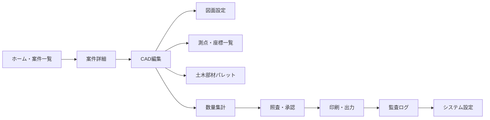
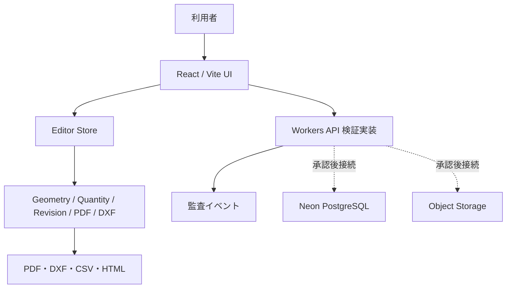

# CivilDraft Web CAD

> 土木施工図、仮設計画図、施工ヤード図、土工・断面図、数量根拠図をブラウザで作成・確認・出力するためのWeb CADです。

CivilDraftは、現場担当者が「図面作成」「数量確認」「照査・承認」「出力」「監査」を一つの画面で扱えるようにすることを目的にしています。現在のリポジトリは、本番デプロイ直前の検証に向けて、フロントエンド、ドメインロジック、Workers API契約、DBマイグレーション、運用文書、テストを整備している段階です。

## 現在の状態

| 領域 | 状態 | 内容 |
| --- | --- | --- |
| フロントエンド | 実装済み | ホーム、案件詳細、CAD編集、図面設定、測点、部材パレット、数量、断面、施工ステップ、図面比較、照査・承認、印刷・出力、監査ログ、システム設定 |
| CAD編集 | 実装済み | グリッド初期表示、線分・矩形・円・ポリライン、Undo/Redo、PDF/DXF入出力、DXF取込、デモ図形5件 |
| 土木部材 | 実装済み | 記号30種、テンプレート6種、パラメトリック7種、Undo可能な配置 |
| 数量・照査 | 実装済み | 数量算出、CSV出力、図面比較、改訂ワークフロー、照査依頼、照査、承認、差戻し、廃止 |
| 出力・管理 | 実装済み | PDF/DXF/CSV出力、出力履歴、監査ログCSV/PDF/HTML出力、設定JSONエクスポート |
| Workers API | 検証用実装済み | Cloudflare Accessヘッダー、相関ID、案件/図面/改訂/数量/出力/監査のインメモリAPI |
| DB | 定義・静的検証済み | Neon PostgreSQL向け `migrations/0001_initial_schema.sql` と `npm run migrations:check`。本番適用は人間承認待ち |
| インフラ/CI | 定義済み | `wrangler.jsonc` に静的配信設定。CIで品質、監査、SBOM/NOTICES、マイグレーション静的検証を実行 |
| セキュリティ | ローカル検証済み | Cloudflare Access前提、ロール権限、監査ログ、CSVインジェクション対策、依存監査、secret候補スキャン |

## 画面構成



## データフロー



## 主な操作

| やりたいこと | 入口 | 動作 |
| --- | --- | --- |
| 新規案件・図面を作る | ホーム | 専用フォームで作成し、案件詳細へ表示 |
| 図面を編集する | CAD編集 | デモ図形5件、グリッド表示、作図ツール、Undo/Redo |
| 測点を入れる | 測点・座標一覧 | CSV貼付、サンプル挿入、取込、図面配置 |
| 部材を置く | 土木部材パレット | 記号、テンプレート、パラメトリック部材を図面へ配置 |
| 数量を確認する | 数量集計 | 図形から数量を算出し、CSVへ出力 |
| 照査・承認する | 照査・承認 | 照査依頼、照査、承認、差戻し、廃止を履歴付きで処理 |
| 出力する | 印刷・出力 | PDF、DXF、CSVを生成し、履歴へ追加 |
| 監査ログを見る | 監査ログ | 保存、承認、出力、認証イベントを表示し、CSV/PDF/HTMLへ出力 |
| 設定を管理する | システム設定 | ロール、ユーザー、マスター、テンプレート、監査設定を確認・エクスポート |

## ローカル開発

```powershell
npm ci
npm run dev -- --host 0.0.0.0 --port 5173
```

ブラウザで `http://127.0.0.1:5173/` を開きます。同一LANから確認する場合は、端末のIPv4アドレスを確認して `http://<IPv4>:5173/` を使います。

停止方法: 起動したターミナルで `Ctrl+C`。

## 品質ゲート

リリース前に以下をすべて通します。

```powershell
npm run lint
npm run typecheck
npm run migrations:check
npm test
npm run e2e
npm run build
npm audit --audit-level=high
npm run sbom
npm run notices
npm run release:audit
```

`release:audit` はリリース前のローカル一括監査です。上記の品質ゲート、Playwright ブラウザE2E、SBOM/NOTICES生成、SBOM/NOTICES drift確認、secret候補スキャンを実行します。

CIでは `.github/workflows/ci.yml` が、lint、型チェック、マイグレーション静的検証、Vitest、Playwright ブラウザE2E、ビルド、依存監査、SBOM生成、SBOM drift確認、THIRD-PARTY-NOTICES drift確認を実行します。

## バックエンドとDB

Workers APIは `src/workers/index.ts` にあります。現在は検証用のインメモリ実装で、API契約、認証ヘッダー、相関ID、監査イベント、主要CRUDを動作確認できます。

本番DBは Neon PostgreSQL を想定し、初期スキーマは `migrations/0001_initial_schema.sql` に定義済みです。リポジトリ内では `npm run migrations:check` により、トランザクション境界、危険DDL不在、外部キー参照、索引、監査/Checksum列を静的検証します。本番DBへの適用、接続文字列登録、Object Storage接続、Cloudflare Accessテナント設定は破壊的・機密性の高い操作を含むため、人間承認後に実施します。

## セキュリティ方針

| 項目 | 方針 |
| --- | --- |
| 認証 | Cloudflare Access の `Cf-Access-Jwt-Assertion` を前提 |
| 権限 | engineer / supervisor / viewer と案件ロールを分離 |
| 監査 | 保存、承認、出力、認証、設定変更を監査対象にする |
| CSV | 数式インジェクションを無害化して出力 |
| シークレット | 接続文字列や秘密情報はリポジトリへ保存しない |
| 本番操作 | デプロイ、DB適用、DNS変更、シークレット変更は明示承認後のみ |

## 運用文書

| 文書 | 内容 |
| --- | --- |
| `docs/architecture/overview.md` | アーキテクチャ概要 |
| `docs/operations/release-procedure.md` | リリース手順 |
| `docs/operations/rollback-procedure.md` | ロールバック手順 |
| `docs/operations/operations-manual.md` | 運用手順 |
| `docs/operations/incident-response.md` | 障害対応手順 |
| `docs/operations/monitoring-readiness.md` | 監視準備チェックリスト |
| `docs/operations/dependency-hygiene.md` | 依存関係とライセンス管理 |
| `docs/operations/pre-release-checklist.md` | リリース前チェックリスト |
| `docs/operations/release-readiness-report.md` | リリース準備レポート |
| `migrations/README.md` | DBマイグレーション手順 |

## 本番直前で止める作業

以下は実行せず、承認待ちで停止します。

- Cloudflare本番デプロイ
- 公開DNS変更
- Neon本番ブランチへのマイグレーション適用
- Object Storageバケット作成・本番接続
- シークレット登録・変更
- Git push、PRマージ、リリースタグ作成

## 現在の既知リスク

| リスク | 状態 | 対応 |
| --- | --- | --- |
| Workers APIがインメモリ実装 | 本番DB接続前 | Neon接続は承認後に実装・検証 |
| Object Storage未接続 | 本番出力保管前 | 署名URL方式を承認後に接続 |
| ブラウザE2Eは最小スモーク | ホーム、新規案件、CAD編集、監査ログHTML出力、照査承認ワークフローを自動確認 | 本番DB/Storage接続後に永続化・障害系E2Eを追加 |
| 本番相当障害系未実行 | DB/Storage未接続 | 接続承認後に障害系を追加検証 |
| 大きいPDF/fontkitチャンク | warning解消済み | PDF/DXF/fontkitを遅延読み込みし、`npm run build` で継続監視 |

## ライセンスと依存関係

- サードパーティ通知: `THIRD-PARTY-NOTICES.md`
- SBOM: `sbom/civildraft-sbom.cdx.json`
- 日本語PDFフォント: `public/fonts/NotoSansJP-Regular-subset.otf`（OFL）

## リリース判断

このリポジトリは「本番デプロイ直前で停止」する方針です。品質ゲート、WebUI確認、DBマイグレーション検証、セキュリティ確認、運用手順確認が完了した時点で、最終承認者へ本番リリース可否を提示します。
