# 🏗️ CivilDraft

> 土木施工図、仮設計画図、施工ヤード図、土工・断面図、数量根拠図を、Webブラウザで作成・確認するための土木施工向け2D CAD

| 製品情報 | 内容 |
| --- | --- |
| 日本語名 | **Civil施工図CAD** |
| 英語名 | **Civil Construction Drawing CAD** |
| 製品名 | **CivilDraft** |
| リポジトリ | `CivilDraft-Web-CAD` |
| 既存技術資産 | [`Civil-Draw`](https://github.com/Kensan196948G/Civil-Draw) |
| 開発基盤 | Claude Code on Linux＋GitHub＋Cloudflare＋Neon |
| 現在の位置付け | Phase 0（棚卸し）完了。Phase 1（プロジェクト基盤・CI品質ゲート）着手中 |

---

## 👋 CivilDraftとは

CivilDraftは、土木工事の日常業務で使う施工図や計画図を、Webブラウザ上で作成・編集・照査する2D CADです。

一般的なCADの線や円に、**工種・規格・測点・数量・施工段階という「土木施工上の意味」**を持たせます。図面、数量根拠、施工順序を別々に管理する負担を減らし、現場説明、協議、照査を分かりやすくすることを目指しています。

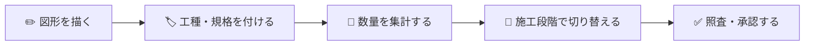

### ひとことで言うと

> 「図を描くだけのCAD」から、「施工図を作り、数量根拠と施工順序まで説明できるCAD」へ。

---

## 👥 どなた向けの製品か

| 対象 | CivilDraftで確認・実施できること | 最初に読む章 |
| --- | --- | --- |
| 👷 現場管理者 | 施工ヤード、仮設、重機範囲、搬入経路、施工順序の作成・説明 | [現場でできること](#-現場でできること) |
| 📐 土木現場技術者 | 測点、座標、中心線、法面、断面、数量根拠の作成・確認 | [主な機能](#-主な機能) |
| 🔬 土木建設研究者 | 図形・業務属性・数量・施工ステップを結び付けたデータモデルの検証 | [研究・技術的な価値](#-研究技術的な価値) |
| 🧑‍💼 経営層 | 作図時間、転記、手戻り、照査負担を減らす狙いとKPI | [導入によって目指す効果](#-導入によって目指す効果) |
| 🖥️ ITシステム部門 | Cloudflare、Neon、GitHub、認証、保存、監査、運用 | [システム構成](#%EF%B8%8F-システム構成) |
| 🛠️ 開発者 | React、TypeScript、Konva、Zustand、IndexedDB、Workers | [開発を始める](#%EF%B8%8F-開発を始める) |

CADやプログラミングに詳しくなくても、まず「何ができるか」と「何は自動判断しないか」を理解できる構成にしています。

---

## 🎯 解決したい課題

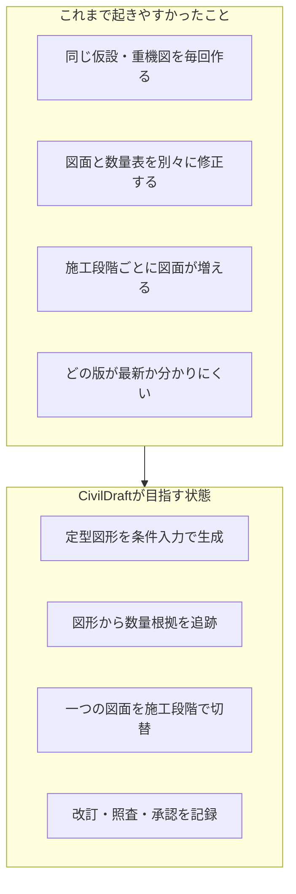

| 現在の負担 | CivilDraftによる改善方針 |
| --- | --- |
| 仮設設備や重機範囲を毎回手作図する | 幅、長さ、半径等を入力して図形を生成する |
| 図面と数量表の転記・修正が別作業 | 図形と数量を関連付け、根拠を強調表示する |
| 施工前・掘削・仮設・完成で別図面が増える | 同じ図面内で施工ステップを切り替える |
| 測点・座標情報が注記だけになる | 測点と座標をデータとして管理する |
| 変更箇所と承認経緯を追いにくい | 新旧比較、改訂、照査、承認を記録する |

---

## 🧭 CivilDraftの立ち位置

CivilDraftは、AutoCADやJw_cadの完全な代替を目指すものではありません。

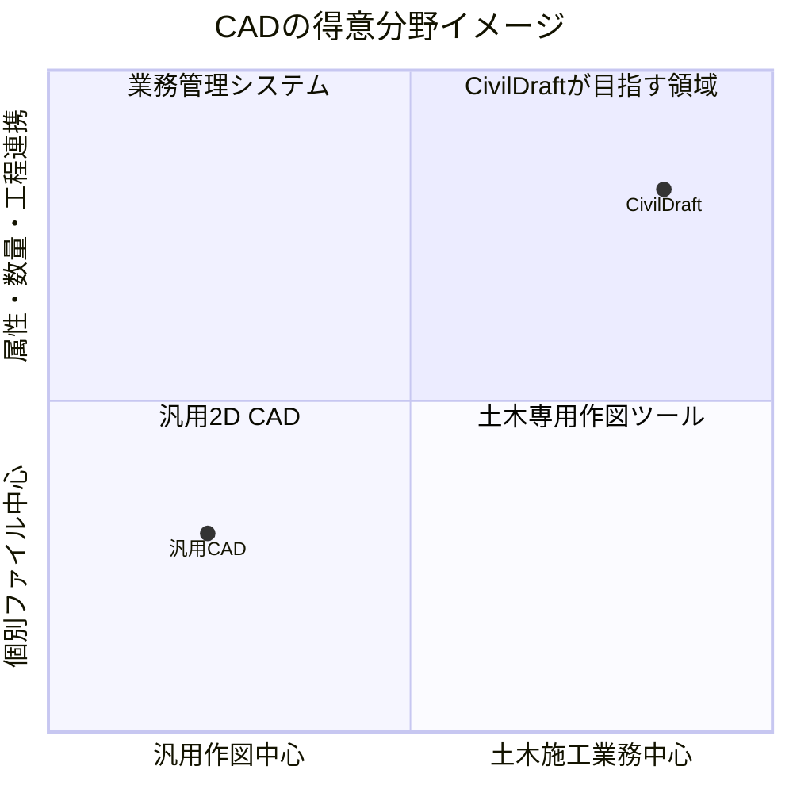

得意にするのは、施工計画、現場説明、仮設配置、数量根拠、施工ステップおよび照査です。高度な道路設計、構造計算、測量網計算、3D BIM/CIM等は初期対象外です。

---

## 🗺️ 主な対象図面

| 分野 | 対象図面例 |
| --- | --- |
| 🏗️ 施工計画 | 施工ヤード計画図、協議・施工説明用図面 |
| 🚧 仮設・安全 | 仮設計画図、重機配置図、クレーン作業計画図、安全設備配置図 |
| 🚚 動線 | 搬入・搬出経路図、作業帯、立入禁止範囲 |
| ⛏️ 土工 | 掘削・埋戻し範囲図、土工平面図、法面・断面図 |
| 🧱 構造物 | 簡易構造図、擁壁、側溝、管渠、桝等の配置図 |
| 🧮 数量 | 数量根拠図、工種・規格別集計図 |

---

## ✨ 主な機能

### 📐 基本作図・編集

- 線、矩形、円、円弧、楕円、ポリライン、スプライン
- 文字、寸法線、引出線、平行線、改訂雲
- トリム、オフセット、回転、ミラー
- レイヤー、スナップ、座標直接入力
- 距離、面積、周長の計測
- ハッチング、土木記号

### 📍 測点・座標

- 測点番号、X・Y座標、標高、備考の管理
- 座標または距離・方位角による点配置
- 座標CSVの取込・出力
- 基準点、水準点、仮BMの表示
- 中心線、測点ピッチ、左右オフセット

### 🚧 仮設・重機・安全設備

- 矢板、腹起し、切梁、仮囲い、バリケード
- 敷鉄板、覆工板、足場、作業帯
- 重機旋回範囲、クレーン作業範囲
- 資材置場、搬入・搬出経路、立入禁止範囲
- 幅、長さ、半径等を入力するパラメトリック作図

### ⛏️ 土工・縦横断

- 切土、盛土、法肩、法尻、掘削、埋戻し
- `1:0.5`、`1:1.0`等の法勾配入力
- 現況線、計画線、地盤高、計画高
- 測点別断面、切盛土の色分け、横断面積
- 平面図と断面図の関連付け、簡易土量

### 🧮 数量と根拠

- 延長、面積、周長、個数、簡易体積
- 工種、種別、細別、規格、単位、工区、測点による集計
- 数量から根拠図形を選択・強調表示
- 図形変更後の再計算と未確定表示
- CSV出力、丸め規則、手動補正理由の記録

### 🕒 施工ステップ

1. 施工前
2. 掘削時
3. 仮設設置時
4. 構造物施工時
5. 埋戻し時
6. 完成時

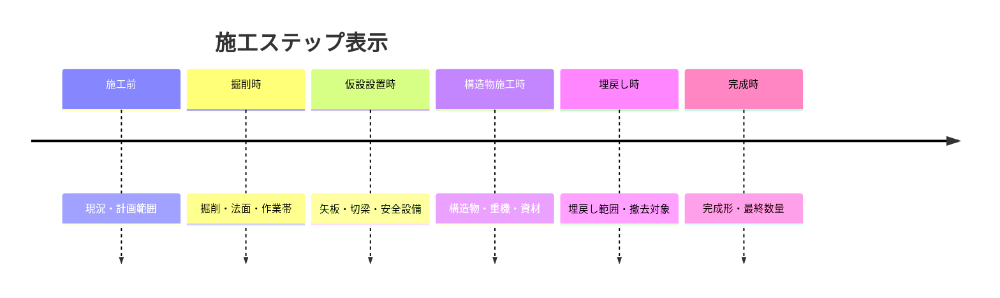

### ✅ 改訂・照査・承認

- 改訂番号、作成日、変更概要
- 新旧図面比較と変更箇所の強調
- 作成中、照査待ち、差戻し、承認待ち、承認済み
- 作成者、照査者、承認者、コメント、日時
- 承認済み版の直接上書き防止

---

## 👷 現場でできること

### 例1：施工ヤード計画図


重機や敷鉄板を毎回一から描かず、寸法や半径を入力して配置します。施工前、掘削時、構造物施工時等を切り替え、同じ図面で施工順序を説明できます。

### 例2：測点を使った施工平面図


欠損、非数値、重複等を取込前に確認します。読み込めなかった行を黙って捨てず、どの行を直すべきか表示します。

### 例3：数量根拠図


数量だけを表示するのではなく、その数値がどの図形から算出されたかを確認できます。図形を変更すると、関連数量を未確定にして再計算します。

---

## 📈 導入によって目指す効果

PoC開始時に現行業務の基準値を測り、次のKPIで効果を評価します。

| 指標 | 目標 |
| --- | --- |
| 定型的な施工・仮設計画図の作成時間 | 現行比30%以上削減 |
| 数量集計表への手入力項目数 | 現行比50%以上削減 |
| 図面と数量集計の重大不整合 | UAT期間中0件 |
| 基本操作の習得 | 代表利用者が60分以内に課題図面を作成 |
| 自動保存からの復旧成功率 | 主要ブラウザで99%以上 |

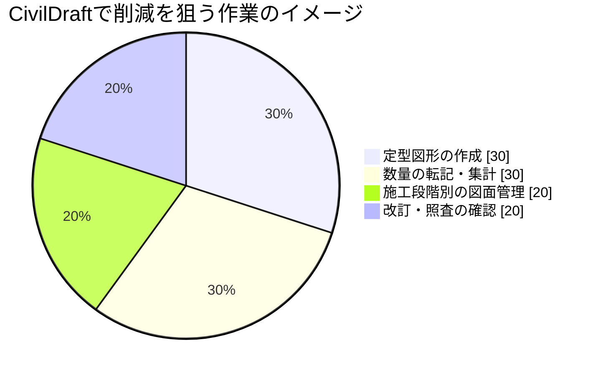

この円グラフは実測結果ではなく、改善対象の構成イメージです。正式な効果はPoC・UATで測定します。

---

## 🔬 研究・技術的な価値

CivilDraftの中核は、Canvas上の図形に土木施工の意味を関連付けるデータモデルです。

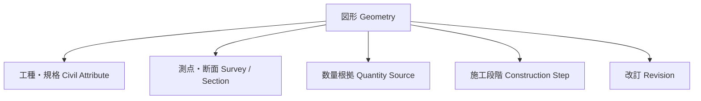

研究・検証テーマの例：

- 図形と施工属性を結ぶ実用的なデータモデル
- 数量根拠の追跡可能性と変更影響の可視化
- 施工ステップによる4D的な説明支援
- Web Canvasで10,000図形を扱う描画最適化
- DXFと土木属性付き独自形式の相互運用
- 土木施工知識をパラメトリック図形として再利用する方法

---

## ⚠️ 重要な注意事項

CivilDraftは**作図・確認・説明を支援するシステム**です。次の正式な判断や計算を自動で保証しません。

| CivilDraftが支援すること | CivilDraftが代替しないこと |
| --- | --- |
| 重機旋回・クレーン作業範囲の図示 | クレーン能力、地耐力、安全離隔の正式判定 |
| 測点・座標の登録と簡易作図 | 測量網平均計算、法定・正式な測量成果 |
| 土工断面と簡易土量 | 正式な設計・積算・出来形判定 |
| 擁壁・仮設材等の配置図 | 構造計算、安定計算、照査計算 |
| DXF入出力 | AutoCAD・Jw_cadとの完全互換 |

> 自動計算結果は必ず人が根拠、単位、条件を確認し、各社・各現場の正式な照査手順に従ってください。「CADがそう言ったから」は、残念ながら安全書類の決め台詞にはなりません。

---

## 💾 データはどこに保存されるか

### 初期版：ローカル完結

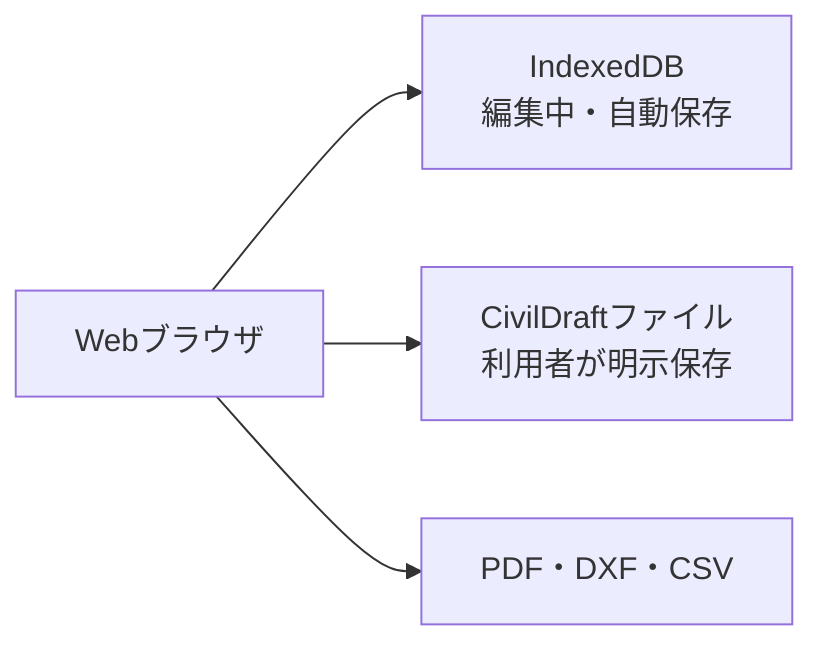

- 編集中データはブラウザ内のIndexedDBへ自動保存します。
- 長期保管や受渡しにはCivilDraftファイルを明示保存します。
- ブラウザデータを消去すると下書きが失われる可能性があります。
- 重要な図面はブラウザ内だけに置かず、正式な保存手順に従います。

### 共有版：将来構成

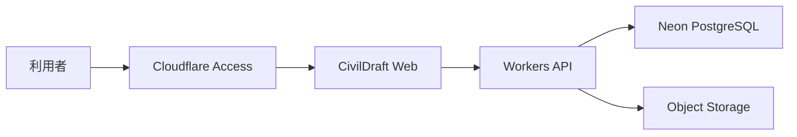

共有、改訂、照査、承認、監査が必要になった段階でNeonとObject Storageを導入します。初期から巨大なクラウド要塞を建てず、必要性を確かめながら育てます。

---

## 🏛️ システム構成

| 構成要素 | 役割 | 正本・位置付け |
| --- | --- | --- |
| Claude Code on Linux | 開発、テスト、ビルド | 開発作業台。正本データを置かない |
| GitHub | ソース、設計書、README、Issue、CI/CD | ソース・文書の正本 |
| Cloudflare Pages | Webフロントエンドの検証公開 | Access配下で公開 |
| Cloudflare Workers | API、認証連携、認可、検証 | 共有版で導入 |
| Cloudflare Access | 検証環境の入口制御 | 許可利用者だけがアクセス |
| IndexedDB | 自動保存、復旧候補 | 編集中のローカルデータ |
| Neon PostgreSQL | 案件、改訂、数量、監査 | 共有版業務メタデータの正本 |
| Object Storage | 図面、PDF、DXF、添付 | 共有版の大容量ファイル候補 |

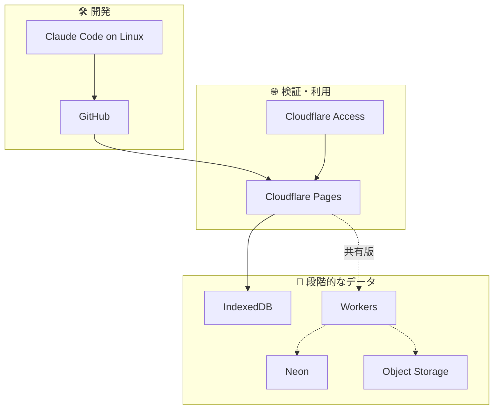

---

## 🧱 ソフトウェア構造

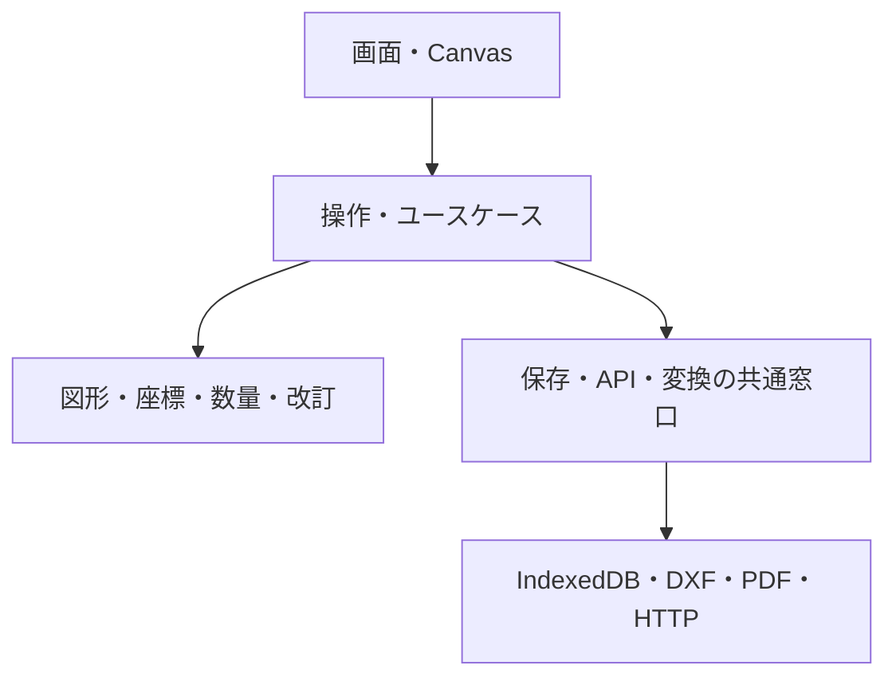

- **画面**と**計算**を分離します。
- 数量や座標計算はReactやCanvasに依存しない形でテストします。
- 保存先がIndexedDBからクラウドへ増えても、CADコアを作り直さない構成にします。
- 既存`Civil-Draw`は丸ごと複製せず、品質・ライセンス・保守性を確認して選択継承します。

---

## 🛣️ 開発ロードマップ

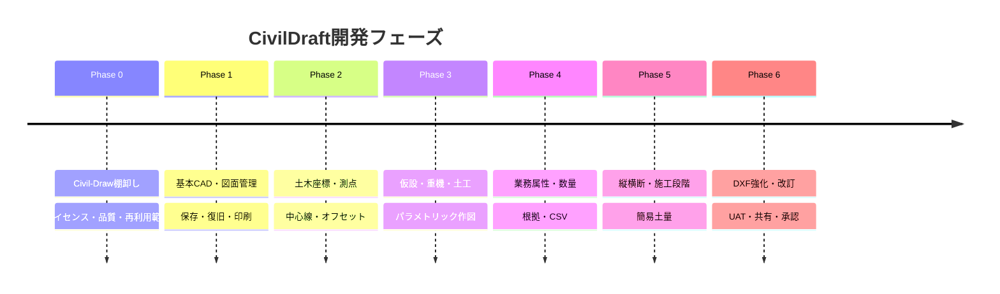

| Phase | 状態 | 到達点 |
| --- | --- | --- |
| 0 | ✅ 完了 | 継承するもの、改修するもの、作り直すものが確定している |
| 1 | 🚧 進行中 | ブラウザで図面を作成・保存・復旧・PDF出力できる |
| 2 | ⬜ 未着手 | 測点と座標を使った施工平面図を作成できる |
| 3 | ⬜ 未着手 | 施工・仮設計画図を定型・条件入力で作成できる |
| 4 | ⬜ 未着手 | 図形から数量根拠を確認・出力できる |
| 5 | ⬜ 未着手 | 平面・断面・施工段階を関連付けられる |
| 6 | ⬜ 未着手 | 代表利用者が実務利用可否をUATで判定できる |

### MVP

最初の実務評価可能版はPhase 1～3です。数量、縦横断、承認を全部載せてから初めて触るのではなく、施工・仮設計画図として役立つかを早めに確認します。

---

## 📊 開発進捗

### 直近のマイルストーン

| 完了日 | 内容 |
| --- | --- |
| 2026-07-14 | ✅ Phase 0: `Civil-Draw`棚卸し・継承台帳・ADR・リスク台帳作成 |
| 2026-07-15 | ✅ Phase 1: プロジェクトスキャフォールド作成（Vite 7 + React 19 + TS 6、共通型システム） |
| 2026-07-15 | ✅ Phase 1: CI品質ゲート構築（GitHub Actions: Lint/Typecheck/Test/Build + Dependency Audit） |
| 2026-07-15 | ✅ `main`ブランチ保護設定（必須ステータスチェック・レビュー承認1件必須） |
| 2026-07-15 | ✅ Phase 1: 内部座標基準の確定（ADR-0012）・幾何演算エンジン移植着手（coordParser/areaCalculator/orthoConstraint等、55テスト） |
| 2026-07-15 | 🔍 Geometry型（Shape判別共用体）の未定義箇所を仕様書横断調査で発見、設計Issue化（Issue #20・後続移植作業の前提条件） |
| 2026-07-15 | ✅ Phase 1: Geometry判別共用体を実装（Issue #20完了・13種のGeometryType全具体型を定義、58テスト）。Issue #5残14ファイル・Issue #18・Issue #19のブロック解除 |
| 2026-07-15 | 🔍 Issue #20実装をコードレビュー（Critical/Important級バグなし。コメント誤字を修正、仕様書§6.2の内部矛盾をIssue #22として起票） |
| 2026-07-15 | ✅ Issue #22対応（仕様書§6.2にSplineGeometry追加、Arc以降8型の正本を実装ファイルに明文化）。Issue closed |
| 2026-07-15 | ✅ Issue #5部分完了: `shapeBBox.ts`（外接矩形計算エンジン）移植、テスト12件追加、70/70 green |

### Open Pull Request

| PR | 内容 | 状態 |
| --- | --- | --- |
| [#1](../../pull/1) | Phase 0 継承台帳・リスク台帳・ADR 11件 | Draft・人間承認待ち |
| [#14](../../pull/14) | Phase 1 スキャフォールド・共通型システム・CI品質ゲート | Draft・人間承認待ち |
| [#16](../../pull/16) | Phase 1 内部座標基準確定（ADR-0012）・幾何演算エンジン移植（部分: 5/18ファイル）・Geometry判別共用体実装（Issue #20） | Draft・人間承認待ち |

> 全PRとも`main`（default branch）宛のため、Mission制約により**人間の明示承認後にのみマージ**します。CTOによる自動mergeは対象外です。

進捗の詳細は[GitHub Projects「CivilDraft-Web-CAD 開発司令盤」](../../projects)、Issue一覧は[Issues](../../issues)を参照してください。

### 🔁 セッション終了時サマリー（2026-07-15）

⏱ セッション時間: 2026-07-14T23:22:09Z 〜 2026-07-15T04:22:09Z UTC（5時間上限）

📊 **本セッションの成果**

- ✅ Phase 0完了（継承台帳・ADR・リスク台帳、PR #1）
- ✅ Phase 1スキャフォールド・CI品質ゲート・型システム基盤（PR #14）
- ✅ ADR-0012（内部座標基準）確定・幾何演算エンジン5/18ファイル移植・**Geometry判別共用体13型を実装**（Issue #15, #5部分, #20完了、PR #16）
- ✅ Issue #20実装をサブエージェントでコードレビュー・指摘反映（コメント誤字修正、仕様書内部矛盾をIssue #22として起票・対応・close）
- ✅ `shapeBBox.ts`（図形の外接矩形計算エンジン、`shapeBBox`/`unionBBox`）移植完了
- 📊 test 70/70・typecheck/lint/build/audit全通過（ローカル実行、CI自体はstacked PR構造によりIssue #17まで未起動）
- 🔒 security critical 0・blocker 0

📋 **次回セッションへの再開ポイント**

1. **Issue #5残ファイル**（P1・ブロック解除済み）: chamferEngine/dimensionEngine/viewportCulling/trimEngine/filletEngine/selection/spatialIndex/snapEngine/shapeTransform/offsetEngine/extendEngine/arrayEngine/scaleEngine/perfHarness/autosave。全てGeometry型で着手可能（正確な残数は次セッション開始時にstate.jsonと突き合わせて再カウントすること）
2. **Issue #18**（P1・DXF変換ロジック移植）・**Issue #19**（P3・templateCatalog.ts）もIssue #20完了によりブロック解除済み
3. **Issue #17**（P2・stacked PRでCI未起動）: `ci.yml`のブランチトリガー拡張は人間確認が必要なため方針決定待ち
4. **Issue #21**（P3・rulerUtils/gridRenderer移植）は独立着手可能
5. **PR #1・#14・#16**はいずれも`main`宛のため人間の明示承認（`y`回答）待ち。PR #14マージ後、PR #16のbaseを`main`へ更新しCI実機確認を行う

🚫 **本セッションでは一切のmain直push・PRマージを実行していません**（Mission制約どおり人間確認待ちの状態を維持）。

---

## 🛡️ セキュリティと運用

- 検証環境はCloudflare Accessで入口を制御します。
- APIキー、DB接続情報、トークンをブラウザ、GitHub、ログへ置きません。
- `.env`はGit管理せず、`.env.example`だけを管理します。
- DXF、CSV、独自形式は、容量・形式・件数・数値・参照を検査します。
- 共有版はAPI側で案件とロールを毎回確認します。
- 承認済み図面は直接上書きせず、新しい改訂を作成します。
- 監査ログへSecretや図面本文を不用意に記録しません。
- バックアップだけで安心せず、リストア試験も行います。

---

## 🧪 品質確認


重点的に確認する項目：

- 距離、面積、交点、座標、方位角、単位、丸めの既知解
- 0、極小・極大、自己交差、閉じていない領域等の境界値
- Undo・Redo後の図形・属性・数量の整合性
- ブラウザ異常終了、保存失敗、容量不足からの復旧
- DXFの要素別往復変換と未対応要素の報告
- 1,000・5,000・10,000図形の性能
- 作成者、照査者、承認者、閲覧者、管理者の権限

### ⚙️ 現在のCI実態（Phase 1時点）

上記は目指す品質確認プロセス全体で、E2E・性能・権限テストはPhase 1後半以降で順次追加します。
現時点で`main`向けPRに自動実行される内容は次のとおりです。

| ジョブ | 内容 | 必須チェック |
| --- | --- | --- |
| `Lint / Typecheck / Test / Build` | ESLint → `tsc --noEmit` → Vitest → `vite build`を直列実行 | ✅ mainブランチ保護で必須化済み |
| `Dependency Audit` | `npm audit --audit-level=high` | ✅ mainブランチ保護で必須化済み |

`main`ブランチはPR必須・レビュー承認1件必須・上記2チェック成功必須（`strict`のためブランチ最新化も要求）・force push禁止・削除禁止で保護されています。

---

## 🛠️ 開発を始める

### 前提

- Linux開発環境
- Git
- Node.js 25系・npm 10以上（`.nvmrc`に記載。`nvm use`で自動選択）
- Cloudflare・Neonは対応フェーズで利用

### 初期化後の標準的な流れ

```bash
git clone <CivilDraft-Web-CADのURL>
cd CivilDraft-Web-CAD
nvm use   # .nvmrcに従いNode 25系を選択
npm ci
npm run dev
```

> `.env`を使う機能（Cloudflare/Neon連携）はPhase 1後半以降で導入予定。現時点ではローカル起動に環境変数は不要です。

### 利用可能なコマンド

`package.json`を正本とします。以下はPhase 1スキャフォールド時点の実績値です。

| コマンド | 用途 |
| --- | --- |
| `npm run dev` | ローカル開発サーバー（Vite） |
| `npm run build` | 本番用ビルド（`tsc -b && vite build`） |
| `npm run preview` | ビルド結果の確認 |
| `npm run lint` | ESLint静的検査（レイヤー間依存方向を`no-restricted-imports`で強制） |
| `npm run typecheck` | TypeScript型検査（`tsc -b --noEmit`） |
| `npm run test` | 単体・結合テスト（Vitest） |
| `npm run test:watch` | Vitestをwatchモードで実行 |

> Playwright E2Eテストは未導入（将来のE2E整備時に追加予定）。導入後、本表に`npm run test:e2e`を追記します。

### 環境変数

- Secretの実値をREADMEや`.env.example`へ書かないでください。
- フロントエンドへ渡す値は公開されても問題ない設定だけに限定します。
- DB接続情報やAPI SecretはWorkers側のSecretとして管理します。
- 初期ローカル版はNeon接続を必須にしません。

---

## 🤝 開発・変更ルール

1. Issueに目的、対象要件ID、受入条件を記載する。
2. 変更前に要件・基本設計・詳細設計への影響を確認する。
3. ブランチで実装し、テストを追加する。
4. Pull Requestへ変更内容、テスト、リスク、画面差分を記載する。
5. CIの型検査、テスト、ビルド、依存検査を通す。
6. 文書・README・既知制限をコードと同時に更新する。
7. レビュー後に保護ブランチへマージする。


---

## 📚 設計文書

| 文書 | 内容 |
| --- | --- |
| [`CivilDraft_要件定義書_20260714.md`](./CivilDraft_要件定義書_20260714.md) | 何を、なぜ、どこまで実現するか |
| [`CivilDraft_基本設計書_20260714.md`](./CivilDraft_基本設計書_20260714.md) | システム構成、画面、機能配置、データ・APIの全体方式 |
| [`CivilDraft_詳細設計仕様書_20260714.md`](./CivilDraft_詳細設計仕様書_20260714.md) | コード、型、処理、DB、API、計算、テストの実装仕様 |
| `README.md` | 製品概要、対象者別案内、導入、開発入口 |

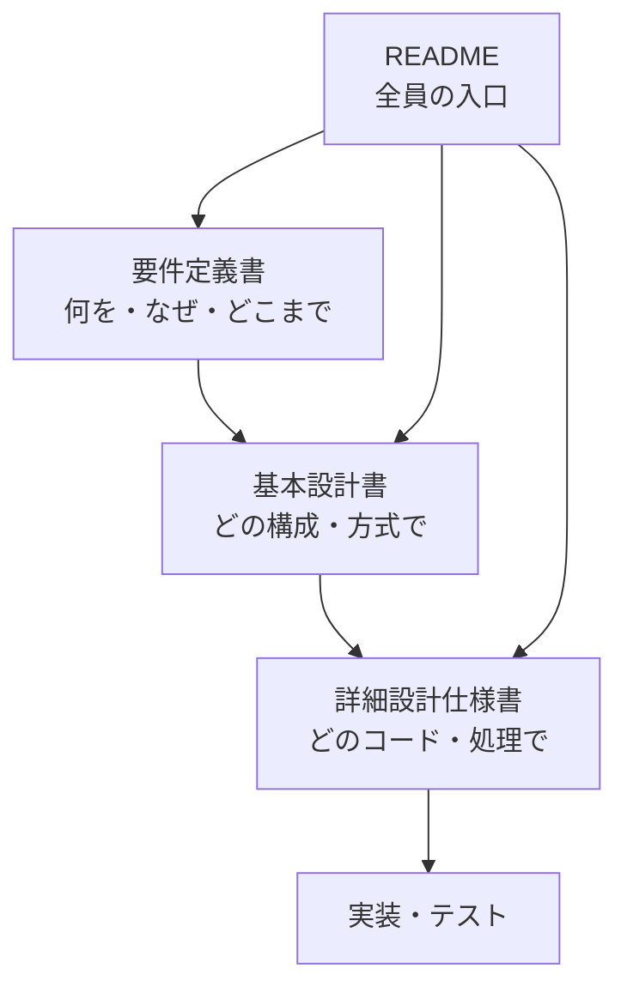

---

## 📌 現在の未決事項

- `Civil-Draw`のコード、依存関係、素材、フォントのライセンスと再利用範囲
- 内部座標の軸方向、角度正方向、基準単位、許容誤差
- CivilDraft独自ファイルの拡張子と圧縮方式
- 対応するDXFバージョンと要素
- 日本語PDFフォントの方式と配布条件
- 共有版の正式な認証、Neon接続、Object Storage
- 数量の標準丸め規則と工種・規格マスター

未決事項は「とりあえず実装」で埋めず、性能・運用・権利・土木実務の確認を経てADRで決定します。

---

## 📄 ライセンス

CivilDraft本体、既存`Civil-Draw`から継承するコード、OSS依存関係、土木記号、テンプレート、フォントのライセンスはPhase 0で確認します。正式なライセンス確定前に、社外公開・再配布・商用利用を判断しないでください。

---

## 🏁 最終目標

> `Civil-Draw`のWeb CAD基盤を選択的に継承し、土木座標、施工・仮設計画、数量算出、断面、施工ステップを統合した「土木施工業務のためのWeb CAD」へ発展させる。

CivilDraftは、いきなり巨大な万能CADを目指しません。現場で繰り返されている作図・転記・説明・照査を一つずつ確実に減らし、土木施工の知識を再利用できる道具として育てていきます。

