# 🏗️ CivilDraft

> 土木施工図、仮設計画図、施工ヤード図、土工・断面図、数量根拠図を、Webブラウザで作成・確認するための土木施工向け2D CAD

| 製品情報 | 内容 |
| --- | --- |
| 日本語名 | **Civil施工図CAD** |
| 英語名 | **Civil Construction Drawing CAD** |
| 製品名 | **CivilDraft** |
| リポジトリ | `CivilDraft-Web-CAD` |
| 既存技術資産 | [`Civil-Draw`](https://github.com/Kensan196948G/Civil-Draw) |
| 開発基盤 | Claude Code on Linux＋GitHub＋Cloudflare＋Neon |
| 現在の位置付け | **土木特化Web CADの技術プレビュー（v0.1.2）**。ブラウザ内CADコアと土木ドメイン部品は拡充中。Workers APIはP0縦線（Project作成/更新→Drawing作成/更新→Revision作成→Content/数量保存→照査/承認→Export作成→Audit検索）を実装し、本番稼働中（`civildraft-web-cad.mirai-dx-platform.com`）。2026-07-21のv0.1.0でpersistX全9ハンドラのNeon永続化配線・監査ログ永続化が本番反映され、Neon migration 0001〜0004適用済み（0003=Neon直接格納・ADR-0014、0004=ID列text整合・ADR-0015）、書き込み系fail-closed暫定措置は撤去済み。2026-07-22のv0.1.1（PR #72・Issue #68恒久対応）でpersistX複合書き込み5種を単一トランザクションへ統合し本番反映済み。2026-07-22のv0.1.2（PR #75・Issue #73恒久対応）でquantity_items孤立item解消も本番反映済み。Cloudflare Access Application設定とAccess Secret登録（人間実施）が完了するまでAPIは認証構成fail-closed（401/503）で安全に停止 |

---

## 👋 CivilDraftとは

CivilDraftは、土木工事の日常業務で使う施工図や計画図を、Webブラウザ上で作成・編集・照査する2D CADです。

一般的なCADの線や円に、**工種・規格・測点・数量・施工段階という「土木施工上の意味」**を持たせます。図面、数量根拠、施工順序を別々に管理する負担を減らし、現場説明、協議、照査を分かりやすくすることを目指しています。

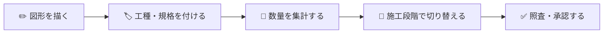

### ひとことで言うと

> 「図を描くだけのCAD」から、「施工図を作り、数量根拠と施工順序まで説明できるCAD」へ。

---

## 👥 どなた向けの製品か

| 対象 | CivilDraftで確認・実施できること | 最初に読む章 |
| --- | --- | --- |
| 👷 現場管理者 | 施工ヤード、仮設、重機範囲、搬入経路、施工順序の作成・説明 | [現場でできること](#-現場でできること) |
| 📐 土木現場技術者 | 測点、座標、中心線、法面、断面、数量根拠の作成・確認 | [目指す機能](#-目指す機能) |
| 🔬 土木建設研究者 | 図形・業務属性・数量・施工ステップを結び付けたデータモデルの検証 | [研究・技術的な価値](#-研究技術的な価値) |
| 🧑‍💼 経営層 | 作図時間、転記、手戻り、照査負担を減らす狙いとKPI | [導入によって目指す効果](#-導入によって目指す効果) |
| 🖥️ ITシステム部門 | Cloudflare、Neon、GitHub、認証、保存、監査、運用 | [システム構成](#%EF%B8%8F-システム構成) |
| 🛠️ 開発者 | React、TypeScript、Konva、Zustand、IndexedDB、Workers | [開発を始める](#%EF%B8%8F-開発を始める) |

CADやプログラミングに詳しくなくても、まず「何ができるか」と「何は自動判断しないか」を理解できる構成にしています。

---

## 🧭 いま何ができて、何を目指すか

このREADMEは、**「いま実際に動くもの」「コードや画面はあるが試作・未統合のもの」「これから製品化で仕上げるもの」**を分けて説明します。以降の「解決したい課題」「主な対象図面」「目指す機能」等は**製品ビジョン（目標）**を含み、そのすべてが現時点で製品機能として動くわけではありません。現時点の実装範囲は、次の「✅ 実装済み機能」を参照してください。

| | いま動くこと（実装済み/試作） | これから製品化で仕上げること |
| --- | --- | --- |
| 🖥️ 動作環境 | Webブラウザ内だけで完結（サーバー・DB不要） | Cloudflare Workers + Neonで共有版へ拡張（R2は任意・将来の共有ストレージ用途） |
| ✏️ 作図 | 選択・線・矩形・円・ポリラインの作図、パン/ズーム/選択、Undo/Redo | 測点・仮設・重機・土工などの土木パラメトリック作図 |
| 💾 保存 | ブラウザ内IndexedDBへ自動保存・起動時復元 | 案件・改訂・数量・監査をサーバーで共有 |
| 🔄 相互運用 | DXF入出力（単位を内部mmへ変換） | DXF強化・独自形式・改訂/照査/承認 |
| 🧮 業務属性 | 数量・測量・断面・施工ステップ・承認のドメイン/UI試作あり | CAD本体との双方向連動、実案件保存、権限、監査 |

> つまり、現時点のCivilDraftは「土木記号・テンプレートを配置し、DXFで受け渡しでき、ブラウザに自動保存される基本的な2D作図ツール」に、数量・測量・断面・承認などのドメイン部品を試作として載せた段階です。土木業務属性を実案件で一気通貫に扱う製品機能は、CAD本体・クラウド保存・権限・監査との統合が次の主戦場です。

### 🎯 競合代替度の目安

既存CADの完全コピーではなく、土木成果物を早く作るWeb CADとして段階的に置き換える前提です。

| 対象 | 現在の代替度 | 判断 |
| --- | ---: | --- |
| AutoCAD LT / BricsCAD Lite 的な2D作図 | 30〜40% | 作図・表示・DXF/PDFの核はあるが、編集コマンドのUI配線、レイヤー/寸法/印刷スタイル、DWG/JWW/SXF互換が不足 |
| 土木数量・横断・簡易計画ツール | 50〜65% | 数量、測量、断面、土量、施工ステップのドメイン部品は強い。図面連動と成果物化が次の壁 |
| Civil 3D 的なBIM/CIM | 10〜20% | 線形・断面の基礎はあるが、サーフェス、縦断、コリドー、動的土木オブジェクト連携は未成熟 |
| SaaS型CAD共有・承認・監査 | 35〜45% | P0縦線API、案件メンバー認可、メタデータ/内容/数量の楽観ロック、照査/承認、Exportジョブ、監査記録は動き始めたが、本番Neon接続、Accessテナント設定、監査永続化の運用検証が未完 |
| プロダクト全体 | 35〜50% | 技術プレビューとして有望。80〜90%代替を名乗るには、実務ワークフローを縦に1本完成させる必要がある |

---

## ✅ 実装済み機能（現時点）

以下は**実際にコードとして存在し、テスト済みの機能**です（正本＝根拠となる実装ファイル）。「実装済みだが未配線」の部品も正直に区別して記載します。

| 機能 | 状態 | 概要 | 正本 |
| --- | --- | --- | --- |
| 幾何演算エンジン | ✅ 実装済み | トリム・延長・オフセット・フィレット・面取り・回転/ミラー・配列・尺度・スナップ・寸法・ハッチ生成・選択判定・空間索引(R-tree)・カリング・外接矩形・面積・座標パーサ 等 | `src/domain/geometry/`（19ファイル） |
| Canvas描画・操作 | ✅ 実装済み | 6レイヤー構成の描画、パン・ズーム・クリック/Shiftクリック選択、レイヤー表示制御、500図形超でビューポートカリング | `src/app/canvas/`（`CanvasStage.tsx` 他） |
| レイヤー管理 | ✅ 実装済み | 表示/非表示・ロック・印刷可否・線幅・追加/削除/リネーム/並替（エディタのレイヤーパネル）。**ロック済みレイヤーは編集コマンド・プロパティ変更・作図から除外**（§6.3 / Issue #40）、PDF出力はprintable=falseを除外、DXFはレイヤー色/線種を出力。**工種別レイヤーテンプレート5種**（施工ヤード/仮設/測量/数量根拠/汎用）をワンクリック適用（同名レイヤーは維持・不足分のみ追加） | `src/app/store/editorStore.ts`（LayerSlice）・`src/domain/catalog/layerTemplates.ts`・`src/domain/tools/editGeometry.ts`・`src/domain/pdf/pdfExporter.ts`・`src/domain/dxf/dxfExporter.ts` |
| 作図ツール | ✅ 実装済み | 選択・線・矩形・円・ポリライン（ドラフトプレビュー・自動確定つき状態機械） | `src/domain/tools/draftGeometry.ts`・ToolSlice |
| Undo / Redo | ✅ 実装済み | 「1操作＝1コマンド」方式、履歴上限100、差分のみ保持 | `src/domain/commands/`・`editorStore.ts` |
| DXF入出力 | ✅ 実装済み | `$INSUNITS`(mm/cm/m)を内部mmへ変換して取込、書出時は単位宣言と座標を整合。未対応要素は警告(issues)に集約。ツールバーの📥取込/📤出力ボタンから操作可能 | `src/domain/dxf/` |
| PDF出力 | ✅ 実装済み | A3等の用紙・縮尺・図面枠・表題欄つきベクター出力（pdf-lib）。日本語フォント未設定時は警告つき代替描画（文字化け黙殺なし）。ツールバーの📄ボタンから操作可能 | `src/domain/pdf/` |
| 土木記号・テンプレート | ✅ 実装済み | 土木記号30種（仮設・車両・測量・土工・構造物）、作図テンプレート6種 | `src/domain/catalog/` |
| 土木ドメイン部品 | 🟡 **試作・一部配線** | 測量座標、中心線、線形、パラメトリック7種、数量、断面、土量、施工ステップ、改訂ワークフロー、図面差分のドメイン/画面を実装。ただし実案件保存・CADハイライト・権限・監査との統合は未完 | `src/domain/survey/`・`src/domain/alignment/`・`src/domain/quantities/`・`src/domain/sections/`・`src/app/pages/` |
| 数量⇔図形連動 | 🟡 **双方向ハイライト実装（#42）** | ①数量明細「図面で確認」→ 根拠図形を CAD 編集でオレンジ破線ハイライト（第一弾）②CAD 編集で図形クリック → 数量集計画面で根拠図形を含む明細行をハイライト表示（第二弾）。分割画面モードは将来 | `src/app/store/editorStore.ts`（highlightedGeometryIds）・`src/app/canvas/CanvasStage.tsx`・`src/app/pages/QuantitySummaryPage.tsx` |
| 自動保存（IndexedDB） | ✅ 実装・**配線済み** | 起動時に最新下書きを復元、図形/レイヤー変更をデバウンス保存、保存失敗は握り潰さず警告表示 | `src/infrastructure/autosave/`・`App.tsx`（`AutosaveManager`） |
| 認証（Cloudflare Access） | 🟡 **部品＋JWT二次防御実装・本番テナント未設定** | Access配下のidentity取得層とロール定義に加え、Workers側にJWT二次防御層（RS256署名・iss/aud/exp/nbf検証、JWKS取得、fail-closed）を実装。v0.1.3から actorId は署名検証済みJWTの `email` を採用（`Cf-Access-Authenticated-User-Email` ヘッダー偽装対策）。`CIVILDRAFT_ACCESS_TEAM_DOMAIN`/`CIVILDRAFT_ACCESS_AUD`設定時に全経路でJWT検証、`neon-r2`本番モードでは検証設定を必須化（未設定なら503）。本番テナント設定・画面本体への配線は未完 | `src/infrastructure/auth/accessIdentity.ts`・`src/workers/accessJwt.ts`・`src/workers/index.ts`・`tests/unit/workers/accessJwt.test.ts`・`tests/unit/workers/auditHardening.test.ts` |
| セキュリティヘッダー | ✅ 実装・**本番適用済み** | `X-Content-Type-Options: nosniff` / `X-Frame-Options: SAMEORIGIN` / `Referrer-Policy: no-referrer` / `Permissions-Policy` / `Strict-Transport-Security` を API・SPA 全応答へ付与（`assets.run_worker_first` で SPA 配信にも適用）。v0.1.3（PR #79）で本番反映 | `src/workers/index.ts`・`wrangler.jsonc`・`tests/unit/workers/auditHardening.test.ts` |
| 共有APIクライアント | 🟡 **画面配線済み・本番未接続** | ブラウザ側から Workers API のP0縦線を呼ぶ `CivilDraftApiClient` を実装し、CAD編集画面の「共有保存」「共有再読込」ボタンからProject作成→Drawing作成→Revision作成→Content保存→再読込→Export作成を実行できる経路を配線。案件詳細の図面行から案件番号・図面番号・改訂番号をエディタへ渡し、保存ペイロードへ反映する。実Workersハンドラ差し込みテストと画面/ナビゲーションテストで検証済み。Secretsは扱わず、Cloudflare Accessの同一オリジン認証を前提にする | `src/infrastructure/cloud/civilDraftApiClient.ts`・`src/app/pages/CadEditorPage.tsx`・`src/app/pages/ProjectDetailPage.tsx`・`tests/unit/infrastructure/cloud/civilDraftApiClient.test.ts`・`tests/unit/app/pages/CadEditorPage.test.tsx` |
| Workers API / Neon | 🟡 **P0縦線実装・本番永続化有効** | 19経路（18仕様経路+監査チェーン検証）で業務応答または入力/認可エラーを返す。Access JWT検証、相関ID伝播、Project作成/更新、Drawing作成/更新、Revision作成、Content保存/再読込、数量スナップショット、照査/承認ワークフロー、Export作成/取得、Audit検索、案件メンバー認可、楽観ロックを実装。persistX全ハンドラをNeon永続化へ配線済み（トランザクション化・fail-visible監査）。監査ログhash chain（ADR-0009 / Issue #61）実装済み: `entry_hash=SHA-256(previous_hash|canonical payload)` を `persistAuditLog` で計算し、`GET /api/v1/audit-logs/verify` でチェーン検証（改ざん検知）。**監査ログ一覧は期間/イベント種別/actorフィルタ+カーソルページング対応（Issue #85）**。migration 0001〜0004本番適用済み、0005は未適用（人間判断待ち）。Accessテナント設定（人間）までは認証構成fail-closed（401/503） | `src/workers/index.ts`・`src/workers/apiStore.ts`・`src/workers/neonApiStore.ts`・`src/workers/auditChain.ts`・`src/workers/persistence.ts`・`migrations/` |
| SBOM・ライセンス衛生 | ✅ 実装済み | CycloneDX SBOM生成、サードパーティ表記生成、依存衛生手順 | `npm run sbom` / `npm run notices`・`docs/operations/dependency-hygiene.md` |

> 🟡 の「未配線」は、部品（モジュール）としては実装・テスト済みだが、まだアプリ本体から呼び出していない状態を指します。誇張せずそのまま記載しています。

---

## 🗺️ システム構成図（現在の実装）

### いま動いている構成（ブラウザ内で完結）

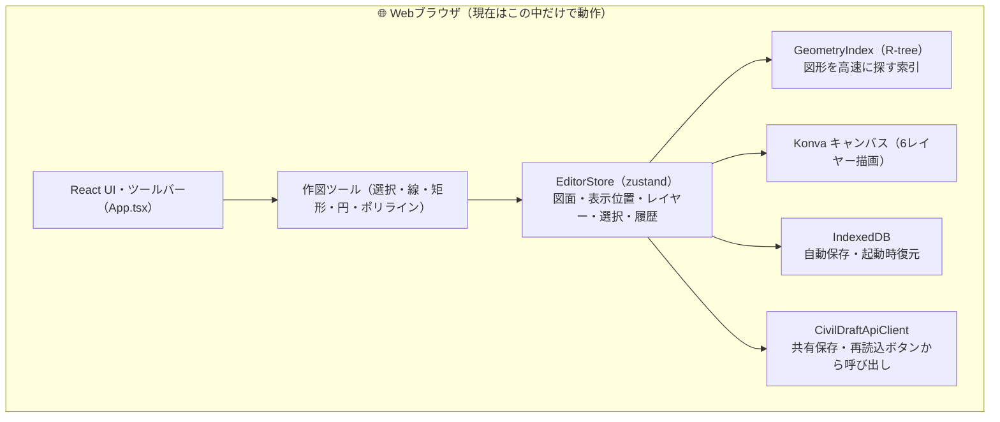

> ⚠️ ローカルのWeb CAD利用はサーバー・データベース不要です。一方で共有版のWorkers API契約とNeon migrationは追加済みです。認証（Cloudflare Access）は部品/APIヘッダー契約までで、画面本体と本番テナントには未配線です。

### レイヤー構造（依存の向き）

内側ほど土木の計算そのもの、外側ほど画面・保存・通信です。**内側は外側を知らない**依存方向を、ESLintの`no-restricted-imports`で機械的に強制しています（domain層はReact/Konva/Zustandや上位層をimportできない等）。

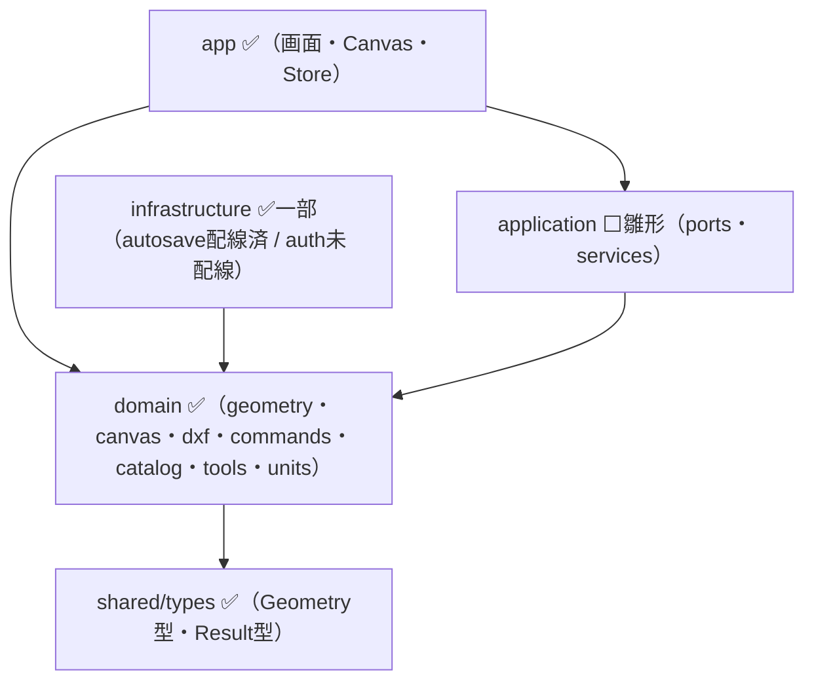

> 📖 図の詳細版（データフローのシーケンス図・座標系の解説・DXF入出力フロー・用語集）は
> [`docs/architecture/overview.md`](./docs/architecture/overview.md) を参照してください。
> ✅＝実装済み、⬜＝ディレクトリだけ用意した雛形（Phase 2 以降で実装）。

---

## 📁 ディレクトリ構造

実際の `src/` の構成です（✅＝実装済み、⬜＝雛形）。

```text
src/
├─ shared/          ✅ 共通型（Geometry判別共用体・Result型・Brand型）
├─ domain/          ✅ 中核ロジック（React/Konvaに非依存・テスト容易）
│  ├─ geometry/     ✅ 幾何演算エンジン19ファイル（トリム/オフセット/スナップ/空間索引 等）
│  ├─ canvas/       ✅ 座標変換・グリッド・用紙・ルーラー
│  ├─ commands/     ✅ Undo/Redo コマンド（1操作=1コマンド）
│  ├─ dxf/          ✅ DXF入出力（単位変換）
│  ├─ catalog/      ✅ 土木記号30種・テンプレート6種
│  ├─ tools/        ✅ 作図ツール状態機械（ドラフト生成）
│  ├─ units/        ✅ 単位換算
│  ├─ pdf/          ✅ PDF出力（用紙・縮尺・図面枠・表題欄、pdf-lib）
│  └─ （civil-attributes / coordinates / quantities / revisions / validation は雛形 ⬜）
├─ app/             ✅ アプリ層（React）
│  ├─ canvas/       ✅ CanvasStage・GeometryRenderer・Ruler・SnapMarker
│  └─ store/        ✅ EditorStore（zustand）と供給層
├─ infrastructure/  ✅一部
│  ├─ autosave/     ✅ IndexedDB 自動保存（配線済み）
│  ├─ auth/         🟡 Cloudflare Access identity（部品のみ・未配線）
│  └─ cloud/        🟡 Workers APIクライアント契約（CAD画面へ配線済み・本番未接続）
├─ application/     ⬜ ユースケースの窓口（ports・services・commands）雛形
├─ features/ pages/ stores/ components/ workers/   ⬜ 雛形（Phase 2 以降）
└─ main.tsx         ✅ エントリポイント
```

---

## 🎯 解決したい課題

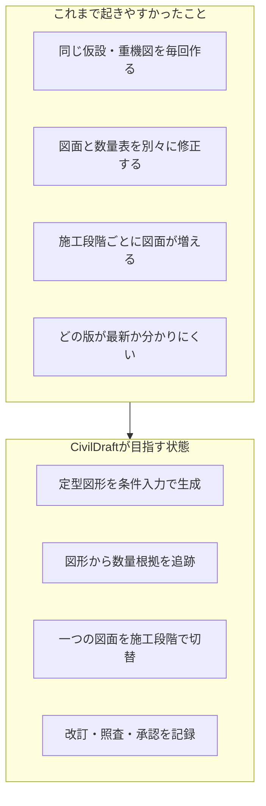

| 現在の負担 | CivilDraftによる改善方針 |
| --- | --- |
| 仮設設備や重機範囲を毎回手作図する | 幅、長さ、半径等を入力して図形を生成する |
| 図面と数量表の転記・修正が別作業 | 図形と数量を関連付け、根拠を強調表示する |
| 施工前・掘削・仮設・完成で別図面が増える | 同じ図面内で施工ステップを切り替える |
| 測点・座標情報が注記だけになる | 測点と座標をデータとして管理する |
| 変更箇所と承認経緯を追いにくい | 新旧比較、改訂、照査、承認を記録する |

---

## 🧭 CivilDraftの立ち位置

CivilDraftは、AutoCADやJw_cadの完全な代替を目指すものではありません。

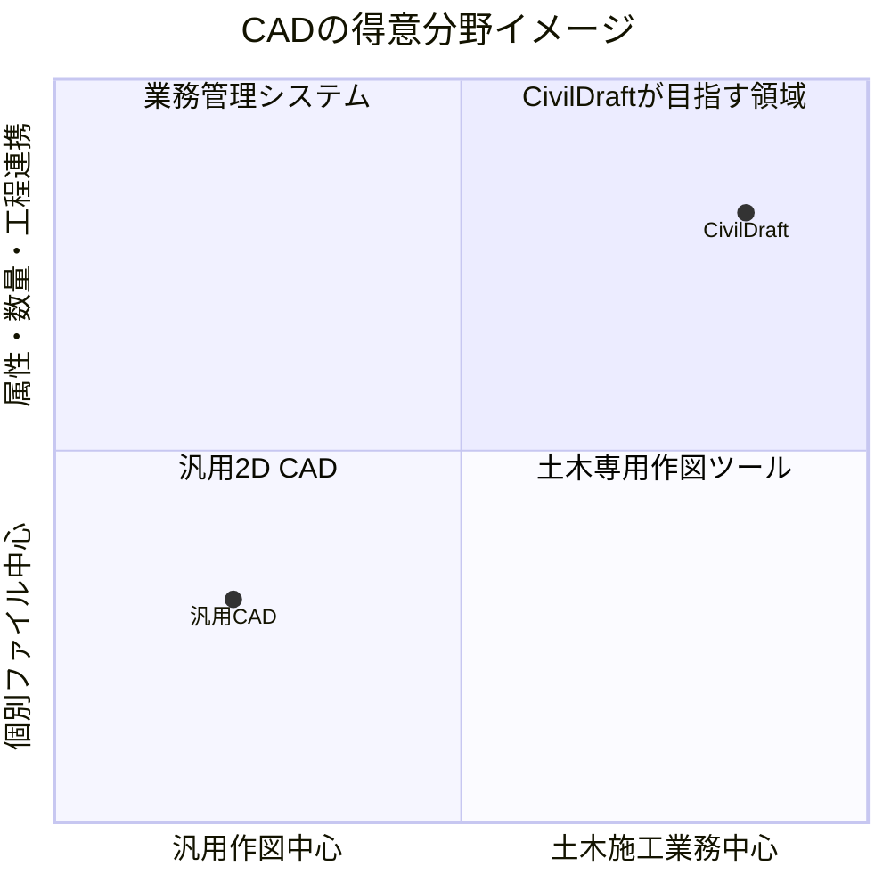

得意にするのは、施工計画、現場説明、仮設配置、数量根拠、施工ステップおよび照査です。高度な道路設計、構造計算、測量網計算、3D BIM/CIM等は初期対象外です。

---

## 🗺️ 主な対象図面

| 分野 | 対象図面例 |
| --- | --- |
| 🏗️ 施工計画 | 施工ヤード計画図、協議・施工説明用図面 |
| 🚧 仮設・安全 | 仮設計画図、重機配置図、クレーン作業計画図、安全設備配置図 |
| 🚚 動線 | 搬入・搬出経路図、作業帯、立入禁止範囲 |
| ⛏️ 土工 | 掘削・埋戻し範囲図、土工平面図、法面・断面図 |
| 🧱 構造物 | 簡易構造図、擁壁、側溝、管渠、桝等の配置図 |
| 🧮 数量 | 数量根拠図、工種・規格別集計図 |

---

## ✨ 目指す機能

> ⚠️ この節は**製品ビジョンとしての目標機能**を示します。現時点で製品機能として動く範囲、試作として存在する範囲、未配線の範囲は「[✅ 実装済み機能](#-実装済み機能現時点)」で区別しています。測点・座標、仮設・重機、土工、数量、施工ステップ、改訂・照査は部品や画面があっても、実案件ワークフローとして完成しているとは読み取らないでください。

### 📐 基本作図・編集

- 線、矩形、円、円弧、楕円、ポリライン、スプライン
- 文字、寸法線、引出線、平行線、改訂雲
- トリム、オフセット、回転、ミラー
- レイヤー、スナップ、座標直接入力
- 距離、面積、周長の計測
- ハッチング、土木記号

### 📍 測点・座標

- 測点番号、X・Y座標、標高、備考の管理
- 座標または距離・方位角による点配置
- 座標CSVの取込・出力
- 基準点、水準点、仮BMの表示
- 中心線、測点ピッチ、左右オフセット

### 🚧 仮設・重機・安全設備

- 矢板、腹起し、切梁、仮囲い、バリケード
- 敷鉄板、覆工板、足場、作業帯
- 重機旋回範囲、クレーン作業範囲
- 資材置場、搬入・搬出経路、立入禁止範囲
- 幅、長さ、半径等を入力するパラメトリック作図

### ⛏️ 土工・縦横断

- 切土、盛土、法肩、法尻、掘削、埋戻し
- `1:0.5`、`1:1.0`等の法勾配入力
- 現況線、計画線、地盤高、計画高
- 測点別断面、切盛土の色分け、横断面積
- 平面図と断面図の関連付け、簡易土量

### 🧮 数量と根拠

- 延長、面積、周長、個数、簡易体積
- 工種、種別、細別、規格、単位、工区、測点による集計
- 数量から根拠図形を選択・強調表示
- 図形変更後の再計算と未確定表示
- CSV出力、丸め規則、手動補正理由の記録

### 🕒 施工ステップ

1. 施工前
2. 掘削時
3. 仮設設置時
4. 構造物施工時
5. 埋戻し時
6. 完成時

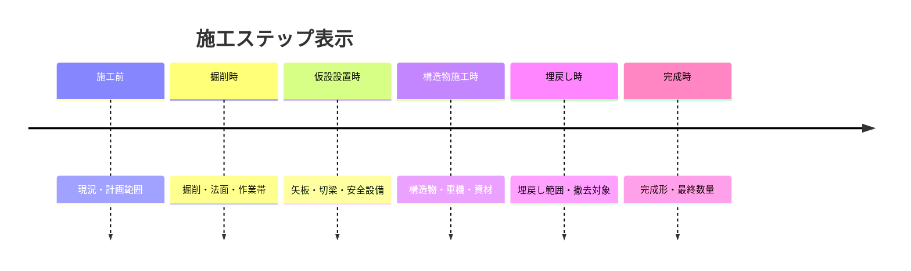

### ✅ 改訂・照査・承認

- 改訂番号、作成日、変更概要
- 新旧図面比較と変更箇所の強調
- 作成中、照査待ち、差戻し、承認待ち、承認済み
- 作成者、照査者、承認者、コメント、日時
- 承認済み版の直接上書き防止

---

## 👷 現場でできること

### 例1：施工ヤード計画図

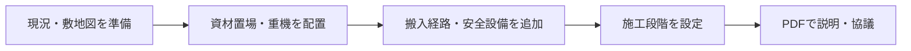

重機や敷鉄板を毎回一から描かず、寸法や半径を入力して配置します。施工前、掘削時、構造物施工時等を切り替え、同じ図面で施工順序を説明できます。

### 例2：測点を使った施工平面図

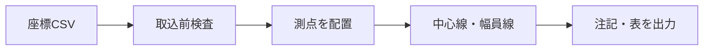

欠損、非数値、重複等を取込前に確認します。読み込めなかった行を黙って捨てず、どの行を直すべきか表示します。

### 例3：数量根拠図

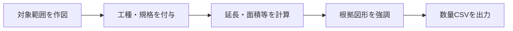

数量だけを表示するのではなく、その数値がどの図形から算出されたかを確認できます。図形を変更すると、関連数量を未確定にして再計算します。

---

## 📈 導入によって目指す効果

PoC開始時に現行業務の基準値を測り、次のKPIで効果を評価します。

| 指標 | 目標 |
| --- | --- |
| 定型的な施工・仮設計画図の作成時間 | 現行比30%以上削減 |
| 数量集計表への手入力項目数 | 現行比50%以上削減 |
| 図面と数量集計の重大不整合 | UAT期間中0件 |
| 基本操作の習得 | 代表利用者が60分以内に課題図面を作成 |
| 自動保存からの復旧成功率 | 主要ブラウザで99%以上 |

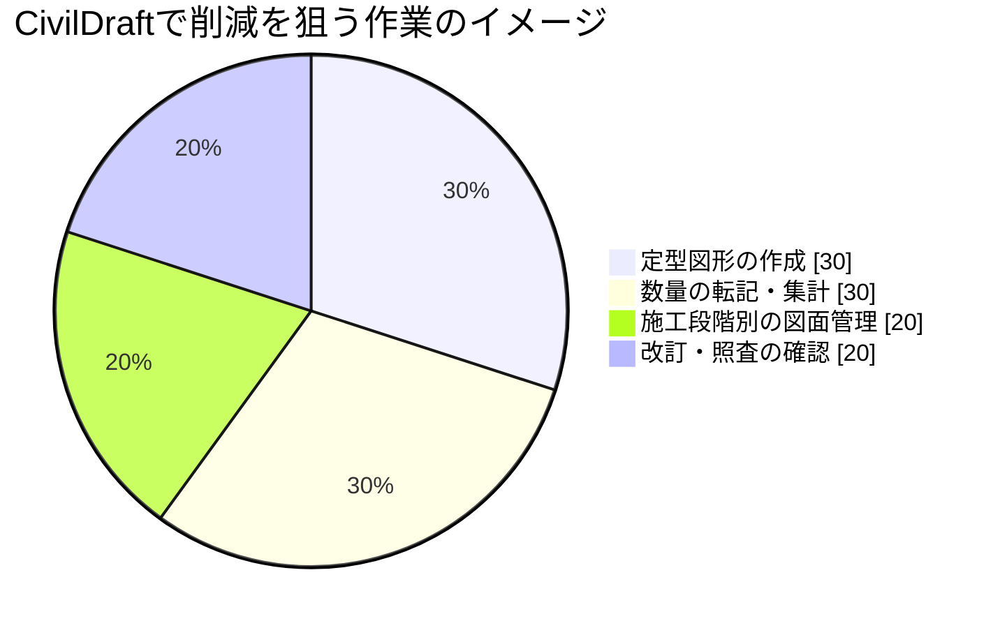

この円グラフは実測結果ではなく、改善対象の構成イメージです。正式な効果はPoC・UATで測定します。

---

## 🔬 研究・技術的な価値

CivilDraftの中核は、Canvas上の図形に土木施工の意味を関連付けるデータモデルです。

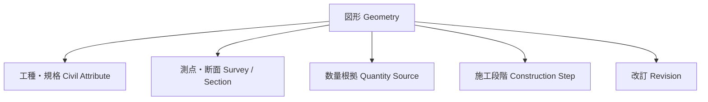

研究・検証テーマの例：

- 図形と施工属性を結ぶ実用的なデータモデル
- 数量根拠の追跡可能性と変更影響の可視化
- 施工ステップによる4D的な説明支援
- Web Canvasで10,000図形を扱う描画最適化
- DXFと土木属性付き独自形式の相互運用
- 土木施工知識をパラメトリック図形として再利用する方法

---

## ⚠️ 重要な注意事項

CivilDraftは**作図・確認・説明を支援するシステム**です。次の正式な判断や計算を自動で保証しません。

| CivilDraftが支援すること | CivilDraftが代替しないこと |
| --- | --- |
| 重機旋回・クレーン作業範囲の図示 | クレーン能力、地耐力、安全離隔の正式判定 |
| 測点・座標の登録と簡易作図 | 測量網平均計算、法定・正式な測量成果 |
| 土工断面と簡易土量 | 正式な設計・積算・出来形判定 |
| 擁壁・仮設材等の配置図 | 構造計算、安定計算、照査計算 |
| DXF入出力 | AutoCAD・Jw_cadとの完全互換 |

> 自動計算結果は必ず人が根拠、単位、条件を確認し、各社・各現場の正式な照査手順に従ってください。「CADがそう言ったから」は、残念ながら安全書類の決め台詞にはなりません。

---

## 💾 データはどこに保存されるか

### 初期版：ローカル完結

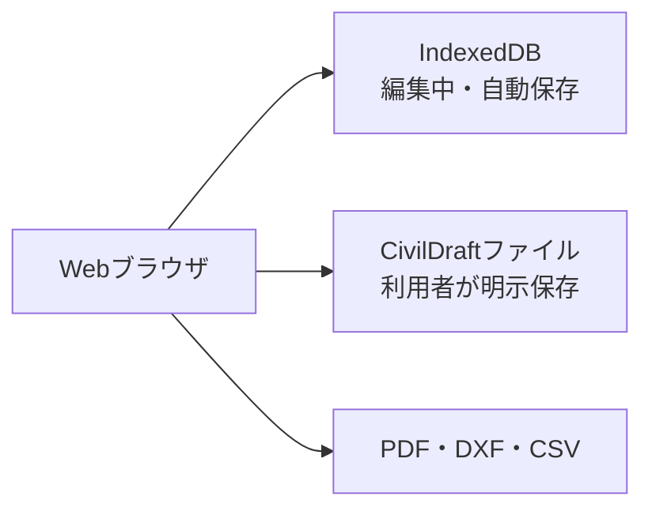

- 編集中データはブラウザ内のIndexedDBへ自動保存します（✅ Phase 1で実装・配線済み。起動時に最新下書きを復元）。
- DXFでの受け渡し・PDF出力は実装済みです（✅）。CivilDraft独自形式での明示ファイル保存は整備中です（🔄）。
- ブラウザデータを消去すると下書きが失われる可能性があります。
- 重要な図面はブラウザ内だけに置かず、正式な保存手順に従います。

### 共有版：将来構成

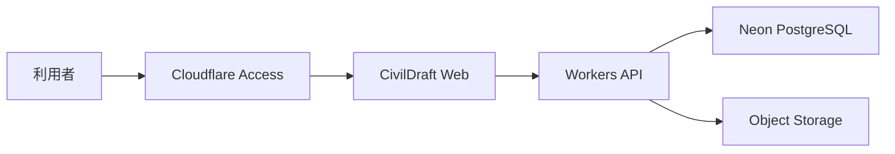

共有、改訂、照査、承認、監査が必要になった段階でNeonとObject Storageを導入します。初期から巨大なクラウド要塞を建てず、必要性を確かめながら育てます。

---

## 🏛️ システム構成

| 構成要素 | 役割 | 正本・位置付け |
| --- | --- | --- |
| Claude Code on Linux | 開発、テスト、ビルド | 開発作業台。正本データを置かない |
| GitHub | ソース、設計書、README、Issue、CI/CD | ソース・文書の正本 |
| Cloudflare Pages | Webフロントエンドの検証公開 | Access配下で公開 |
| Cloudflare Workers | API、認証連携、認可、検証 | 共有版で導入 |
| Cloudflare Access | 検証環境の入口制御 | 許可利用者だけがアクセス |
| IndexedDB | 自動保存、復旧候補 | 編集中のローカルデータ |
| Neon PostgreSQL | 案件、改訂、数量、監査 | 共有版業務メタデータの正本 |
| Object Storage | 図面、PDF、DXF、添付 | 共有版の大容量ファイル候補 |

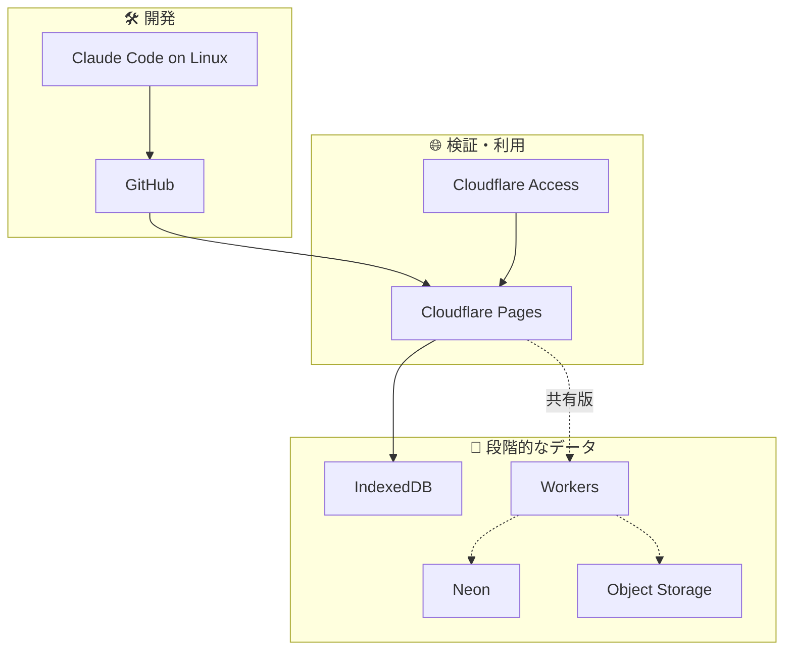

---

## 🧱 ソフトウェア構造

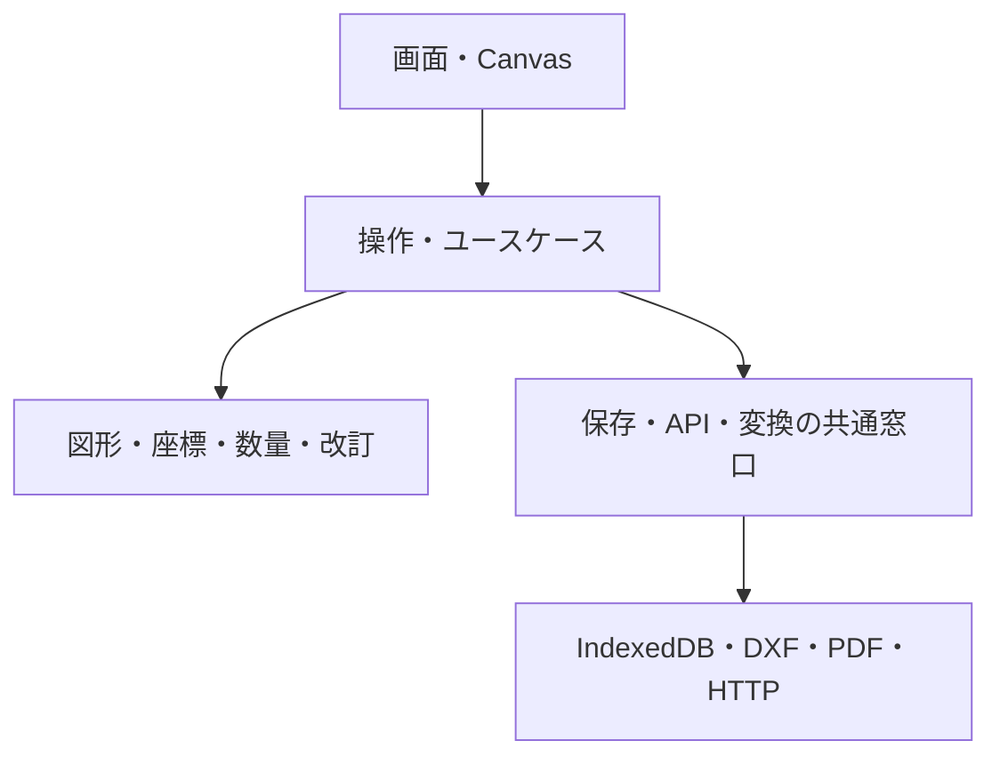

- **画面**と**計算**を分離します。
- 数量や座標計算はReactやCanvasに依存しない形でテストします。
- 保存先がIndexedDBからクラウドへ増えても、CADコアを作り直さない構成にします。
- 既存`Civil-Draw`は丸ごと複製せず、品質・ライセンス・保守性を確認して選択継承します。

---

## 🛣️ 開発ロードマップ

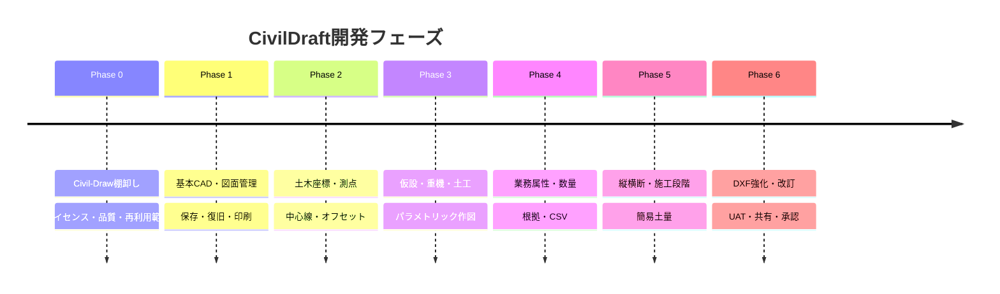

| Phase | 状態 | 到達点 |
| --- | --- | --- |
| 0 | ✅ 完了 | 継承するもの、改修するもの、作り直すものが確定している |
| 1 | ✅ コア実装済み | ブラウザで図面を作成・保存・復旧・PDF出力できる |
| 2 | 🟡 ドメイン/UI試作 | 測点と座標を使った施工平面図を作成できる |
| 3 | 🟡 ドメイン/UI試作 | 施工・仮設計画図を定型・条件入力で作成できる |
| 4 | 🟡 ドメイン/UI試作 | 図形から数量根拠を確認・出力できる |
| 5 | 🟡 ドメイン/UI試作 | 平面・断面・施工段階を関連付けられる |
| 6 | 🟡 P0 API縦線 | 共有・承認・監査のデータ契約を固め、代表利用者がUATで判定できる |

> 🟡 は「コードや画面は存在するが、実案件保存・CAD本体との双方向連動・権限/監査・運用検証まで閉じていない」状態です。READMEでは、この状態を完成品として扱いません。

### MVP

最初の実務評価可能版はPhase 1～3です。数量、縦横断、承認を全部載せてから初めて触るのではなく、施工・仮設計画図として役立つかを早めに確認します。

---

## 📊 開発進捗

### 直近のマイルストーン

| 完了日 | 内容 |
| --- | --- |
| 2026-07-14 | ✅ Phase 0: `Civil-Draw`棚卸し・継承台帳・ADR・リスク台帳作成 |
| 2026-07-15 | ✅ Phase 1: プロジェクトスキャフォールド作成（Vite 7 + React 19 + TS 6、共通型システム） |
| 2026-07-15 | ✅ Phase 1: CI品質ゲート構築（GitHub Actions: Lint/Typecheck/Test/Build + Dependency Audit） |
| 2026-07-15 | ✅ `main`ブランチ保護設定（必須ステータスチェック・レビュー承認1件必須） |
| 2026-07-15 | ✅ Phase 1: 内部座標基準の確定（ADR-0012）・幾何演算エンジン移植着手（coordParser/areaCalculator/orthoConstraint等、55テスト） |
| 2026-07-15 | 🔍 Geometry型（Shape判別共用体）の未定義箇所を仕様書横断調査で発見、設計Issue化（Issue #20・後続移植作業の前提条件） |
| 2026-07-15 | ✅ Phase 1: Geometry判別共用体を実装（Issue #20完了・13種のGeometryType全具体型を定義、58テスト）。Issue #5残14ファイル・Issue #18・Issue #19のブロック解除 |
| 2026-07-15 | 🔍 Issue #20実装をコードレビュー（Critical/Important級バグなし。コメント誤字を修正、仕様書§6.2の内部矛盾をIssue #22として起票） |
| 2026-07-15 | ✅ Issue #22対応（仕様書§6.2にSplineGeometry追加、Arc以降8型の正本を実装ファイルに明文化）。Issue closed |
| 2026-07-15 | ✅ Issue #5部分完了: `shapeBBox.ts`（外接矩形計算エンジン）移植、テスト12件追加、70/70 green |
| 2026-07-15 | ✅ **Issue #5完了（closed）**: 幾何演算エンジン17/17ファイル移植。5並列エージェントで selection/spatialIndex/viewportCulling/trim/extend/offset/fillet/chamfer/shapeTransform/scale/array/snap/dimension/hatchGenerator を一括移植 |
| 2026-07-15 | ✅ ADR-0013（図形ID発番: crypto.randomUUID + コンテキスト注入、nanoid不採用）制定・`geometryFactory.ts`実装 |
| 2026-07-15 | ✅ Issue #7部分: `GeometryIndex`（R-tree空間索引）のインスタンス化改修・複数図面独立性テスト完了 |
| 2026-07-15 | ✅ Issue #19部分: `symbolCatalog`（土木記号30種）・`templateCatalog`（テンプレート6種）移植 |
| 2026-07-15 | ✅ Issue #6基盤: `CoordinateTransformer`（仕様書§9.2）・`EditorStore`（§8.1 Slice構成ファクトリ）・React供給層実装。konva/react-konva/zustand導入 |
| 2026-07-15 | 🔍 継承元の潜在課題をIssue化: #23（Arc掃引方向）・#24（スナップ改善）・#25（回転二重適用疑い） |
| 2026-07-15 | ✅ **Issue #18完了**: DXF入出力移植（$INSUNITS→mm単位変換層、R-002/R-004不整合是正、継承元バグ5件修正、回帰テスト付き） |
| 2026-07-15 | ✅ **Issue #6完了**: Canvas描画パイプライン（§9.1レイヤー構成・パン/ズーム/選択・カリング）+ GeometryRenderer 13種 |
| 2026-07-15 | ✅ **Issue #7完了**: 空間索引+store層シングルトン解消。ベンチ実測32〜59倍高速（劣化なし実証） |
| 2026-07-15 | ✅ **Issue #8完了**: Undo/Redo Commandパターン（メモリ約5,000倍改善実証、R-001解消）+ ToolSlice作図ツール |
| 2026-07-15 | ✅ **Issue #9完了**: 自動保存IndexedDB移行+UI配線（起動時復元・容量超過警告、R-006握り潰し解消） |
| 2026-07-15 | ✅ **Issue #10完了**: PDF出力新規実装（pdf-lib、用紙/縮尺/図面枠/表題欄、DD-TBD-006方式確定） |
| 2026-07-15 | ✅ **Issue #13完了**: Cloudflare Access認証アプリ側（identity取得+ロール3種、テナント設定は人間確認事項） |
| 2026-07-15 | ✅ **Issue #19/#21完了**: 記号30種・テンプレート6種・ルーラー/グリッド計算移植 |
| 2026-07-15 | ✅ Issue #12部分: SBOM（CycloneDX）+ THIRD-PARTY-NOTICES自動生成（copyleft混入なし確認、ci.yml組込は人間承認待ち） |
| 2026-07-15 | ✅ 結合テスト12件（エディタ全体フロー7+PDF経路5）、運用文書4点、アーキテクチャ図解（mermaid 8図）整備 |
| 2026-07-15 | 🔒 セキュリティレビュー実施: 高信頼・実悪用可能な脆弱性0件（DXF/autosave/auth/CI/スクリプト全経路検査） |
| 2026-07-15 | 📊 品質ゲート最終確認: **テスト632/632（3連続・STABLE）**・typecheck/lint/build green・脆弱性0 |
| 2026-07-15 | 🎉 **PR #1→#14→#16 マージトレイン完遂**（人間承認）。Phase 1 コアが main へ着地、CI実機green |
| 2026-07-15 | 🎨 ホーム画面デザイン100%適用（Claude Design Home.dc.html、PR #28マージ）。テーマ切替・実IndexedDB復旧候補結線 |
| 2026-07-15 | 🔤 PDF日本語フォント同梱（Noto Sans JP・OFL、DD-TBD-006確定、PR #29マージ）。函渠等レア漢字も埋込可 |
| 2026-07-15 | 🚀 ホスティング確定: Cloudflare Workers Static Assets（人間承認）。CI: 全ブランチPRトリガー+SBOMジョブ（PR #27マージ、Issue #12/#17完了） |
| 2026-07-15 | 📊 最終: **テスト646/646**・オープンIssueは設計課題4件のみ（#23/#24/#25実機検証待ち・#26 P3） |
| 2026-07-15 | 🟡 **Phase 2-6相当の試作実装（PR #31）**: 測量・線形（§12/§13）/ パラメトリック7種（§15）/ 属性・数量集計（§14/§17）/ 断面・土量・施工ステップ（§16/§18）/ 承認ワークフロー・図面差分（§19/§20）/ 独自ファイル形式・Workers 18エンドポイント骨格・Neon 12テーブルDDL（§22/§25/§26） |
| 2026-07-17 | 🟡 Workers API P0縦線を実装: Project作成/更新 → Drawing作成/更新 → Revision作成 → Content/数量保存 → 照査/承認 → Export作成 → Audit検索。全18経路が501ではなく業務応答または入力/認可エラーを返す状態にし、案件メンバー認可とメタデータ/内容/数量更新の楽観ロックも追加。開発/テスト用インメモリストアで契約を固定し、本番Neon/R2接続は人間承認前の残課題として分離 |
| 2026-07-17 | 🐘 Neon migration 0002を追加: Workers API P0契約に合わせ、quantity_snapshots、数量version、Exportメタ、R2メタ、監査ログ hash chain 列を前方互換で定義。破壊的DDLを含まないことを単体テストで検証 |
| 2026-07-17 | 🛡️ Workers永続化境界を分離: `ApiStore`/`MemoryStore`/`persistence`契約を分け、`neon-r2` モードが未接続の場合はインメモリへフォールバックせず 503 で停止 |
| 2026-07-17 | 🟡 ブラウザ側 Workers APIクライアントを追加し、CAD編集画面の「共有保存」「共有再読込」へ配線: `CivilDraftApiClient` から Project作成 → Drawing作成 → Revision作成 → Content保存/再読込 → Export作成を実行可能にし、実Workersハンドラ差し込みテストと画面テストで検証。本番Neon/R2接続は後続 |
| 2026-07-17 | 🟡 共有保存の案件・図面コンテキストをサンプル固定から画面注入型へ改善: 案件詳細の図面行クリックで案件番号/図面番号/改訂番号をCAD編集へ渡し、共有保存ペイロードとヘッダー表示へ反映。統合テストでナビゲーション経由の受け渡しを検証 |
| 2026-07-17 | ✅ VitestをNode/jsdomプロジェクトへ分離し、NAS/Windows環境でも一括テストが完走するよう改善。`npm run test -- --reporter=dot` で96ファイル・1048テストpass |
| 2026-07-15 | 🖥️ 業務画面7枚を試作: 測点・座標一覧 / 土木部材パレット / 数量集計 / 縦横断管理 / 施工ステップ / 図面比較 / 照査・承認 — サイドバー全ナビが有効化。CAD本体との双方向連動は後続 |
| 2026-07-15 | 📊 最終: **テスト1030/1030（×2連続STABLE）**・typecheck/lint/build green |
| 2026-07-18 | 🐘 Neon migration 0003を追加: R2 binding を**任意化**し、図面内容（`drawing_contents.content` jsonb）をNeonへ直接保存する方針へ転換。`object_key`/`quantity_items.name`/`quantity`のNOT NULL制約も緩和。`persistence.ts`の本番readiness判定からR2を除外し、回帰テスト・migrations静的検証を追加更新。dev branch（`br-fancy-frog-aja6lujp`）でDDL適用・`persistContent`/`persistQuantities`相当の実データINSERTともに実地検証済み（ADR-0014、PR #65） |
| 2026-07-18 | 🚀 **本番デプロイ実行**（人間承認）: `civildraft-web-cad.mirai-dx-platform.com` へWorkers + Neon本番接続で公開。Neon `civildraft-production`（pg17）にmigration 0001/0002適用済み。共有保存（PUT content/quantities）はmigration 0003（PR #65）本番適用までfail-closed（503）。read-only疎通確認: SPA=HTTP 200、API GET（無認証）=HTTP 401（fail-closedの503ではなくAccess層の通常拒否）。Cloudflare Access Secret（TEAM_DOMAIN/AUD）の本番設定はWorker bindings一覧で未確認のため人間確認待ち |
| 2026-07-21 | 🎉 **v0.1.0 リリース**（PR #67・人間承認Y）: Issue #66恒久対応としてpersistX全9ハンドラをNeon永続化へ配線、監査ログ永続化（flush失敗は500 fail-visible）、fail-closed暫定措置撤去。配線検証で発覚した既存バグ4件（ID型ドリフト uuid vs 接頭辞文字列→migration 0004/ADR-0015、bigint文字列化による楽観ロック不整合、quantity sources復元、jsonb配列直列化）を修正。migration 0003→0004を本番Neon mainへ適用（実データ0件・前方互換）、Worker再デプロイ（Version 269aebbe）。スモーク: SPA=200/API無認証=401/API JWT有り=503（Access未構成fail-closed・期待値）。`wrangler secret list`（名前照会）でAccess Secret未登録を確定→登録（人間実施）までAPIは認証層で安全に停止。Neon実接続roundtripテスト・DROP CONSTRAINT waiver付きmigration validator追加。残: Access設定（人間）・#68トランザクション化 |
| 2026-07-18 | 📊 テスト105ファイル・1191テストpass、typecheck/lint/build green |
| 2026-07-21 | 📚 PR #69: v0.1.0リリース結果をstate.json/READMEへ文書同期 |
| 2026-07-21 | ✨ PR #70: アダプティブグリッド間隔を導入し、CAD編集画面の初期表示からグリッドを可視化（本番デプロイ済み） |
| 2026-07-21 | 🎨 PR #71: グリッド線色を背景と同化しない中間グレー+不透明度階調へ変更（本番デプロイ済み、Worker Version `697e6051`） |
| 2026-07-22 | 🔒 Issue #68恒久対応（PR #72）: persistX複合書き込み5種（project+member、revision+drawing、content+revision、quantities+revision、workflowAction+revision）を`@neondatabase/serverless`の単一トランザクションへ統合し、部分永続化リスクを解消。実装過程で発見した別件2件はスコープ外としてIssue #73（quantity_items削除同期漏れ・P2）・#74（persistExportJobのobject_provider固定・P3）へ分離起票。CI4項目全pass・CodeRabbitレビュー済み（指摘1件はIssue #73で追跡中）。**v0.1.1として人間承認Y取得・本番デプロイ済み**（[Release v0.1.1](../../releases/tag/v0.1.1)） |
| 2026-07-22 | 📊 テスト105ファイル・1209テストpass（Neon実接続が必要な結合テスト1ファイル2件はCI環境上NOT RUN・既存の制約）、typecheck/lint/build green |
| 2026-07-22 | 🐛 Issue #73恒久対応（PR #75）: PR #72の実装過程で発見した`buildQuantitiesQueries`のDELETE文欠落（quantity_items部分更新PUTでの孤立item残留）を解消。新スナップショットのid集合に含まれない行をrevision_id一致条件で削除、既存UPSERT群と同一トランザクションでアトミック実行。回帰テスト3件追加（正常系・削除境界値・全件削除）。lint/typecheck/build green、テスト105ファイル・**1212**テストpass。人間承認Yでmainへsquash-merge済み。**v0.1.2として本番デプロイ済み**（[Release v0.1.2](../../releases/tag/v0.1.2)） |
| 2026-07-22 | 📚 PR #76: state.json実態同期（PR #72マージ・v0.1.1本番デプロイ・Issue #68クローズの反映）。人間承認Yでmainへsquash-merge済み |
| 2026-07-22 | 🚀 v0.1.2 本番デプロイ: main（`ce5a93f`、PR #75/#76含む）をユーザー明示指示によりCTOがwrangler deployで自律実行（Worker Version `39751487`）。スモークテスト（SPA 200・無認証API 401 CD-AUTH-001・Secret残存）全PASS（[Release v0.1.2](../../releases/tag/v0.1.2)） |
| 2026-08-01 | 🚀 **v0.1.3 本番デプロイ**（PR #78/#79/#80 統合・ユーザー指示D）: Issue #74（object_provider='unassigned'）、actorIdのJWT検証（ヘッダー偽装対策）、セキュリティヘッダー5種（API/SPA全応答）、Workers Observability有効化、依存修正（npm audit 0件）。main最終`db1e5b7`のCI全5ジョブsuccess → wrangler deploy（Worker Version `01102e33`）。スモーク全PASS・セキュリティヘッダー実測・Observability enabled確認（[Release v0.1.3](../../releases/tag/v0.1.3)） |
| 2026-08-01 | 🚀 **v0.1.4 本番デプロイ**（PR #81/#82・ユーザー承認Y）: 監査ログhash chain実装（`entry_hash=SHA-256(previous_hash|canonical payload)`・`GET /api/v1/audit-logs/verify`・レガシー前方互換）。main最終`3f93cb1`のCI全5ジョブsuccess → wrangler deploy（Worker Version `9fdf812b`）。スモーク全PASS（[Release v0.1.4](../../releases/tag/v0.1.4)） |
| 2026-08-01 | 🚀 **v0.1.5 本番デプロイ**（PR #83/#84・ユーザー承認Y）: 監査画面のAPI接続（`listAuditLogs`/`verifyAuditChain`・hash chain検証表示・API未接続時サンプルフォールバック）で **Issue #61 完了**。main最終`801e771`のCI全5ジョブsuccess → wrangler deploy（Worker Version `ea7fa2d4`）。スモーク全PASS（[Release v0.1.5](../../releases/tag/v0.1.5)） |
| 2026-08-01 | 🚀 **v0.1.6 本番デプロイ**（PR #86/#87・ユーザー承認Y）: ロック済みレイヤーの編集禁止を全経路で強制（§6.3 / Issue #40）: 編集コマンド除外・trim/extend対象ロック拒否・作図拒否・UI通知。main最終`f233bdf`のCI全5ジョブsuccess → wrangler deploy（Worker Version `0d0fcd4f`）。スモーク全PASS（[Release v0.1.6](../../releases/tag/v0.1.6)） |
| 2026-08-01 | 🚀 **v0.1.7 本番デプロイ**（PR #88/#89・ユーザー承認Y）: 数量⇔図形連動第一弾（Issue #42）: 明細「図面で確認」→根拠図形をCAD編集でオレンジ破線ハイライト。main最終`5ee5d51`のCI全5ジョブsuccess → wrangler deploy（Worker Version `e7a1b053`）。スモーク全PASS（[Release v0.1.7](../../releases/tag/v0.1.7)） |
| 2026-08-01 | 🚀 **v0.1.8 本番デプロイ**（PR #90/#91・ユーザー承認Y）: 数量⇔図形連動第二弾（Issue #42完了）: 図形クリック→根拠図形を含む明細行をハイライト。main最終`c593ca0`のCI全5ジョブsuccess → wrangler deploy（Worker Version `d53ad09f`）。スモーク全PASS（[Release v0.1.8](../../releases/tag/v0.1.8)） |
| 2026-08-01 | 🚀 **v0.1.9 本番デプロイ**（PR #92/#93・ユーザー承認Y）: 工種別レイヤーテンプレート5種（Issue #40）: 既定色/線種/線幅/印刷可否、同名レイヤー維持+不足分追加。main最終`b6f7f19`のCI全5ジョブsuccess → wrangler deploy（Worker Version `57001bbe`）。スモーク全PASS（[Release v0.1.9](../../releases/tag/v0.1.9)） |
| 2026-08-01 | 🚀 **v0.1.10 本番デプロイ**（PR #94/#95・ユーザー承認Y）: 監査ログのフィルタ+カーソルページング（Issue #85）: 期間/イベント種別/操作者フィルタ・さらに古い/新しい記録・該当件数表示。main最終`b246f56`のCI全5ジョブsuccess → wrangler deploy（Worker Version `128fc1aa`）。スモーク全PASS（[Release v0.1.10](../../releases/tag/v0.1.10)） |
| 2026-08-01 | 🚀 **v0.1.11 本番デプロイ**（PR #96/#97・ユーザー承認Y）: Neon週次バックアップ自動化（ブランチ方式・接続文字列不要・毎週日曜cron+手動dispatch・Artifacts90日）。main最終`61ca8ce`のCI全5ジョブsuccess → wrangler deploy（Worker Version `9add959a`）。スモーク全PASS（[Release v0.1.11](../../releases/tag/v0.1.11)） |
| 2026-08-01 | 🚀 **v0.1.12 本番デプロイ**（PR #98/#99・ユーザー承認Y）: 本番合成監視（30分毎ヘルスチェック・失敗時Issueアラート・SLO草案: 可用性99.5%等）。main最終`d75945e`のCI全5ジョブsuccess → wrangler deploy（Worker Version `3cefe8e4`）。スモーク全PASS（[Release v0.1.12](../../releases/tag/v0.1.12)） |
| 2026-08-02 | 🚀 **v0.1.13 本番デプロイ**（PR #100/#101・ユーザー承認Y）: バックアップのリストア検証（Neon restore-check: 最新backup-*の実データ検証+SQL可読性チェック・毎週実行）。main最終`f019644`のCI全5ジョブsuccess → wrangler deploy（Worker Version `be59e5b3`）。スモーク全PASS（[Release v0.1.13](../../releases/tag/v0.1.13)） |

### 🛠️ 次に閉じるべき実務ワークフロー

80〜90%代替を狙う前に、次の順で「縦に1本」動く範囲を完成させます。

| 優先 | 対応 | 完了条件 |
| --- | --- | --- |
| P0 | README/設計文書と実装状態の同期 | 実装済み・試作・未配線・未実装が外向け文書で混同されない |
| P0 | Workers APIの最小縦線 | ✅ Project作成/更新 → Drawing作成/更新 → Revision作成 → Content/数量保存 → 照査/承認 → Export作成 → Audit記録、案件メンバー認可、楽観ロックを実装・本番稼働中。v0.1.0（2026-07-21）でpersistX全9ハンドラをNeon永続化へ配線し、migration 0001〜0004本番適用・fail-closed撤去済み（Neon実接続roundtrip検証pass）。次はAccess Application設定+Access Secret登録（人間実施）によるフル機能有効化 |
| P0 | ブラウザ側共有保存クライアント | ✅ `CivilDraftApiClient` でWorkers P0縦線を呼び出し、CAD編集画面の「共有保存」「共有再読込」からクラウド保存・再読込経路を実行可能。案件詳細の図面行から案件/図面/改訂メタデータを渡す導線も実装。サーバ側永続化はv0.1.0で有効化済み（Access Secret登録後にエンドツーエンド開通）。次は案件一覧/検索/複製/アーカイブの実データ化、複数利用者/権限E2E |
| P0 | CAD編集UIの基本セット配線 | Trim/Extend/Offset/Fillet/Move/Copy/Rotate/Mirror/Scale/Explode/Joinのうち優先コマンドを画面操作から実行できる |
| P1 | レイヤー・寸法・印刷の実務化 | 線種/線幅/ロック/印刷尺度/寸法/注記を納品図面として確認できる |
| P1 | 土木差別化の図面連動 | 数量表・測点・横断・施工ステップから該当図形をハイライト/更新できる |
| P1 | ファイル互換方針 | DXF対応範囲、JWW/SXF調査、DWG変換方針（ODA等）を明記する |
| P2 | E2E/性能試験 | 大規模図面、Undo大量操作、DXF読込、PDF出力、クラウド保存をPlaywright等で保護する |

### Pull Request

| PR | 内容 | 状態 |
| --- | --- | --- |
| [#1](../../pull/1) | Phase 0 継承台帳・リスク台帳・ADR 11件 | ✅ マージ済み（2026-07-15） |
| [#14](../../pull/14) | Phase 1 スキャフォールド・共通型システム・CI品質ゲート | ✅ マージ済み（2026-07-15） |
| [#16](../../pull/16) | **Phase 1 コア実装一式** | ✅ マージ済み（2026-07-15） |
| [#27](../../pull/27) | CI: PRトリガー全ブランチ化 + SBOMジョブ | ✅ マージ済み（2026-07-15） |
| [#28](../../pull/28) | ホーム画面デザイン100%適用 | ✅ マージ済み（2026-07-15） |
| [#29](../../pull/29) | PDF日本語フォント同梱 + Workers配信手順確定 | ✅ マージ済み（2026-07-15） |
| [#31](../../pull/31) | Phase 2-6 試作実装（測量・線形・パラメトリック・数量・断面・ステップ・承認・差分・Workers/Neon基盤） | ✅ マージ済み |
| [#32](../../pull/32) | サイドメニュー全13項目の100%有効化（残4画面実装+ナビ統合テスト） | ✅ マージ済み |
| [#34](../../pull/34) | CAD Editor.dc.htmlをCadEditorPageとして実装、Sidebarと統合 | ✅ マージ済み（enforce_admins一時解除で対応） |
| [#35](../../pull/35) | リリース準備状況の可視化UI + Workers API P0縦線・永続化層（main再統合・コンフリクト19ファイル解消） | ✅ マージ済み（2026-07-17） |
| [#49](../../pull/49) | 永続化モード未設定時のサイレントフォールバック廃止・fail-closed化（Issue #48） | ✅ マージ済み（2026-07-17） |
| [#54](../../pull/54) | Issue #50 TOCTOU競合修正 | ✅ マージ済み（2026-07-17） |
| [#55](../../pull/55) | Issue #36 Access JWT二次防御（RS256/iss/aud/exp検証・fail-closed） | ✅ マージ済み（2026-07-17） |
| [#56](../../pull/56) | 本番デプロイ手順書 `production-deployment.md` 追加 | ✅ マージ済み（2026-07-17） |
| [#57](../../pull/57) | Issue #51 状態遷移グラフをdomain/revisionsへ一本化（P3リファクタ） | ✅ マージ済み（2026-07-18・admin bypass） |
| [#64](../../pull/64) | 外部評価（2026-07-18）精査結果反映（state.jsonのみ・Issue #58-#63起票） | ✅ マージ済み（2026-07-18・admin bypass） |
| [#65](../../pull/65) | 共有保存fail-closed化・ADR-0014（R2任意化）・Neon migration 0003 | ✅ マージ済み（2026-07-18・人間承認Y） |
| [#67](../../pull/67) | **v0.1.0**: persistX配線・監査ログ永続化・migration 0004（ID text整合・ADR-0015）・fail-closed撤去（Issue #66恒久対応） | ✅ マージ済み（2026-07-21・人間承認Y）→ migration 0003/0004本番適用・本番デプロイ・[Release v0.1.0](../../releases/tag/v0.1.0) |
| [#69](../../pull/69) | v0.1.0リリース結果の文書同期（state.json/README） | ✅ マージ済み（2026-07-21） |
| [#70](../../pull/70) | アダプティブグリッド間隔でCAD編集初期表示からグリッドを可視化 | ✅ マージ済み（2026-07-21・本番デプロイ済み） |
| [#71](../../pull/71) | グリッド線色を背景と同化しない中間グレー+不透明度階調へ変更 | ✅ マージ済み（2026-07-21・本番デプロイ済み、Worker Version `697e6051`） |
| [#72](../../pull/72) | **v0.1.1**: Issue #68恒久対応: persistX複数レコード書き込みを単一トランザクション化 | ✅ マージ済み（2026-07-22・人間承認Y）→ 本番デプロイ済み・[Release v0.1.1](../../releases/tag/v0.1.1) |
| [#75](../../pull/75) | Issue #73恒久対応: quantity_items部分更新PUTでの孤立item残留を解消（`buildQuantitiesQueries`にDELETE文追加） | ✅ マージ済み（2026-07-22・人間承認Y）→ 本番デプロイ済み・[Release v0.1.2](../../releases/tag/v0.1.2) |
| [#76](../../pull/76) | state.json実態同期（PR #72マージ・v0.1.1本番デプロイ・Issue #68クローズの反映、コード変更なし） | ✅ マージ済み（2026-07-22・人間承認Y） |
| [#77](../../pull/77) | README/state.json実態同期（PR #75/#76マージ・v0.1.2本番デプロイ・テスト1212件・ADR-0014/0015追記の反映、コード変更なし） | ✅ マージ済み（2026-07-22） |
| [#78](../../pull/78) | Issue #74恒久対応: export_jobs.object_providerを'unassigned'へ統一（ADR-0014整合）+ migration 0005 + ESLint worktree除外 + 依存修正 | ✅ マージ済み（2026-08-01・admin squash `7deadf2`） |
| [#79](../../pull/79) | リリース後監査是正: actorIdのJWT検証・セキュリティヘッダー5種・Observability有効化・依存修正・SBOM・ops文書 | ✅ マージ済み（2026-08-01・admin squash `d8dd06a`）→ v0.1.3本番デプロイ済み |
| [#80](../../pull/80) | PR #77マージ実態・Issue #74設計判断をREADME/state.jsonへ同期 | ✅ マージ済み（2026-08-01・admin squash `db1e5b7`） |
| [#81](../../pull/81) | v0.1.3統合・本番デプロイ実態をREADME/state.jsonへ同期 | ✅ マージ済み（2026-08-01・admin squash `96a6945`） |
| [#82](../../pull/82) | **v0.1.4**: 監査ログhash chain実装（Issue #61）: `auditChain.ts`・persistAuditLog連鎖計算・`GET /api/v1/audit-logs/verify`・テスト1227件 | ✅ マージ済み（2026-08-01・admin squash `3f93cb1`）→ v0.1.4本番デプロイ済み |
| [#83](../../pull/83) | v0.1.4デプロイ・監査hash chain実装の実態をREADME/state.jsonへ同期 | ✅ マージ済み（2026-08-01・admin squash `6859d29`） |
| [#84](../../pull/84) | **v0.1.5**: 監査画面のAPI接続（Issue #61完了）: `listAuditLogs`/`verifyAuditChain`・hash chain検証表示・サンプルフォールバック | ✅ マージ済み（2026-08-01・admin squash `801e771`）→ v0.1.5本番デプロイ済み |
| [#86](../../pull/86) | v0.1.5デプロイ・Issue #61完了の実態をREADME/state.jsonへ同期 | ✅ マージ済み（2026-08-01・admin squash `d8c29f6`） |
| [#87](../../pull/87) | **v0.1.6**: ロック済みレイヤーの編集禁止を全経路で強制（Issue #40 / §6.3） | ✅ マージ済み（2026-08-01・admin squash `f233bdf`）→ v0.1.6本番デプロイ済み |
| [#88](../../pull/88) | **v0.1.7**: 数量⇔図形連動第一弾（Issue #42）: 明細「図面で確認」→根拠図形をCAD編集でハイライト | ✅ マージ済み（2026-08-01・admin squash `5daf63c`）→ v0.1.7本番デプロイ済み |
| [#89](../../pull/89) | v0.1.6デプロイ・ロックレイヤー強制（Issue #40）の実態をREADME/state.jsonへ同期 | ✅ マージ済み（2026-08-01・admin squash `5ee5d51`） |
| [#90](../../pull/90) | **v0.1.8**: 数量⇔図形連動第二弾（Issue #42完了）: 図形クリック→根拠図形を含む明細行をハイライト | ✅ マージ済み（2026-08-01・admin squash `533b2dc`）→ v0.1.8本番デプロイ済み |
| [#91](../../pull/91) | v0.1.7デプロイ・数量⇔図形連動（Issue #42）の実態をREADME/state.jsonへ同期 | ✅ マージ済み（2026-08-01・admin squash `c593ca0`） |
| [#92](../../pull/92) | **v0.1.9**: 工種別レイヤーテンプレート5種（Issue #40）: 施工ヤード/仮設/測量/数量根拠/汎用 | ✅ マージ済み（2026-08-01・admin squash `10519ce`）→ v0.1.9本番デプロイ済み |
| [#93](../../pull/93) | v0.1.8デプロイ・Issue #42完了の実態をREADME/state.jsonへ同期 | ✅ マージ済み（2026-08-01・admin squash `b6f7f19`） |
| [#94](../../pull/94) | **v0.1.10**: 監査ログのフィルタ+カーソルページング（Issue #85）: from/to/eventName/actorId・total/nextCursor | ✅ マージ済み（2026-08-01・admin squash `1e8ee4f`）→ v0.1.10本番デプロイ済み |
| [#95](../../pull/95) | v0.1.9デプロイ・レイヤーテンプレート（Issue #40）の実態をREADME/state.jsonへ同期 | ✅ マージ済み（2026-08-01・admin squash `b246f56`） |
| [#96](../../pull/96) | **v0.1.11**: Neon週次バックアップ自動化（ブランチ方式・cron+dispatch・Artifacts90日） | ✅ マージ済み（2026-08-01・admin squash `8a35af5`）→ v0.1.11本番デプロイ済み |
| [#97](../../pull/97) | v0.1.10デプロイ・Issue #85完了の実態をREADME/state.jsonへ同期 | ✅ マージ済み（2026-08-01・admin squash `61ca8ce`） |
| [#98](../../pull/98) | **v0.1.12**: 本番合成監視（30分毎ヘルスチェック・失敗時Issueアラート）+ SLO草案 | ✅ マージ済み（2026-08-01・admin squash `58cb9e0`）→ v0.1.12本番デプロイ済み |
| [#99](../../pull/99) | v0.1.11デプロイ・バックアップ自動化の実態をREADME/state.jsonへ同期 | ✅ マージ済み（2026-08-01・admin squash `d75945e`） |
| [#100](../../pull/100) | **v0.1.13**: バックアップのリストア検証（Neon restore-check: 実データ検証+SQL可読性チェック） | ✅ マージ済み（2026-08-02・admin squash `b25cefb`）→ v0.1.13本番デプロイ済み |
| [#101](../../pull/101) | v0.1.12デプロイ・合成監視の実態をREADME/state.jsonへ同期 | ✅ マージ済み（2026-08-02・admin squash `f019644`） |

> マージ済みPRは人間の明示承認（選択式Y判断）を得てマージ済み。レビュー承認1件必須はPR作成者の自己承認不可のため、マージ実行時は enforce_admins を一時解除し完了後に即復元した。

進捗の詳細は[GitHub Projects「CivilDraft-Web-CAD 開発司令盤」](../../projects)、Issue一覧は[Issues](../../issues)を参照してください。

### 🔁 セッション終了時サマリー（2026-07-15 午後・Phase 1 コア完成）

⏱ セッション時間: 2026-07-15T04:16:26Z 開始（JST 13:16）、5時間上限 09:16:26Z

📊 **本セッションの成果（6並列エージェント + CTO統合）**

- ✅ **Issue 10件クローズ**: #5(幾何演算17種)・#6(Canvas描画)・#7(空間索引+store刷新)・#8(Undo/Redo Command)・#9(自動保存IndexedDB)・#10(PDF出力)・#13(認証部品)・#18(DXF入出力)・#19(カタログ)・#21(ルーラー/グリッド)
- ✅ ADR-0013制定（ID発番=crypto.randomUUID+コンテキスト注入）、DD-TBD-006方式確定（PDF=pdf-lib）
- ✅ WebUIが動作: 作図（線/矩形/円/ポリライン）・選択・Undo/Redo・パン/ズーム・グリッド・DXF取込/出力・PDF出力・自動保存/復元
- ✅ 継承元バグ是正: DXF単位不整合(R-002/R-004)・hatch無限ループ・DASHDOT不正DXF・rad二重変換・レイヤー色取り違え・autosave握り潰し(R-006)
- ✅ 性能実証: 空間索引32〜59倍高速・Undo履歴メモリ約5,000倍改善(R-001)
- 📊 **テスト 70 → 632件（+562、3連続green=STABLE）**、typecheck/lint/build green、脆弱性0
- 🔒 セキュリティレビュー実施（DXF/autosave/auth/CI全経路、実悪用可能な所見0件）、シークレット露出なし
- 📚 運用文書4点（リリース/ロールバック/運用/障害対応）・アーキテクチャ図解(mermaid 8図)・SBOM/NOTICES・README刷新

📋 **残課題（次セッション/人間判断）**

1. 🚫 **人間承認待ち**: PR #1/#14/#16のマージ（main宛）、Issue #17（ci.ymlトリガー）、Issue #12残（CIへのSBOM組込）、Cloudflare Accessテナント設定（Issue #13コメントのチェックリスト）、日本語フォント同梱（DD-TBD-006配布条件）
2. 🔍 **描画実機検証待ち**: Issue #23（Arc掃引方向）・#24残（回転図形スナップ）・#25（回転二重適用疑い）— 本端末のChrome起動不能（SIGTRAP）のため、ユーザーによるブラウザ確認が必要
3. 📐 **Phase 2以降**: 土木座標・測量・線形（ロードマップどおり）。Issue #26（バンドル最適化、P3）
4. Minimap/ContextMenu/スナップガイド表示/独自形式保存は必要時に別Issue起票

🚫 **本セッションでは main直push・PRマージ・本番デプロイを一切実行していません**（人間の明示承認待ちの状態を維持）。

### 🔁 セッション終了時サマリー（2026-07-18・本番デプロイ + fail-closed化）

📊 **このセッション区間までの主な成果**

- 🚀 **本番デプロイ実行**（人間承認）: `civildraft-web-cad.mirai-dx-platform.com` へCloudflare Workers + Neon本番接続で公開。SPA・API疎通をread-only照会/curlで実測確認
- 🐘 Neon本番プロジェクト `civildraft-production`（pg17）にmigration 0001/0002を適用
- 🛡️ Issue #36 Access JWT二次防御（RS256/iss/aud/exp検証・fail-closed、PR #55）、Issue #50 TOCTOU競合修正（PR #54）をマージ
- 🟡 **ADR-0014策定**: R2 bindingを任意化し、図面内容（`drawing_contents.content` jsonb）をNeonへ直接保存する方針へ転換。migration 0003・共有保存（PUT content/quantities）のfail-closed化を実装し、Neon dev branchで実地検証（PR #65、レビュー中）
- 📊 テスト105ファイル・1191テストpass、typecheck/lint/build green
- 🔍 Cloudflare/Neonへのread-only照会で本番実態を確認: Worker bindings（`ASSETS`/`CIVILDRAFT_API_MODE`/`CIVILDRAFT_NEON_CONNECTION`）、本番APIへの無認証GETはHTTP 401（fail-closedの503ではなくAccess層の通常拒否）

📋 **残課題（次セッション/人間判断）**

1. 🚫 **人間確認待ち**: Cloudflare Access Secret（`CIVILDRAFT_ACCESS_TEAM_DOMAIN`/`CIVILDRAFT_ACCESS_AUD`）の本番設定状況。Worker bindings一覧では確認できず、未設定と断定はできないが確認もできていない
2. 🔍 **Codexレビュー待ち**: PR #65は`disable-model-invocation`によりモデルからの起動が不可。ユーザーによる`/codex:review --base main --background`の手動起動が必要
3. 🐘 **migration 0003本番適用待ち**: PR #65マージ後に本番適用し、共有保存のfail-closed暫定措置を撤去

---

## 🛡️ セキュリティと運用

- 検証環境はCloudflare Accessで入口を制御します。
- APIキー、DB接続情報、トークンをブラウザ、GitHub、ログへ置きません。
- `.env`はGit管理せず、`.env.example`だけを管理します。
- DXF、CSV、独自形式は、容量・形式・件数・数値・参照を検査します。
- 共有版はAPI側で案件とロールを毎回確認します。
- 承認済み図面は直接上書きせず、新しい改訂を作成します。
- 監査ログへSecretや図面本文を不用意に記録しません。
- バックアップだけで安心せず、リストア試験も行います。

---

## 🧪 品質確認

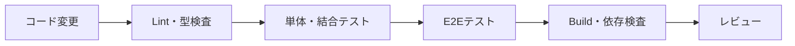

重点的に確認する項目：

- 距離、面積、交点、座標、方位角、単位、丸めの既知解
- 0、極小・極大、自己交差、閉じていない領域等の境界値
- Undo・Redo後の図形・属性・数量の整合性
- ブラウザ異常終了、保存失敗、容量不足からの復旧
- DXFの要素別往復変換と未対応要素の報告
- 1,000・5,000・10,000図形の性能
- 作成者、照査者、承認者、閲覧者、管理者の権限

### ⚙️ 現在のCI実態

上記は目指す品質確認プロセス全体で、性能・権限テストは今後順次追加します。
現時点で`main`向けPRに自動実行される内容は次のとおりです。

| ジョブ | 内容 | 必須チェック |
| --- | --- | --- |
| `Lint / Typecheck / Test / Build`（quality） | ESLint → `tsc --noEmit` → マイグレーション静的検証 → Vitest（node/jsdom 2プロジェクト）→ `vite build`を直列実行 | ✅ mainブランチ保護で必須 |
| `Dependency Audit`（security） | `npm audit --audit-level=high` → secret候補スキャン | ✅ mainブランチ保護で必須 |
| `Browser E2E`（e2e） | Playwright（Chromium）でホーム・新規案件・CAD編集・監査ログHTML出力・照査承認ワークフローの最小スモークを確認 | ⚠️ ブランチ保護は未設定（PRマージ前に人間がgreenを個別確認） |
| `SBOM / Notices`（compliance） | SBOM（CycloneDX）生成・drift確認、THIRD-PARTY-NOTICES生成・drift確認 | ⚠️ ブランチ保護は未設定（npm CLIバージョン差によるドリフト誤検知の実績があるため、安定性を継続確認してから必須化を検討） |

`main`ブランチはPR必須・レビュー承認1件必須・quality/securityの成功必須（`strict`のためブランチ最新化も要求）・force push禁止・削除禁止で保護されています。e2e/complianceは必須チェック未設定のため、PRマージ前に人間が個別にgreenを確認する運用でカバーしています。

> 2026-07-22時点のローカル検証では、`npm run test -- --reporter=dot` が105ファイル・1212テストpass（Neon実接続が必要な結合テスト1ファイル2件はskip）で完走しています。NAS/Windows環境ではjsdomテストの起動コストが大きいため、Vitestは `node`（domain/shared/workers/cloud client）と `jsdom`（app/infrastructure/integration）に分離しています。

---

## 🛠️ 開発を始める

### 前提

- Linux開発環境
- Git
- Node.js 25系・npm 10以上（`.nvmrc`に記載。`nvm use`で自動選択）
- Cloudflare・Neonは対応フェーズで利用

### 初期化後の標準的な流れ

```bash
git clone <CivilDraft-Web-CADのURL>
cd CivilDraft-Web-CAD
nvm use   # .nvmrcに従いNode 25系を選択
npm ci
npm run dev
```

> `.env`を使う本番接続機能（Cloudflare/Neon/R2のSecret連携）は未適用です。現時点ではローカル起動に環境変数は不要です。

### 利用可能なコマンド

`package.json`を正本とします。

| コマンド | 用途 |
| --- | --- |
| `npm run dev` | ローカル開発サーバー（Vite） |
| `npm run build` | 本番用ビルド（`tsc -b && vite build`） |
| `npm run preview` | ビルド結果の確認 |
| `npm run lint` | ESLint静的検査（レイヤー間依存方向を`no-restricted-imports`で強制） |
| `npm run typecheck` | TypeScript型検査（`tsc -b --noEmit`） |
| `npm run migrations:check` | DBマイグレーション静的検証（トランザクション境界・危険DDL不在・FK・索引・監査列） |
| `npm run test` | 単体・結合テスト（Vitest。node/jsdomプロジェクト分離） |
| `npm run test:watch` | Vitestをwatchモードで実行 |
| `npm run e2e` | Playwright ブラウザE2E（Chromiumの最小スモーク） |
| `npm run sbom` | CycloneDX形式のSBOMを生成（`sbom/civildraft-sbom.cdx.json`） |
| `npm run notices` | サードパーティ表記を生成（`THIRD-PARTY-NOTICES.md`） |
| `npm run secret:scan` | secret候補スキャン |
| `npm run release:audit` | リリース前ローカル一括監査（品質ゲート＋E2E＋SBOM/NOTICES drift＋secretスキャン） |

### ✅ 品質ゲート（PR前・リリース前に全green必須）

| # | ゲート | コマンド | 合格条件 |
| --- | --- | --- | --- |
| 1 | Lint | `npm run lint` | ESLintエラー0（レイヤー間依存も強制） |
| 2 | 型検査 | `npm run typecheck` | `tsc -b --noEmit`エラー0 |
| 3 | マイグレーション静的検証 | `npm run migrations:check` | 危険DDL・FK/索引/監査列の欠落なし |
| 4 | テスト | `npm run test` | Vitest全件pass |
| 5 | ブラウザE2E | `npm run e2e` | Playwright全件pass |
| 6 | ビルド | `npm run build` | `tsc -b && vite build`成功・`dist/`生成 |
| 7 | 依存脆弱性 | `npm audit --audit-level=high` | high以上0件（CIの`Dependency Audit`と同一基準） |
| 8 | SBOM/NOTICES | `npm run sbom` / `npm run notices` | 生成物がdrift（差分）なし |

一括実行（1つでも失敗したら停止）:

```bash
npm run lint && npm run typecheck && npm run migrations:check && npm test && npm run e2e && npm run build && npm audit --audit-level=high && npm run sbom && git diff --exit-code sbom/civildraft-sbom.cdx.json && npm run notices && git diff --exit-code THIRD-PARTY-NOTICES.md
```

またはリリース前一括監査（品質ゲート全項目＋secret候補スキャンをまとめて実行）:

```bash
npm run release:audit
```

> 上記1・2・3・4・6はGitHub Actionsの`quality`ジョブ、5は`e2e`ジョブ、7は`security`ジョブ、8は`compliance`ジョブとしてPR時に自動実行されます（[⚙️ 現在のCI実態](#️-現在のci実態)参照）。
> リリース・ロールバック・障害対応の手順は [`docs/operations/`](./docs/operations/) を参照してください。

### 環境変数

- Secretの実値をREADMEや`.env.example`へ書かないでください。
- フロントエンドへ渡す値は公開されても問題ない設定だけに限定します。
- DB接続情報やAPI SecretはWorkers側のSecretとして管理します。
- 初期ローカル版はNeon接続を必須にしません。

---

## 🤝 開発・変更ルール

1. Issueに目的、対象要件ID、受入条件を記載する。
2. 変更前に要件・基本設計・詳細設計への影響を確認する。
3. ブランチで実装し、テストを追加する。
4. Pull Requestへ変更内容、テスト、リスク、画面差分を記載する。
5. CIの型検査、テスト、ビルド、依存検査を通す。
6. 文書・README・既知制限をコードと同時に更新する。
7. レビュー後に保護ブランチへマージする。

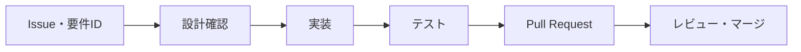

---

## 📚 ドキュメント

### 設計文書

| 文書 | 内容 |
| --- | --- |
| [`CivilDraft_要件定義書_20260714.md`](./CivilDraft_要件定義書_20260714.md) | 何を、なぜ、どこまで実現するか |
| [`CivilDraft_基本設計書_20260714.md`](./CivilDraft_基本設計書_20260714.md) | システム構成、画面、機能配置、データ・APIの全体方式 |
| [`CivilDraft_詳細設計仕様書_20260714.md`](./CivilDraft_詳細設計仕様書_20260714.md) | コード、型、処理、DB、API、計算、テストの実装仕様 |
| `README.md` | 製品概要、対象者別案内、導入、開発入口 |

### アーキテクチャ・設計判断（ADR）

| 文書 | 内容 |
| --- | --- |
| [`docs/architecture/overview.md`](./docs/architecture/overview.md) | 非エンジニア向けアーキテクチャ図解（構成・レイヤー・データフロー・座標系・DXF・用語集） |
| [`docs/adr/0001-auth-cloudflare-access-not-msal-browser.md`](./docs/adr/0001-auth-cloudflare-access-not-msal-browser.md) | 認証はCloudflare Accessモデルを採用し、MSAL/Entra ID直接統合は不採用 |
| [`docs/adr/0002-nominal-id-brand-types.md`](./docs/adr/0002-nominal-id-brand-types.md) | 全エンティティIDに`Brand<T,B>`による公称型付けを導入 |
| [`docs/adr/0003-result-type-for-expected-failures.md`](./docs/adr/0003-result-type-for-expected-failures.md) | 予期される失敗の表現に`Result<T,E>`を採用し、例外送出と分離 |
| [`docs/adr/0004-command-pattern-undo-redo.md`](./docs/adr/0004-command-pattern-undo-redo.md) | Undo/RedoはCommandパターンで再実装し、全スナップショット方式を廃止 |
| [`docs/adr/0005-unit-safe-coordinate-values.md`](./docs/adr/0005-unit-safe-coordinate-values.md) | 座標・寸法値は単位タグ付き値型（`LengthValue`等）で扱う |
| [`docs/adr/0006-deploy-stack-systemd-cloudflare-neon.md`](./docs/adr/0006-deploy-stack-systemd-cloudflare-neon.md) | デプロイ標準スタックをSystemd + GitHub + Cloudflare + Neonとし、Docker関連資産を非継承 |
| [`docs/adr/0007-autosave-indexeddb-migration.md`](./docs/adr/0007-autosave-indexeddb-migration.md) | 自動保存はlocalStorageからIndexedDBへ移行 |
| [`docs/adr/0008-spatial-index-per-drawing-instance.md`](./docs/adr/0008-spatial-index-per-drawing-instance.md) | 空間索引（R-tree）はグローバルシングルトンではなく描画インスタンス単位で保持 |
| [`docs/adr/0009-audit-log-hash-chain-workers-neon.md`](./docs/adr/0009-audit-log-hash-chain-workers-neon.md) | 監査ログはハッシュチェーン構造とし、Cloudflare Workers + Neonで永続化 |
| [`docs/adr/0010-ci-quality-gate-enforcement.md`](./docs/adr/0010-ci-quality-gate-enforcement.md) | CI品質ゲートは名ばかりステップを禁止し、実効性を機械的に検証 |
| [`docs/adr/0011-dependency-license-hygiene.md`](./docs/adr/0011-dependency-license-hygiene.md) | 依存関係ライセンスはSBOM自動生成とNOTICEファイル維持で衛生管理 |
| [`docs/adr/0012-internal-coordinate-baseline.md`](./docs/adr/0012-internal-coordinate-baseline.md) | 内部座標基準（mm・X右・Y下、公開APIは度数法） |
| [`docs/adr/0013-geometry-id-generation.md`](./docs/adr/0013-geometry-id-generation.md) | 図形ID発番（`crypto.randomUUID` + コンテキスト注入） |
| [`docs/adr/0014-neon-direct-content-storage.md`](./docs/adr/0014-neon-direct-content-storage.md) | 図面内容の永続化先をNeon直接格納とし、R2は任意の共有ストレージ拡張点とする |
| [`docs/adr/0015-id-text-alignment.md`](./docs/adr/0015-id-text-alignment.md) | エンティティIDはアプリ生成の接頭辞付き文字列を正とし、DBのID列はtext型へ整合する |

### 運用文書

| 文書 | 内容 |
| --- | --- |
| [`docs/operations/release-procedure.md`](./docs/operations/release-procedure.md) | リリース前チェックリストと成果物生成・検証手順 |
| [`docs/operations/production-deployment.md`](./docs/operations/production-deployment.md) | 本番Neon/R2/Access接続・Secret登録・Worker有効化の手順（環境変数一覧・fail-closed仕様・デプロイ後スモーク） |
| [`docs/operations/rollback-procedure.md`](./docs/operations/rollback-procedure.md) | 切り戻し（git revert / タグ再ビルド）手順 |
| [`docs/operations/operations-manual.md`](./docs/operations/operations-manual.md) | 開発サーバー・品質ゲート・SBOM/NOTICES・GitHub Projects運用 |
| [`docs/operations/incident-response.md`](./docs/operations/incident-response.md) | 障害分類・初動・Auto Repair制約・エスカレーション |
| [`docs/operations/monitoring-readiness.md`](./docs/operations/monitoring-readiness.md) | 監視準備チェックリスト |
| [`docs/operations/dependency-hygiene.md`](./docs/operations/dependency-hygiene.md) | 依存衛生・ライセンス・リリース可否の人間判断（正本） |
| [`docs/operations/pre-release-checklist.md`](./docs/operations/pre-release-checklist.md) | リリース前チェックリスト |
| [`docs/operations/release-readiness-report.md`](./docs/operations/release-readiness-report.md) | リリース準備レポート |
| [`migrations/README.md`](./migrations/README.md) | DBマイグレーション手順 |

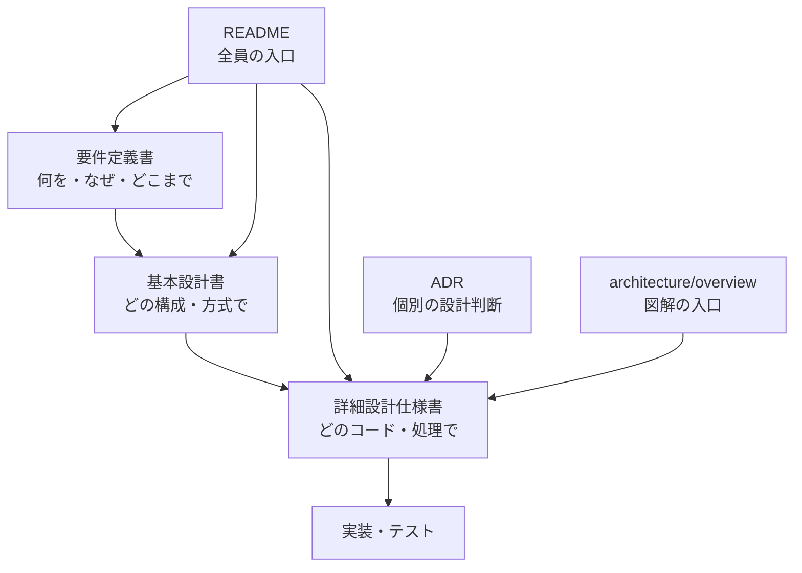

---

## 📌 現在の未決事項

- `Civil-Draw`のコード、依存関係、素材、フォントのライセンスと再利用範囲
- ~~内部座標の軸方向、角度正方向、基準単位、許容誤差~~ → ✅ ADR-0012で確定（mm・X右・Y下、公開APIは度数法）
- CivilDraft独自ファイルの拡張子と圧縮方式
- 対応するDXFバージョンと要素
- 日本語PDFフォントの方式と配布条件
- ~~共有版の正式な認証、本番Neon接続~~ → ✅ v0.1.0（PR #67）で本番Neon接続・persistX全配線完了。Cloudflare Access Secret登録（人間実施）待ちでAPI層はfail-closed中。ADR-0014でR2は必須構成から任意拡張点へ格下げ済み、署名付きURL発行は必要になった時点で着手
- 数量の標準丸め規則と工種・規格マスター
- ~~export_jobs.object_providerの不整合~~ → ✅ v0.1.3（PR #78）で'unassigned'へ統一。migration 0005の本番適用のみ人間判断待ち（export_jobsは実データ0件のためコード動作に影響なし）
- 監査ログhash chainの計算実装（Issue #61）と監査APIの実務化（ページング・フィルタ・verify）

未決事項は「とりあえず実装」で埋めず、性能・運用・権利・土木実務の確認を経てADRで決定します。

---

## 📄 ライセンス

CivilDraft本体、既存`Civil-Draw`から継承するコード、OSS依存関係、土木記号、テンプレート、フォントのライセンスはPhase 0で確認します。正式なライセンス確定前に、社外公開・再配布・商用利用を判断しないでください。

---

## 🏁 最終目標

> `Civil-Draw`のWeb CAD基盤を選択的に継承し、土木座標、施工・仮設計画、数量算出、断面、施工ステップを統合した「土木施工業務のためのWeb CAD」へ発展させる。

CivilDraftは、いきなり巨大な万能CADを目指しません。現場で繰り返されている作図・転記・説明・照査を一つずつ確実に減らし、土木施工の知識を再利用できる道具として育てていきます。
