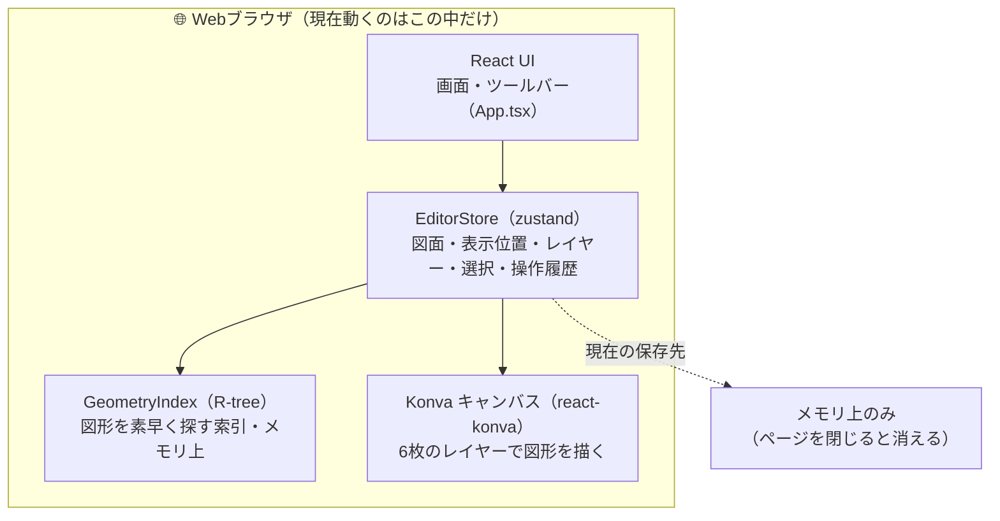
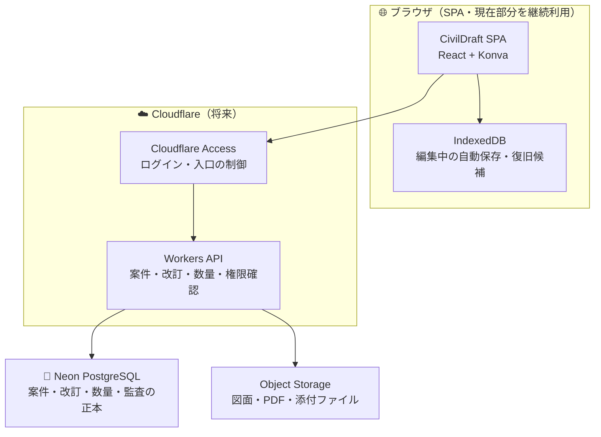
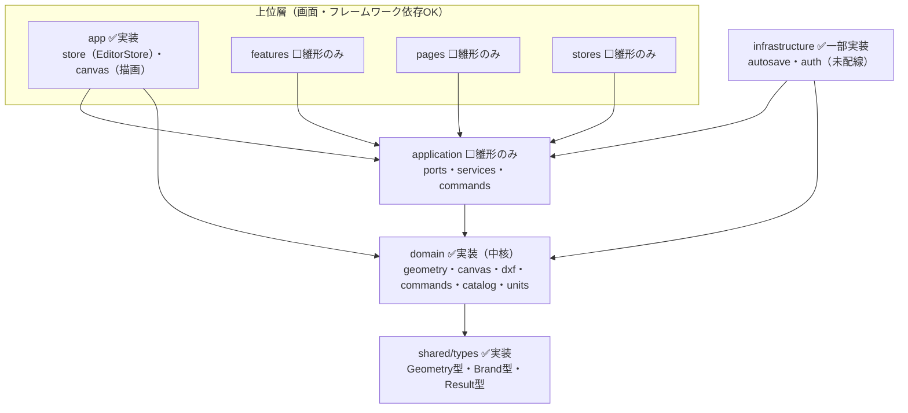
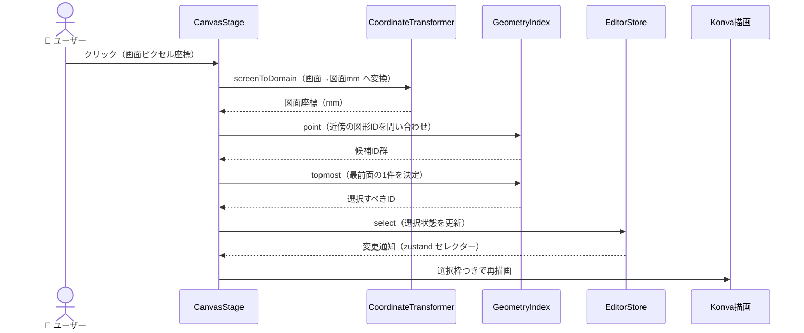
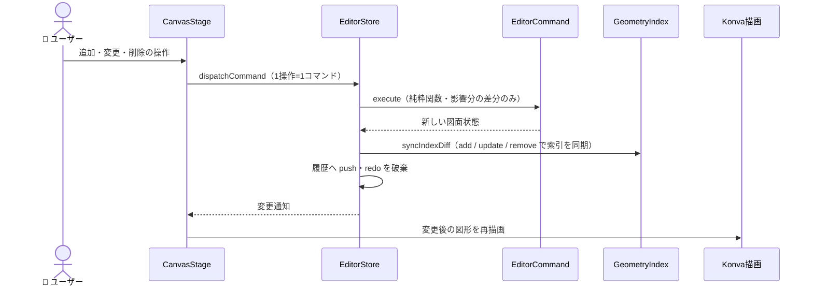
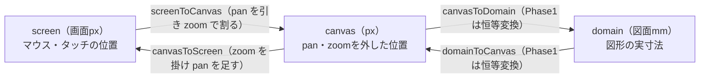
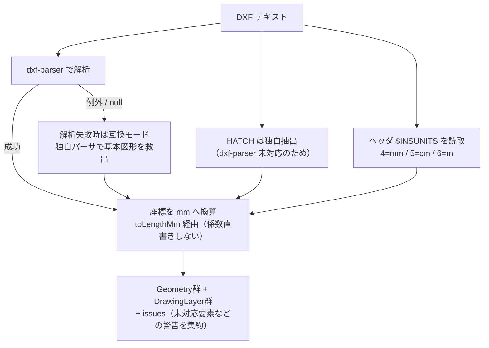
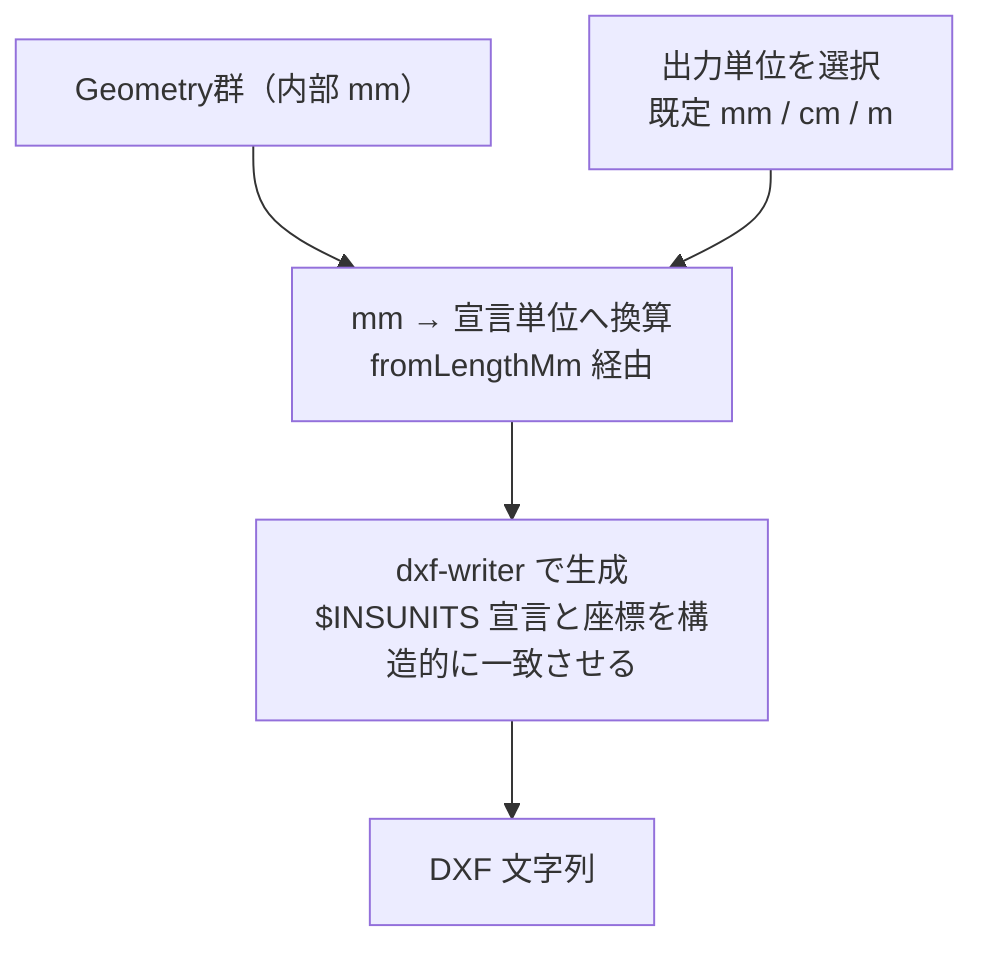

# 📌 CivilDraft アーキテクチャ図解（非エンジニア向け概説）

> **対象フェーズ: Phase 1（MVP 開発中）。実装済みの範囲と、将来（Phase 2 以降）に足す範囲を明確に分けて記載します。**
>
> この文書は、CivilDraft が「いま何で動いているか」を、CAD やプログラミングに詳しくない方にも
> 追えるように図で説明します。各図の下に「正本」（その図の根拠となる実装ファイル）を記載しています。
> 図と実装が食い違ったときは、実装ファイルが正です。

---

## 📌 1. システム全体像

CivilDraft は「いまはブラウザだけで完結して動く」段階です。将来（Phase 6）に、共有・承認・監査が
必要になった時点でサーバー側（Cloudflare Workers + Neon）を足します。**現在と将来を混同しないよう、
図を 2 枚に分けます。**

### 1.1 現在の構成（Phase 1・実際に動いている範囲）

いまは、あなたのパソコンの Web ブラウザの中だけで完結します。サーバーもデータベースもまだ使いません。

> ⚠️ **未配線の実装**: IndexedDB への自動保存（`infrastructure/autosave`）と Cloudflare Access 認証
> （`infrastructure/auth`）は**部品としては実装済み**ですが、まだ画面本体（`src/app`）につながっていません。
> したがって「現在」の保存はメモリ上のみです。配線は後続の Issue で行います。
>
> 正本: `src/app/App.tsx`, `src/app/canvas/CanvasStage.tsx`, `src/app/store/editorStore.ts`, `src/main.tsx`

### 1.2 将来の構成（Phase 6・未実装。方針のみ）

共有・改訂・照査・承認・監査が必要になった段階で、サーバー側を足します。標準スタックは
Systemd + GitHub + Cloudflare + Neon（Docker は使いません）。**下図はまだ作っていない将来像です。**

> 正本（方針）: `README.md`「システム構成」節、`src/infrastructure/auth/accessIdentity.ts`（Cloudflare Access 前提の identity 取得層・未配線）

---

## 🗂 2. レイヤー構造（部品の置き場所と依存の向き）

コードは「内側ほど土木の計算そのもの、外側ほど画面・保存・通信」という同心円状に分けています。
**内側は外側を知らない**（＝画面や保存の都合が計算ロジックに混ざらない）ことを、機械的に強制しています。

矢印は「依存してよい向き（import してよい向き）」です。**逆向きは禁止**で、次のように eslint が機械的に止めます。

| ルール（`no-restricted-imports`） | 内容 |
| --- | --- |
| domain 層は React / Konva / Zustand を import できない | 中核の計算をフレームワークから独立させる |
| domain 層は application / infrastructure / 上位層を import できない | 内側が外側を知らないようにする |
| application 層は infrastructure / 上位層を import できない | 実装詳細（保存・通信）に依存させない |
| stores / features / pages は infrastructure を直接 import できない | 必ず application の窓口（ports）を経由する |

> ✅ = 実装済みでファイルがある層、⬜ = ディレクトリだけ用意した雛形（Phase 2 以降で中身を実装）。
>
> 正本: `eslint.config.js`（`FRAMEWORK_SPECIFIERS` / `UPPER_LAYER_PATTERNS` と各層の `no-restricted-imports`）、詳細設計仕様書 §2.1

---

## 🔁 3. データフロー（操作から再描画まで）

ユーザーの操作が、どの部品をどの順に通って画面へ返るかを示します。CivilDraft の編集は
「1 操作 = 1 コマンド」で記録され、Undo/Redo と操作履歴の土台になっています。

### 3.1 図形を選ぶとき（クリック → ヒットテスト → 選択）

> 正本: `src/app/canvas/CanvasStage.tsx`（`handleClick`）、`src/domain/canvas/coordinateTransformer.ts`、`src/domain/geometry/spatialIndex.ts`（`point`/`topmost`）

### 3.2 図形を追加・変更・削除するとき（コマンド → 索引同期 → 再描画）

> 正本: `src/app/store/editorStore.ts`（`dispatchCommand`/`syncIndexDiff`/`HistorySlice`）、`src/domain/commands/editorCommand.ts`、`src/domain/commands/geometryCommands.ts`

---

## 📐 4. 座標系の説明（画面のピクセルと図面の実寸mm）

CAD では「画面上の見た目の位置」と「図面としての実際の寸法」を区別する必要があります。
例えば同じ 1 メートルの線でも、画面を拡大すれば長く、縮小すれば短く**見えます**が、
図面としての実寸は 1000mm のまま変わりません。CivilDraft はこの 2 つを次のように橋渡しします。

| 座標系 | 単位 | 何を表すか | 例え |
| --- | --- | --- | --- |
| screen | 画面ピクセル（px） | マウス・タッチの位置、実際に描かれる位置 | 「モニター上のどこか」 |
| canvas | ピクセル（px） | パン・ズームを取り除いた中間座標 | 「地図をスクロール・拡大する前の紙面」 |
| domain | ミリメートル（mm） | 図形の実寸法（ADR-0012 の内部基準） | 「図面としての本当の大きさ」 |

- **拡大率 zoom** は「図面 1mm を画面何ピクセルで描くか」です。ホイールで拡大すると zoom が上がり、線は太く長く見えますが、図面上の寸法（mm）は変わりません。
- **パン pan** は「図面を画面のどれだけ横・縦にずらして表示しているか」です。
- Phase 1 では canvas と domain は同じ向き・同じ原点（恒等変換）です。将来、用紙原点や測量座標系（§ロードマップ）を入れるときに、この橋渡しの一部だけを差し替えます。
- 描画も入力処理も、独自の変換式を書かず**必ずこの変換器を通す**ことで、ズレの原因を一箇所に集約しています。

> 正本: `src/domain/canvas/coordinateTransformer.ts`、`docs/adr/0012-internal-coordinate-baseline.md`

---

## 📄 5. DXF 入出力フロー

DXF は AutoCAD などと図面をやりとりするための標準テキスト形式です。CivilDraft は取り込み・書き出しの
両方で、**単位（mm / cm / m）を必ず内部基準の mm に揃える**ことを最重要の約束にしています
（単位取り違えは図面が実寸から桁違いにずれる重大事故につながるため）。

### 5.1 インポート（DXF → 内部モデル・単位を mm へ）

- 未対応の単位（インチ等）や未対応の要素は、黙って捨てず **issues（警告）に記録**して取り込みます。
- 角度は内部が度数法（ADR-0012）のため、ライブラリがラジアンで返す経路だけ度へ変換します。

> 正本: `src/domain/dxf/dxfImporter.ts`（`importDxf`/`resolveLengthUnit`/`buildFromParsed`/`buildFromFallback`）

### 5.2 エクスポート（内部モデル → DXF・mm から宣言単位へ）

- 継承元にあった「単位を Meters と宣言しながら座標は mm のまま」という不整合を、
  宣言と座標を**同じ 1 つの出力単位から導く**ことで解消しています。
- 13 種の図形種別を漏れなく分岐し、未対応の組み合わせはコンパイル時に検出されます。

> 正本: `src/domain/dxf/dxfExporter.ts`（単位宣言と座標の一致・`DxfExportOptions`）

---

## 🧩 6. 用語集（非エンジニア向け）

| 用語 | 1〜2 行の説明 |
| --- | --- |
| Geometry 判別共用体 | 線・円・円弧・矩形・楕円・ポリライン・スプライン・文字・寸法・引出線・ハッチ・記号・パラメトリック図形の 13 種類を、共通の土台（ID・レイヤー・スタイル等）の上で 1 つの型として扱う仕組み。 |
| 空間索引（R-tree） | 大量の図形から「この位置の近くにある図形」を高速に見つけるための索引。全図形を毎回総当たりせずに済む（クリック選択・カリングを速くする）。 |
| Command パターン | 「1 つの操作」を実行と取り消しの両方を持つ小さな部品にしたもの。全図形のコピーを積まず影響分の差分だけ持つため、Undo/Redo が軽く、将来の監査ログにも再利用できる。 |
| ビューポートカリング | 画面外の図形を描画対象から外して速くする最適化。図形が一定数（既定 500）を超えたときに、いま見えている範囲の図形だけを描く。 |
| EditorStore | 図面・表示位置（ズーム/パン）・レイヤー・選択・操作履歴をまとめて持つ状態の入れ物。図面ごとに独立して作れる。 |
| CoordinateTransformer | 画面ピクセルと図面 mm を相互変換する唯一の窓口。座標のズレの原因を一箇所に集約する。 |
| DrawingLayer | 図形をまとめる「レイヤー（層）」。表示/非表示・ロック・既定の線色などを持つ。 |
| ADR-0012 | 内部座標の約束（mm・X 右・Y 下、公開 API は度数法）を決めた設計記録。 |
| issues（ValidationIssue） | 取り込みや検証で見つかった問題を、黙って捨てずに集める警告の集合。「どこを直すべきか」を利用者に見せるための仕組み。 |

---

## 🛣 7. ロードマップ（未実装機能の区別）

以下は **まだ実装していない**、Phase 2 以降で足す機能です。上の図（§1〜§6）に含めていません。

| Phase | 追加予定（現時点で未実装） |
| --- | --- |
| Phase 2 | 測量座標・測点、中心線・オフセット（座標系変換の canvas↔domain を拡張） |
| Phase 3 | 仮設・重機・土工のパラメトリック作図 |
| Phase 4 | 業務属性・数量集計・数量根拠の追跡 |
| Phase 5 | 縦横断・施工ステップ・簡易土量 |
| Phase 6 | DXF 強化・改訂/照査/承認、共有版（Cloudflare Workers + Neon + Object Storage）、IndexedDB 自動保存と認証の配線 |

> 実装済みディレクトリと雛形（⬜）ディレクトリの対応は §2 を参照。
> 各 Phase の到達点は `README.md`「開発ロードマップ」節が正本です。

---

## 📎 関連文書

| 文書 | 用途 |
| --- | --- |
| `README.md` | 製品概要・システム構成・ロードマップ（外向けの正本） |
| `docs/adr/0012-internal-coordinate-baseline.md` | 内部座標の約束（mm・軸方向・角度） |
| `docs/adr/0013-geometry-id-generation.md` | 図形 ID の発番方針 |
| `CivilDraft_詳細設計仕様書_20260714.md` | §2.1 レイヤー構成・§7 コマンド・§9 キャンバスの実装仕様 |
| `docs/operations/` | リリース・ロールバック・運用・障害対応の手順 |
