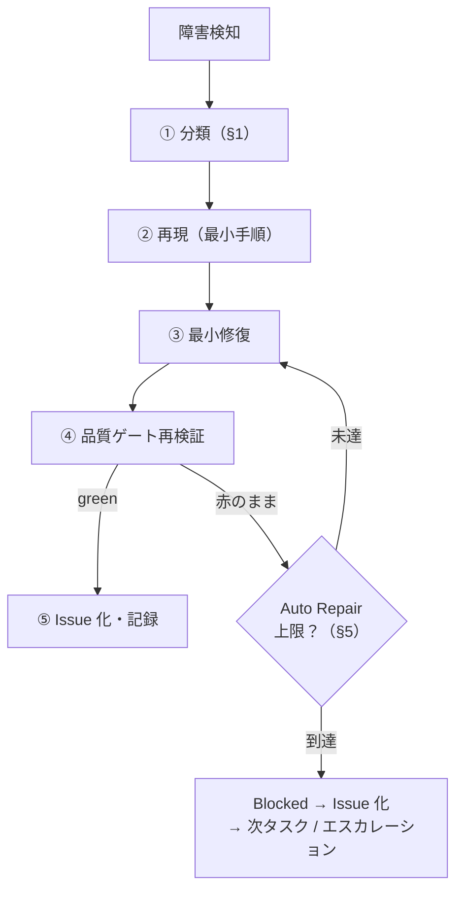
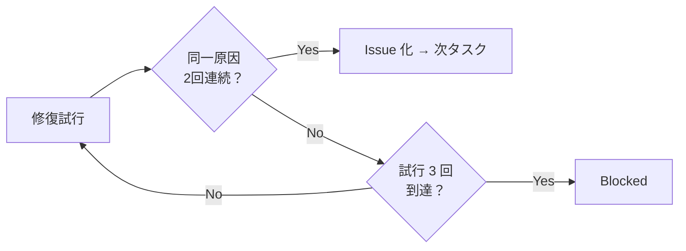

# 📌 障害対応手順書（Incident Response）

> **対象フェーズ: Phase 1（未デプロイ段階）。本番ホスティング確定時に改訂する。**
>
> Phase 1 MVP はフロントエンド単体（Vite + React SPA）で本番未稼働です。したがって現段階の
> 「障害」は主に**開発・CI・依存・リグレッション**に関するものであり、本番サービス障害
> （可用性・レイテンシ・データ破損）は Phase 6 のバックエンド導入後に本書へ追記します。

---

## 📋 1. 障害分類

| 分類 | 症状の例 | 主な発生源 | 一次対応の起点 |
| --- | --- | --- | --- |
| 🔴 ビルド不能 | `npm run build` / `typecheck` が失敗、`dist/` 生成不可 | 型エラー・構文エラー・依存欠落 | §3 初動 → 直近 green へ |
| ❌ CI 失敗 | GitHub Actions `quality` / `security` ジョブが fail | lint/type/test/build/audit いずれか | §3 初動 → 該当ゲート特定 |
| 🔐 依存脆弱性 | `npm audit --audit-level=high` で high 以上検出 | 依存パッケージの CVE | §4 → dependency-hygiene 手順 |
| ⚠️ リグレッション | マージ後に既存機能が壊れる・テストが赤転 | 変更の副作用 | §3 → 必要なら rollback |

> 分類はエスカレーション経路（§6）と Auto Repair 上限（§5）の判断に用いる。

---

## 🔁 2. 障害対応フロー（全体像）



---

## 🔍 3. 初動（再現 → 最小修復 → Issue 化）

### 3.1 再現

1. **エラーメッセージ全文とコマンド**を確保する（`npm run build 2>&1 | tee` 等でログ保全）。
2. **最小再現手順**を特定する（どのファイル・どの入力・どのコマンドで起きるか）。
3. **直近の green との差分**を確認する（`git log --oneline`、`git diff <green>..HEAD`）。

### 3.2 最小修復

| 原則 | 内容 |
| --- | --- |
| 最小差分 | 原因に直結する最小の修正のみ。「ついで整理」を混ぜない（CLAUDE.md §18） |
| 原因特定後に修正 | 原因不明のままの修正は禁止（CLAUDE.md §18） |
| 深追い禁止 | 1 対応 = 1 仮説。仮説が外れたら記録して次仮説へ |

### 3.3 再検証

```bash
npm run lint && npm run typecheck && npm test && npm run build
```

必要に応じて `npm audit --audit-level=high` も実行する。

### 3.4 Issue 化・記録

| 記録先 | 内容 |
| --- | --- |
| GitHub Issue | 分類・再現手順・原因・対応・再発防止（受入条件付き） |
| 再現テスト | リグレッションは必ず回帰テストを追加してから close |
| Projects | 対応中は Development、上限到達は Blocked（§operations-manual §5） |

---

## 🔐 4. 依存脆弱性への対応

1. `npm audit --audit-level=high` で検出内容（パッケージ・重大度・推奨対応）を確認する。
2. 直接依存なら更新可否を検討、推移的依存なら上流の更新可否を確認する。
3. 更新後に**品質ゲートを再検証**し、`npm run sbom` / `npm run notices` を再生成する。
4. ⚠️ **リリース可否・ライセンス影響の最終判断は `docs/operations/dependency-hygiene.md` の手順で人間が行う**（本書は技術的初動のみ）。

> Security critical 検知は CTO 優先順位で最上位（CLAUDE.md §5.1）。他作業に優先して対応する。
> ただし修正が認証・認可・依存の広範な更新に及ぶ場合はエスカレーション（§6）。

---

## ⚠️ 5. Auto Repair 制約（CLAUDE.md §12）

無限修復を防ぐため、以下の**強制停止条件**を守る。

| 条件 | 挙動 |
| --- | --- |
| 同一エラーの**同一原因が 2 回連続** | 🛑 それ以上リトライせず **Issue 化して次タスクへ** |
| **修復試行が 3 回**到達 | 🛑 当該タスクを **Blocked** にする |
| コンテキスト圧迫警告 | 🛑 **即座に終了処理**へ移行 |

補助的な停止基準:

| 基準 | 挙動 |
| --- | --- |
| 最大リトライ 3 回 | 到達で停止 |
| 修正差分が出ない | 停止（同じ変更の繰り返し禁止） |
| テストが改善しない | 停止（効果が出ない修復を続けない） |
| Security blocker 検知 | 停止してエスカレーション |



> 同一エラーの 2 回目以降は、CLAUDE.md 運用方針上 Codex rescue（`/codex:rescue --background investigate`）への委任も選択肢。
> ただし Codex が使えなくても停止条件は同じであり、上限到達時は Blocked / Issue 化で確実に止める。

---

## 🚦 6. エスカレーション基準（人間判断が必要な境界）

以下は CTO / 自動側で完結させず、**人間の明示判断**を仰ぐ（CLAUDE.md）。

| 事象 | 対応 |
| --- | --- |
| 🚫 本番公開・外部公開 URL の切替が絡む障害 | 人間決裁（Phase 1 では本番未配置のため主に将来事項） |
| 🚫 データ削除・履歴改変・force push・`main` 直 push を伴う復旧 | 人間の明示承認を待つ |
| 🚫 課金が発生する操作（リソース作成・プラン変更） | 事前に判断材料・推奨案を提示し承認を待つ |
| 🚫 秘密情報（Secret・トークン・接続文字列）の登録・変更・削除 | 人間が実施 |
| 🚫 認証・認可・DB スキーマ・並列処理に関わる修正 | 対抗レビュー（`/codex:adversarial-review`）必須、方針は人間確認 |
| 🛑 Auto Repair 上限到達（同一原因2回 / 修復3回） | Blocked にして Issue 化、方針を人間へ提示 |
| 🔐 Security critical で修正範囲が広範 | 影響範囲を提示して承認を待つ |
| 🔌 プラグイン MCP が 401/403（認証失効） | ブロッカー化せず Issue 化、再認証は人間へ依頼して他作業継続 |

### 6.1 エスカレーション時に添える情報

1. 障害分類（§1）と検知経路
2. 再現手順とエラーログ全文
3. 試した仮説・修復とその結果（Auto Repair 試行回数を含む）
4. 推奨対応案とリスク、影響範囲
5. 人間判断が必要な理由（上表のどれに該当するか）

---

## 📋 7. 障害対応チェックリスト

| # | 項目 | 状態欄 |
| --- | --- | --- |
| 1 | 障害を分類した（§1） | ☐ |
| 2 | エラーログ全文を保全した | ☐ |
| 3 | 最小再現手順を特定した | ☐ |
| 4 | 直近 green との差分を確認した | ☐ |
| 5 | 最小差分で修復した（原因特定済み） | ☐ |
| 6 | 品質ゲートを再検証した | ☐ |
| 7 | Issue 化・再現テスト追加をした | ☐ |
| 8 | 上限到達なら Blocked にしエスカレーションした | ☐ |

---

## 📎 関連文書

| 文書 | 用途 |
| --- | --- |
| `docs/operations/rollback-procedure.md` | リグレッション時の切り戻し |
| `docs/operations/operations-manual.md` | 品質ゲート実行・Projects 状態運用 |
| `docs/operations/release-procedure.md` | リリース前チェック・成果物検証 |
| `docs/operations/dependency-hygiene.md` | 依存脆弱性・ライセンス判断（正本） |
| `CLAUDE.md` §12 | Auto Repair 制御 / Stop Conditions の正本 |
