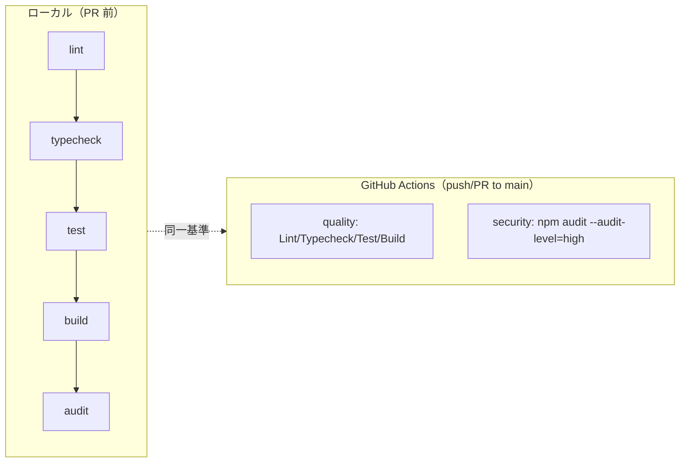
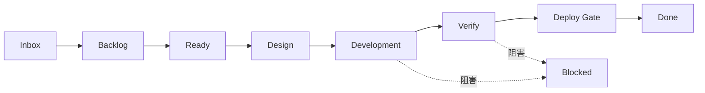
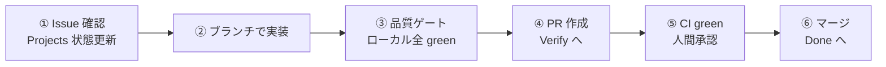

# 📌 運用手順書（Operations Manual）

> **対象フェーズ: Phase 1（未デプロイ段階）。本番ホスティング確定時に改訂する。**
>
> Phase 1 MVP はフロントエンド単体（Vite + React SPA）です。本書は開発・検証環境における
> 日常運用（開発サーバー、品質ゲート、SBOM/NOTICES、GitHub Projects 運用）を対象とします。
> 本番運用（監視・ログ・スケーリング）はホスティング確定後（Phase 6 以降）に本書へ追記します。

---

## 📋 1. 前提環境

| 項目 | 値 | 確認先 |
| --- | --- | --- |
| OS | Linux 開発環境 | — |
| Node.js | 25 系（`.nvmrc` = `25`。`engines` は `>=24`） | `package.json` / `.nvmrc` |
| npm | 10 以上 | `package.json` `engines` |
| 依存インストール | `npm ci`（`package-lock.json` 準拠） | — |

```bash
nvm use      # .nvmrc に従い Node 25 系を選択
npm ci       # ロックファイル準拠でクリーンインストール
```

---

## 🖥️ 2. 開発サーバーの起動・停止

Phase 1 の稼働対象は Vite 開発サーバーのみ（バックエンドプロセス無し）。

### 2.1 起動

| 目的 | コマンド | 備考 |
| --- | --- | --- |
| 標準起動（localhost） | `npm run dev` | `package.json` の `dev` = `vite` |
| ポート・ホスト指定（LAN 共有・検証） | `npx vite --port <port> --host 0.0.0.0` | 例: `npx vite --port 5173 --host 0.0.0.0` |
| npm script 経由でフラグ付与 | `npm run dev -- --port 5173 --host 0.0.0.0` | `--` 以降が vite に渡る |
| ビルド結果の確認 | `npm run preview` | `dist/` を配信（要 `npm run build`） |

```bash
# 標準（自分の端末でのみ確認）
npm run dev

# LAN 内の別端末・実機ブラウザから確認する場合
npx vite --port 5173 --host 0.0.0.0
```

> `--host 0.0.0.0` は全 NIC で待受ける。検証ネットワーク外へは公開しない（外部公開 URL 切替は人間決裁の境界）。

### 2.2 停止

| 方法 | 操作 |
| --- | --- |
| フォアグラウンド | 実行中ターミナルで `Ctrl + C` |
| ポート占有が残った場合 | `lsof -i :5173` で PID 確認 → 該当プロセスを停止 |

---

## ✅ 3. 品質ゲートの回し方

CI（`.github/workflows/ci.yml`）と同一のチェックをローカルで再現できる。**PR 前にローカルで全 green を確認**する。

### 3.1 個別コマンド

| ゲート | コマンド | CI ジョブ対応 |
| --- | --- | --- |
| Lint | `npm run lint` | `quality`（ESLint） |
| 型検査 | `npm run typecheck` | `quality`（`tsc -b --noEmit`） |
| テスト | `npm test` | `quality`（Vitest `vitest run`） |
| ビルド | `npm run build` | `quality`（`tsc -b && vite build`） |
| 依存監査 | `npm audit --audit-level=high` | `security`（Dependency Audit） |
| テスト（watch） | `npm run test:watch` | ローカル開発用（CI では未使用） |

### 3.2 一括実行（PR 前の推奨シーケンス）

```bash
npm run lint && npm run typecheck && npm test && npm run build && npm audit --audit-level=high
```

> いずれか失敗で全体停止。失敗時は `docs/operations/incident-response.md` の初動に従う。

### 3.3 CI との対応関係



| CI ジョブ | トリガー | 必須チェック |
| --- | --- | --- |
| `Lint / Typecheck / Test / Build`（quality） | `main` への push / PR | ✅ ブランチ保護で必須 |
| `Dependency Audit`（security） | `main` への push / PR | ✅ ブランチ保護で必須 |

> `main` は PR 必須・レビュー承認1件必須・上記2チェック success 必須（strict でブランチ最新化要求）・force push / 削除禁止。

### 3.4 typecheck が並列作業で不安定なとき

複数エージェント並列作業で `tsbuildinfo` キャッシュが壊れて誤検知することがある。その場合のみ:

```bash
rm -rf node_modules/.tmp/*.tsbuildinfo
npm run typecheck
```

---

## 🔐 4. SBOM / サードパーティ表記の再生成

| 生成物 | コマンド | 出力先 | 形式 |
| --- | --- | --- | --- |
| SBOM | `npm run sbom` | `sbom/civildraft-sbom.cdx.json` | CycloneDX（`npm sbom`） |
| サードパーティ表記 | `npm run notices` | `THIRD-PARTY-NOTICES.md` | 本番依存のライセンス集約 |

```bash
npm run sbom       # SBOM を CycloneDX 形式で出力
npm run notices    # THIRD-PARTY-NOTICES.md を再生成
```

### 4.1 再生成タイミング

| タイミング | 理由 |
| --- | --- |
| `package.json` の依存（dependencies）を追加・更新・削除した時 | 依存グラフが変わるため |
| リリース準備時 | `release-procedure.md` §2.2 のチェック項目 |
| 依存監査で対応した時 | 監査後の依存状態を反映 |

> ⚠️ どちらも**生成物**であり手動編集しない（次回生成で上書きされる）。
> リリース可否・ライセンス最終判断は `docs/operations/dependency-hygiene.md` の手順で**人間が行う**。本書は生成手順のみを扱う。

---

## 📋 5. GitHub Projects の状態遷移運用

Issue / PR は GitHub Projects「CivilDraft-Web-CAD 開発司令盤」で状態管理する。CLAUDE.md §10 の遷移に従う。



| 状態 | 意味 | 入る条件 |
| --- | --- | --- |
| Inbox | 未整理の起票 | Issue 作成直後 |
| Backlog | 優先度付け待ち | 内容整理済み |
| Ready | 着手可能 | 受入条件・要件 ID が確定 |
| Design | 設計中 | 設計判断・ADR が必要 |
| Development | 実装中 | ブランチで作業開始 |
| Verify | 検証中 | 品質ゲート・レビュー実施 |
| Deploy Gate | 配置判断待ち | STABLE 達成・人間決裁待ち |
| Done | 完了 | マージ済み・受入条件充足 |
| Blocked | 阻害 | 依存未解決 / 同一エラー2回 / 修復3回到達（§incident-response） |

### 5.1 更新タイミング

| いつ | 何を |
| --- | --- |
| セッション開始時 | 前回状態を確認、着手対象を Ready → Development へ |
| 各ループ終了時 | 現状態を反映（Development → Verify 等） |
| PR 作成時 | Verify へ、必要チェック状況を記録 |
| マージ時 | Done へ |
| ブロッカー発生時 | Blocked へ、理由を Issue コメントに記録 |
| セッション終了時 | 最終状態を反映、再開ポイントを記録 |

> Projects へ接続できない場合は、その旨（「未接続」「不明」）を明記してから作業を継続する（CLAUDE.md §10）。

---

## 🔁 6. 日常運用の 1 サイクル（まとめ）



1. Issue と Projects の状態を確認し、着手対象を決める。
2. ブランチ（または WorkTree）で実装・テスト追加する（`main` 直 push 禁止）。
3. ローカルで品質ゲートを全 green にする（§3.2）。
4. PR を作成し、変更内容・テスト結果・影響範囲・残課題を記載する。
5. CI 2 ジョブ success と人間承認を得る（`main` 宛）。
6. マージし、Projects を Done へ更新、README / 文書を同期する。

---

## 📎 関連文書

| 文書 | 用途 |
| --- | --- |
| `docs/operations/release-procedure.md` | リリース前チェックリスト・成果物生成 |
| `docs/operations/rollback-procedure.md` | 切り戻し手順 |
| `docs/operations/incident-response.md` | 障害初動・Auto Repair 制約・エスカレーション |
| `docs/operations/dependency-hygiene.md` | 依存衛生・ライセンス判断（正本） |
| `README.md` | CI 実態・コマンド一覧・開発の始め方 |
