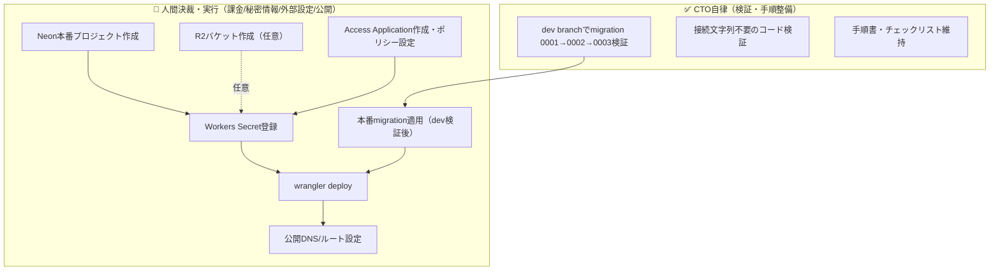

# 🚀 本番デプロイ手順書（Production Deployment）

> **対象**: CivilDraft Web CAD を Cloudflare Workers + Neon PostgreSQL で本番公開する際の手順（R2 は任意・§4.1 参照）。
>
> **前提**: 本書の各手順は**人間（運用者）が実行する**。CTO（自動開発）は手順書の整備・dev ブランチでの検証までを担い、
> 本番リソース作成・Secret 登録・DNS 切替・`wrangler deploy` は実行しない（課金・秘密情報・外部サービス設定・本番公開のため）。
>
> 関連: [`release-procedure.md`](./release-procedure.md)（リリース手順）・[`rollback-procedure.md`](./rollback-procedure.md)（切り戻し）・[`pre-release-checklist.md`](./pre-release-checklist.md)

---

## 📌 1. 全体像



本アプリは**2つの独立した公開単位**を持つ。2026-07-18時点で両方とも本番デプロイ済み（read-only照会で確認、詳細は§7）:

| 単位 | 内容 | 現状 |
| --- | --- | --- |
| 静的SPA | `dist/` を Static Assets として配信（ブラウザ内CAD） | ✅ デプロイ済み（`ASSETS` binding確認、`civildraft-web-cad.mirai-dx-platform.com` でHTTP 200確認） |
| Workers API | `src/workers/index.ts`（18経路のP0縦線） | ✅ デプロイ済み（`main` エントリ有効化済み）。書き込み系9ルート（GET以外の全経路）は、(a) migration 0003 本番適用 と (b) persistX配線実装 の両方が完了するまでfail-closed（503、ADR-0014）。GET系読み取りには影響しない |

---

## 🔑 2. 必要な環境変数・Secret 一覧

Worker は起動時に以下を参照する。**すべて Workers Secret / binding として登録**し、リポジトリには保存しない。

| キー | 種別 | 必須条件 | 用途 | コード参照 |
| --- | --- | --- | --- | --- |
| `CIVILDRAFT_API_MODE` | 変数 | 本番は `neon-r2` を明示 | 永続化モード。未設定/不正値は 503 で停止（fail-closed） | `src/workers/index.ts` `resolvePersistenceMode` |
| `CIVILDRAFT_NEON_CONNECTION` | Secret | `neon-r2` 時必須 | Neon 接続文字列 | `src/workers/persistence.ts` |
| `CIVILDRAFT_R2_BUCKET` | R2 binding | **任意**（§4.1） | 図面内容は Neon (`drawing_contents.content`) へ直接保存するため不要。将来の共有ストレージ用途のみ | `src/workers/persistence.ts` |
| `CIVILDRAFT_ACCESS_TEAM_DOMAIN` | 変数 | `neon-r2` 時必須 | Access チームドメイン（`https://<team>.cloudflareaccess.com`）。iss 検証にも使用 | `src/workers/accessJwt.ts` |
| `CIVILDRAFT_ACCESS_AUD` | Secret/変数 | `neon-r2` 時必須 | Access Application の AUD タグ | `src/workers/accessJwt.ts` |

> ⚠️ **fail-closed 仕様**: `CIVILDRAFT_API_MODE=neon-r2` かつ Access 検証設定（`CIVILDRAFT_ACCESS_TEAM_DOMAIN` / `CIVILDRAFT_ACCESS_AUD`）が未構成の場合、
> Worker は全 API を **503 で停止**する。ヘッダー存在確認のみの弱認証で本番データへ到達させないための二次防御（#36）。
> 永続化 binding は `CIVILDRAFT_NEON_CONNECTION` のみが必須。欠けている場合も同様に 503（fail-closed）。
> `CIVILDRAFT_R2_BUCKET` は任意のため、未設定でも 503 の原因にはならない（migrations/0003 で Neon 直接保存へ移行済み）。

Secret 登録コマンド（**人間実行**、値は対話入力でシェル履歴に残さない）:

```bash
wrangler secret put CIVILDRAFT_NEON_CONNECTION
wrangler secret put CIVILDRAFT_ACCESS_AUD
# 変数（非秘匿）は wrangler.jsonc の "vars" か dashboard で設定:
#   CIVILDRAFT_API_MODE = "neon-r2"
#   CIVILDRAFT_ACCESS_TEAM_DOMAIN = "https://<team>.cloudflareaccess.com"
```

---

## 🐘 3. Neon（DB）手順

### 3.1 dev ブランチでの検証（✅ CTO 自律可・本番へ波及しない）

```
1. Neon dev ブランチを作成（create_branch）
2. 0001_initial_schema.sql → 0002_api_contract_alignment.sql → 0003_persistence_schema_drift_fix.sql の順に適用
3. npm run migrations:check の静的検証と実適用の整合を確認
4. explain/describe で索引・FK・監査ハッシュチェーン列を確認
5. persistContent/persistQuantities 相当の INSERT を実データで試行し、NOT NULL 制約違反がないことを確認
```

`migrations/0002_api_contract_alignment.sql` ・ `migrations/0003_persistence_schema_drift_fix.sql` は前方互換（既存列削除なし・`ADD COLUMN IF NOT EXISTS` / `DROP NOT NULL` による制約緩和のみ）。
0003 は R2 スキップ決定（本セクション・§4.1）に伴うスキーマドリフト（`drawing_contents.content` 列追加、`object_key`/`quantity_items.name`/`quantity` の NOT NULL 緩和）を解消する。2026-07-18 時点で dev ブランチ実地検証済み（DDL 適用・実データ INSERT とも成功）。

> ⚠️ 上記ステップ5「persistContent/persistQuantities 相当の INSERT」は、SQL を直接実行するスキーマレベルの検証であり、
> Worker コード側の `persistContent`/`persistQuantities`（`src/workers/neonApiStore.ts`）が実際に呼ばれることを確認したものではない。
> これらの永続化メソッドは本ADR時点で `src/workers/index.ts` のどのハンドラからも呼ばれておらず（配線漏れ、ADR-0014 Decision 5 参照）、
> 別途 Issue でコード側の配線実装・結合テストが必要。

### 3.2 本番適用（🚫 人間決裁）

- Neon **本番（main）ブランチ**への適用は自動実行禁止（データ影響・CLAUDE.md §8.6）。
- 手順: dev ブランチで検証済みの `0001`→`0002`→`0003` を、人間が承認して本番へ適用 → `CIVILDRAFT_NEON_CONNECTION` を Secret 登録。
- 切り戻しは [`rollback-procedure.md`](./rollback-procedure.md) §4.1（Neon ブランチ / PITR）。

---

## ☁️ 4. Cloudflare 手順

### 4.1 R2 バケット（任意・🚫 人間決裁・課金）

**Phase 1 の本番公開には不要**。図面内容は Neon (`drawing_contents.content` jsonb 列、migrations/0003)
へ直接保存する方針に転換済みで、R2 は将来の共有ストレージ用途（大容量添付ファイル等）向けの拡張ポイントとして残しているのみ。
`CIVILDRAFT_R2_BUCKET` binding が未設定でも `inspectProductionPersistenceReadiness` は ready を返し、Worker は 503 にならない
（`src/workers/persistence.ts` `PRODUCTION_BINDING_LABELS`）。

必要になった場合のみ:

```bash
wrangler r2 bucket create civildraft-drawings   # 名称は運用規約に合わせる
```

作成後、`wrangler.jsonc` に R2 binding を追加（`CIVILDRAFT_R2_BUCKET`）。

### 4.2 Cloudflare Access（🚫 人間決裁・外部設定）

```
1. Access Application を作成し、対象ドメイン/ルートを保護対象に設定
2. ポリシー（engineer/supervisor/viewer に対応するグループ）を割当
3. Application の AUD タグを取得 → CIVILDRAFT_ACCESS_AUD へ
4. チームドメイン（https://<team>.cloudflareaccess.com）→ CIVILDRAFT_ACCESS_TEAM_DOMAIN へ
```

JWKS は Worker が `<team-domain>/cdn-cgi/access/certs` から自動取得・キャッシュする（追加設定不要）。

### 4.3 Worker 有効化（🚫 人間決裁・本番公開）

`wrangler.jsonc` の `main` エントリ（現在コメントアウト）を有効化する際の設計判断（Issue #36 の残課題）:

- **案A**: Static Assets の前段に API routing を置く同一 Worker（`main: src/workers/index.ts` + `assets.binding: ASSETS`）
- **案B**: API と静的配信を別 Worker に分離

いずれも人間が決定。決定後 `wrangler deploy`（**人間実行**）。

---

## ✅ 5. デプロイ前チェックリスト（2026-07-18 read-only照会で状態欄を更新）

| # | 項目 | 確認方法 | 決裁 | 状態 |
| --- | --- | --- | --- | --- |
| 1 | 品質ゲート全 green | `npm run release:audit` | CTO | ✅ 完了（105ファイル/1191テストpass） |
| 2 | CI 必須チェック成功（quality/E2E/audit/SBOM） | GitHub PR checks | CTO | ✅ 完了（PR#65で5チェック全pass） |
| 3 | migration 0001→0002→0003 を dev ブランチで検証 | Neon dev で実適用 | CTO | ✅ 完了 |
| 4 | 本番 migration 適用 | Neon main（承認後） | 🚫 人間 | `0001`+`0002` ✅適用済み／`0003` ❌未適用（PR#65マージ後） |
| 5 | R2 バケット作成・binding 設定（**任意**・§4.1） | `wrangler r2 bucket list` | 🚫 人間 | ➖ 対象外（ADR-0014でNeon直接保存へ転換） |
| 6 | Access Application・ポリシー設定 | Cloudflare dashboard | 🚫 人間 | ⚠️ 未確認（§7参照。本番API無認証GETはHTTP 401でfail-closedの503ではない） |
| 7 | Secret/変数を登録 | `wrangler secret list` | 🚫 人間 | `API_MODE`/`NEON_CONNECTION` ✅bindings確認済み／`ACCESS_TEAM_DOMAIN`・`ACCESS_AUD` ⚠️bindings一覧で未確認 |
| 8 | `wrangler.jsonc` の `main`/API routing 決定 | 設計判断（#36） | 🚫 人間 | ✅ 完了（`ASSETS` binding統合＝案A相当で有効化済み） |
| 9 | `wrangler deploy` | デプロイ実行 | 🚫 人間 | ✅ 完了 |
| 10 | スモーク（401/403/200 と 503 fail-closed） | 本番エンドポイント確認 | 🚫 人間 | ⚠️ 部分実施のみ（read-only GET: SPA=200, API無認証=401）。JWT付き200・403・fail-closed 503の確認は未実施 |
| 11 | 公開 DNS/ルート切替 | Cloudflare dashboard | 🚫 人間 | ✅ 完了（`civildraft-web-cad.mirai-dx-platform.com`、enabled確認済み） |

---

## 🔎 6. デプロイ後スモーク観点

`CIVILDRAFT_API_MODE=neon-r2` で有効化後、以下を確認する:

| 確認 | 期待 |
| --- | --- |
| Access 未通過（JWT なし） | 401 CD-AUTH-001 |
| 不正/期限切れ JWT | 401（理由はレスポンスに非露出、ログのみ） |
| 権限外リソース参照 | 403 CD-AUTH-002 |
| Secret 一部欠落で起動 | 503 CD-SYS-002（fail-closed。データを返さない） |
| 正常フロー（案件→図面→改訂→保存→承認→出力→監査） | 各業務応答（200/201） |

観測は Cloudflare Workers Observability（`query_worker_observability`）でエラー率・ログを確認する。

---

## 📋 7. 残課題（2026-07-18 read-only照会で更新）

- ✅ 完了: Neon本番プロジェクト `civildraft-production`（pg17）作成・`0001`+`0002`適用、Workers Secret（`CIVILDRAFT_NEON_CONNECTION`/`CIVILDRAFT_API_MODE=neon-r2`）登録、`wrangler.jsonc` の `main` エントリ有効化（`ASSETS` binding統合＝案A相当）、`wrangler deploy` 実行、カスタムドメイン `civildraft-web-cad.mirai-dx-platform.com` 設定
- ➖ 対象外: R2 バケット作成（ADR-0014 で Neon 直接保存へ方針転換。§4.1 参照）
- ⚠️ 要人間確認: Cloudflare Access Secret（`CIVILDRAFT_ACCESS_TEAM_DOMAIN` / `CIVILDRAFT_ACCESS_AUD`）— Workers bindings 一覧（read-only 照会）では確認できなかった。ただし本番 API への無認証 GET は HTTP 401（CD-AUTH-001 相当）を返しており、fail-closed の 503 ではない。つまり Worker 自体は稼働し認証チェック層も機能しているが、正規の Access ログインフローが最終的に成功するかは未確認。Secret の登録状況そのものの確認・対応は人間が行う（秘密情報のため）
- 🚫 人間決裁（未実施）: migration `0003`（`migrations/0003_persistence_schema_drift_fix.sql`）の本番 Neon main 適用。PR#65 マージ後に実施し、適用後は共有保存 API の fail-closed 暫定措置（`isSharedSaveRoute`、ADR-0014）の撤去要否を判断する
