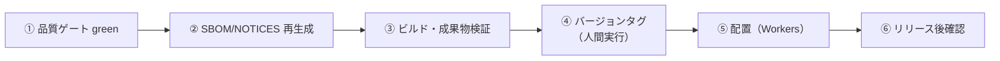

# 📌 リリース手順書（Release Procedure）

> **対象フェーズ: リリース前検証段階。公開・タグ付け・本番デプロイは人間決裁後に実行する。**
>
> 本プロジェクトは Vite + React SPA と、リリース前検証用の Cloudflare Workers API を持ちます。
> 初回公開構成は Cloudflare Workers Static Assets による静的配信です。
> Workers API は `src/workers/index.ts` に検証実装済みですが、本番DB/Storage/Secret接続は未承認です。
> 本書は「成果物を生成・検証し、人間がリリース可否を判断できる状態に整える」ところまでを正式手順とします。

---

## 📋 1. このフェーズでの「リリース」の定義

| 項目 | Phase 1 での実態 |
| --- | --- |
| リリース対象 | 静的成果物 `dist/`（Vite ビルド出力、SPA） |
| 配置先 | ✅ **Cloudflare Workers（Static Assets）に確定**（2026-07-15 人間承認） |
| バックエンド | Workers API は検証実装済み。本番DB/Storage接続は未承認 |
| リリース判断者 | 🚫 **人間（バージョンタグ・本番配置は人間実行）**。CTO は提案・準備まで |

> Phase 1 の「リリース準備完了」とは、**全品質ゲートが green・脆弱性0・成果物検証済み・README 最新・PR 承認済み**の状態を指す。
> 実際の公開（外部公開 URL 切替）は人間の最終決断が必要な境界（CLAUDE.md）に該当し、自動実行しない。

---

## ✅ 2. リリース前チェックリスト

リリース準備を完了と判断する前に、以下を**すべて green** にする。1つでも未達なら STABLE 未達（CLAUDE.md §9）として先へ進まない。

### 2.1 品質ゲート（ローカル + CI 双方で確認）

| # | 項目 | コマンド | 合格条件 |
| --- | --- | --- | --- |
| 1 | Lint | `npm run lint` | ESLint エラー 0（レイヤー間依存も `no-restricted-imports` で強制） |
| 2 | 型検査 | `npm run typecheck` | `tsc -b --noEmit` エラー 0 |
| 3 | DBマイグレーション静的検証 | `npm run migrations:check` | 危険DDLなし、FK/索引/監査列の整合 |
| 4 | テスト | `npm test` | Vitest 全件 pass |
| 5 | ブラウザE2E | `npm run e2e` | Playwright スモーク全件 pass |
| 6 | ビルド | `npm run build` | `tsc -b && vite build` 成功、`dist/` 生成 |
| 7 | 依存脆弱性 | `npm audit --audit-level=high` | high 以上 0 件（CI の `Dependency Audit` と同一基準） |
| 8 | Secret scan | `npm run secret:scan` | 高信頼 secret 候補 0 件 |
| 9 | 一括監査 | `npm run release:audit` | ローカル品質ゲート、Playwright E2E、生成物、secret scan が完走 |

一括実行の目安（1つでも失敗したら停止）:

```bash
npm run release:audit
```

### 2.2 成果物・ドキュメント・法務

| # | 項目 | コマンド / 確認先 | 合格条件 |
| --- | --- | --- | --- |
| 10 | SBOM 再生成 | `npm run sbom` | `sbom/civildraft-sbom.cdx.json`（CycloneDX）を最新化 |
| 11 | サードパーティ表記再生成 | `npm run notices` | `THIRD-PARTY-NOTICES.md` を最新化 |
| 12 | 依存衛生・ライセンス最終判断 | `docs/operations/dependency-hygiene.md` の手順 | 🚫 人間がリリース可否を判断（本書は判断を代替しない） |
| 13 | README 最新化 | `README.md` の進捗・CI 実態・コマンド表 | 実装と乖離が無い（CLAUDE.md §17 基準） |
| 14 | CI green | GitHub Actions（`.github/workflows/ci.yml`） | `quality` / `e2e` / `security` / `compliance` 各ジョブ success |
| 15 | PR 承認 | 対象 PR | ⚠️ `main` 宛は人間承認1件必須・必須チェック成功・ブランチ最新（strict） |

> **SBOM / NOTICES の再生成タイミング**: 依存関係（`package.json` の dependencies）が変わった時、およびリリース準備時。
> どちらも生成物であり手動編集不可（次回生成で失われる）。詳細は運用手順書（`operations-manual.md`）を参照。

### 2.3 チェックリスト・サマリー表

| 分類 | 項目 | 状態欄 |
| --- | --- | --- |
| 品質 | lint / typecheck / test / build / audit すべて green | 完了（ローカル検証） |
| 成果物 | `dist/` 生成・SBOM・NOTICES 再生成済み | 完了（ローカル生成） |
| 法務 | dependency-hygiene 手順で人間がライセンス判断済み | 人間判断待ち |
| 文書 | README・設計文書がコードと同期 | 完了 |
| CI | GitHub Actions 4 ジョブ success | push/PR更新後に確認 |
| 承認 | 対象 PR に人間承認（`main` 宛） | 人間承認待ち |

---

## 🔁 3. リリース手順（Phase 1: 成果物生成・検証まで）



### 3.1 手順（番号付き）

1. **作業ブランチを最新化**する（`main` を取り込み、コンフリクト解消）。
2. **品質ゲートを一括実行**して全 green を確認する（`npm run release:audit`）。
3. **DBマイグレーション静的検証**を確認する: `npm run migrations:check`。
4. **SBOM を再生成**する: `npm run sbom`。差分があればコミット対象に含める（コミットは親／人間が実施）。
5. **サードパーティ表記を再生成**する: `npm run notices`。差分を確認する。
6. **依存衛生の人間判断**を `docs/operations/dependency-hygiene.md` に従って仰ぐ。
7. **本番相当ビルド**を実行する: `npm run build`。`dist/` に成果物が生成されることを確認する。
8. **成果物を検証**する（§4）。
9. **バージョンタグを付与**する（§5、🚫 **人間が実行**。CTO は提案のみ）。
10. **配置**する（§6、Cloudflare Workers Static Assets。人間実行）。

> ⚠️ CTO（自動実行側）は **手順 1〜8 の準備と検証まで**を担い、手順 9 のタグ付与・手順 10 の本番配置は人間の明示実行を待つ。
> `git commit` / `git push` / `git tag` / `main` 直 push はいずれも人間または統合担当（親）が行う。

---

## 🔍 4. 成果物（`dist/`）の生成・検証手順

`dist/` は Vite のデフォルト出力ディレクトリ（`.gitignore` 済み、Git 管理外）。

### 4.1 生成

```bash
npm run build      # tsc -b（型検査つきコンパイル）→ vite build
```

### 4.2 検証

| # | 検証項目 | 方法 |
| --- | --- | --- |
| 1 | ビルド成功 | 上記コマンドが exit 0 で終了 |
| 2 | 成果物存在 | `dist/index.html`・`dist/assets/`・`dist/fonts/` が生成される |
| 3 | ローカル動作確認 | `npm run preview` でビルド結果を起動し、キャンバス描画・パン・ズーム・選択が動く |
| 4 | コンソールエラー無 | ブラウザ devtools で致命的エラーが出ない |

```bash
npm run preview    # dist/ をローカルサーバーで配信し、実ブラウザで確認
```

> 成果物検証はローカル `preview` と開発サーバーでの実ブラウザ確認を行う。
> 自動テストは Vitest の単体・結合・Worker API 契約・PDF/DXF/数量/ワークフロー検証と、Playwright のブラウザスモークを含む。

---

## 🏷️ 5. バージョンタグ手順（人間実行・CTO は提案のみ）

現行バージョンは `package.json` の `version`（現在 `0.1.0`）。

| ステップ | 実行者 | 内容 |
| --- | --- | --- |
| 1 | CTO（提案） | 変更内容から semver 案（例: `0.2.0`）と CHANGELOG 草案を提示 |
| 2 | 🚫 人間 | `package.json` の `version` 更新可否を判断・確定 |
| 3 | 🚫 人間 | アノテーション付きタグを作成: `git tag -a v0.2.0 -m "..."` |
| 4 | 🚫 人間 | タグを push: `git push origin v0.2.0` |

> タグ付与は履歴に影響する操作であり、`main` 宛の変更同様に**人間の明示承認が必要な境界**（CLAUDE.md）。
> 現時点で GitHub Releases・自動リリースノート生成は未整備。導入する場合は人間承認後に手順化する。

---

## 🚀 6. 本番配置手順（Cloudflare Workers 静的配信）

> ✅ **ホスティングは Cloudflare Workers（Static Assets）に確定**（2026-07-15 人間承認、選択式判断）。
> リソース作成・公開 URL 切替・課金確認は引き続き人間の明示実行。CTO は手順準備・検証まで。

| 項目 | 決定内容 | 状態 |
| --- | --- | --- |
| フロント配信 | **Cloudflare Workers + Static Assets**（`dist/` を assets として配信） | ✅ 確定（2026-07-15） |
| 配置単位 | `dist/` 静的成果物 | ✅ 生成手順は §4 で確定 |
| バックエンド | `src/workers/index.ts` に検証用インメモリ API 実装済み | ⚠️ 本番経路未接続 |
| DB | Neon PostgreSQL | ⚠️ 本番接続は人間決裁後（ブランチ戦略は `rollback-procedure.md` 参照枠） |
| 環境変数 / Secret | Workers Secret として管理（フロントには公開可の値のみ） | ⚠️ 本番接続時に設定 |

### 6.1 初回セットアップ（人間実行）

1. `wrangler.jsonc` をリポジトリに追加する（下記テンプレート、PR経由）:

```jsonc
{
  "name": "civildraft-web-cad",
  "compatibility_date": "2026-07-15",
  "assets": {
    "directory": "./dist",
    "not_found_handling": "single-page-application"
  }
}
```

2. `npx wrangler login` で Cloudflare アカウントへ認証（人間・対話）。
3. 初回デプロイ前に `npx wrangler deploy --dry-run` で構成を検証。

### 6.2 リリース配置（人間実行、§2 チェックリスト全通過が前提）

1. `npm ci && npm run build` — `dist/` を生成（§4）
2. `npx wrangler deploy` — Workers Static Assets へ配置
3. 発行された `*.workers.dev` URL で表示・作図・PDF/DXF 入出力を確認
4. Cloudflare Access ポリシーを有効化（Issue #13 のテナント設定チェックリスト参照）

### 6.3 残りの人間決裁事項

| # | 未確定事項 | 決定主体 |
| --- | --- | --- |
| T-2 | ビルド〜配置の自動化範囲（GitHub Actions からの deploy 有無・APIトークン管理） | 🚫 人間 |
| T-3 | Cloudflare Access のアクセスポリシー（Issue #13 チェックリスト） | 🚫 人間 |
| T-4 | カスタムドメイン・DNS（当面 `*.workers.dev` で検証公開） | 🚫 人間 |
| T-5 | Workers API の本番経路有効化と Neon 接続構成 | 🚫 人間（追加ADR/移行計画で確定） |

---

## 📎 関連文書

| 文書 | 用途 |
| --- | --- |
| `docs/operations/rollback-procedure.md` | リリース後の切り戻し手順 |
| `docs/operations/operations-manual.md` | 日常運用（開発サーバー・品質ゲート・SBOM/NOTICES） |
| `docs/operations/incident-response.md` | 障害発生時の初動・エスカレーション |
| `docs/operations/monitoring-readiness.md` | 監視・ログ・アラートの本番前確認 |
| `docs/operations/dependency-hygiene.md` | 依存衛生・ライセンス・リリース可否の人間判断（正本） |
| `docs/operations/pre-release-checklist.md` | リリース前の実行チェックリスト |
| `README.md` | CI 実態・ブランチ保護・コマンド一覧 |
