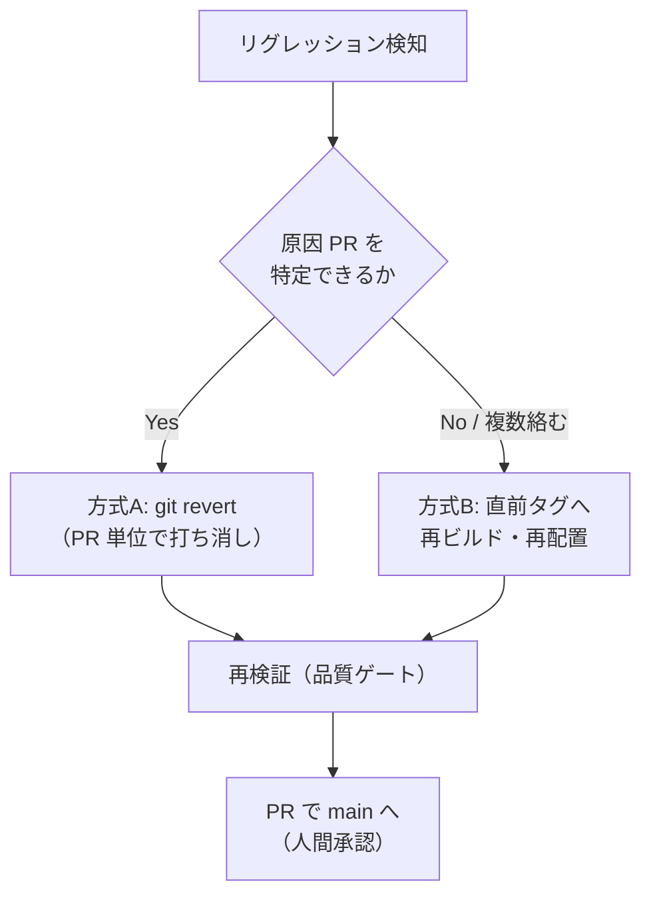

# 📌 ロールバック手順書（Rollback Procedure）

> **対象フェーズ: フロントエンドSPA + Workers API P0縦線（未デプロイ段階）。**
>
> 本プロジェクトはブラウザ内CADに加えて、Workers API P0縦線とNeon migration定義まで進んでいます。
> ただし本番Neon/R2接続・Cloudflare Accessテナント設定・本番配置はまだ実行していません。
> したがって現段階のロールバックは「**コード（Git）の切り戻し**」「**成果物（`dist/`）の再生成・再配置**」
> 「**Neon dev ブランチでのmigration検証やり直し**」を中心に扱います。

---

## 📋 1. ロールバックの適用判断

| 状況 | 一次対応 | ロールバック要否 |
| --- | --- | --- |
| CI が失敗しただけ（未マージ） | 修正コミットで再 CI | ❌ 不要（マージ前は前進修正） |
| マージ済み変更がリグレッションを起こした | 影響範囲を確認 | ✅ §3 の方式 A/B を選択 |
| ビルド不能に陥った | 直近 green への切り戻し | ✅ 方式 A（revert）を優先 |
| 本番配置後の不具合 | Cloudflare Workers配置版を直前のgreen成果物へ戻す | ✅ 方式 A/B + §4 |
| Neon migration 検証失敗 | dev ブランチを破棄せず原因を特定し、前進修正migrationを作成 | ❌ 本番適用前なら不要 |

> **原則**: マージ前は「前進修正（fix-forward）」、マージ後の実害は「切り戻し（rollback）」。
> どちらも `main` への反映は PR 経由・人間承認が必要（`main` 直 push 禁止）。

---

## 🔁 2. 2 系統のロールバック方式（概観）



| 方式 | 使いどころ | 粒度 | 履歴 |
| --- | --- | --- | --- |
| **A: `git revert`（PR 単位）** | 原因コミット / PR が特定できる | PR / コミット単位 | 打ち消しコミットを追加（履歴保持・監査向き） |
| **B: 直前タグへ再ビルド・再配置** | 複数変更が絡む / 全体を安定版へ戻す | リリース単位 | タグ時点のツリーを再現 |

---

## 🔁 3. 手順

### 3.1 方式 A: `git revert`（PR 単位・推奨）

履歴を書き換えず、打ち消しコミットを積む安全な方式。監査証跡が残る。

1. **原因 PR / コミットを特定**する（`git log --oneline`、`git bisect`、Issue のリグレッション報告）。
2. **切り戻し用ブランチを作成**する（`main` 直編集は禁止）:
   ```bash
   git switch -c revert/pr-<番号> main
   ```
3. **revert を実行**する（マージコミットなら `-m 1` で親を指定）:
   ```bash
   git revert <commit>            # 単一コミット
   git revert -m 1 <merge-commit> # PR のマージコミット
   ```
4. **品質ゲートで再検証**する（`rollback` も通常変更と同じ STABLE 基準）:
   ```bash
   npm run lint && npm run typecheck && npm test && npm run build
   ```
5. **PR を作成**し、変更内容・切り戻し理由・影響範囲・残課題を記載する。
6. ⚠️ **人間承認後にマージ**する（`main` 宛は承認1件必須・CI 必須チェック成功）。
7. **リグレッションの再発防止**として、原因と再現条件を Issue 化し、再現テストを追加する。

### 3.2 方式 B: 直前タグへ再ビルド・再配置

安定していた**リリースタグ時点**の成果物へ戻す。

1. **戻し先タグを確認**する:
   ```bash
   git tag --list                 # 例: v0.1.0
   git log --oneline v0.1.0 -1    # 対象コミットの確認
   ```
2. **タグをチェックアウト**して内容を確認する（detached HEAD で読み取り確認）:
   ```bash
   git switch --detach v0.1.0
   ```
3. **依存を固定インストール**する（`package-lock.json` 準拠、環境差異を排除）:
   ```bash
   npm ci
   ```
4. **成果物を再生成**する:
   ```bash
   npm run build                  # dist/ をタグ時点で再現
   ```
5. **成果物を検証**する（`npm run preview` で目視確認、`release-procedure.md` §4）。
6. **再配置**する（⚠️ 人間実行: Cloudflare Workers Static Assets へ `npx wrangler deploy`）。
7. 恒久対応は方式 A の revert または前進修正で `main` に反映し、`main` と配置版の乖離を残さない。

> ⚠️ タグへの `git switch --detach` は読み取り目的。ここから直接コミットせず、
> 恒久修正は必ずブランチ + PR + 人間承認の通常フローに戻す。

---

## 📋 4. データ（DB）ロールバックについて

> ✅ **現時点: 本番 DB 適用済み（migration 0001〜0004 / v0.1.0 以降）。**
>
> Workers API は Neon main ブランチへ接続中（fail-closed は Access 設定待ち）。
> データロールバックは §4.1 のブランチ/PITR 方針に従い、破壊的な down migration は行わない。
> バックアップは §4.3 の週次ブランチ方式で自動取得する。

| 保存先 | Phase 1 での扱い | ロールバック |
| --- | --- | --- |
| IndexedDB（ブラウザ内） | 自動保存・復旧候補（利用者端末に閉じる） | サーバー操作の対象外。利用者のブラウザデータ管理に依存 |
| CivilDraft ファイル（明示保存） | 利用者が手元に保存 | 版管理は利用者側 |
| Workers API インメモリストア | 検証実装。プロセス永続性を前提にしない | サーバー操作の対象外 |
| サーバー DB | ⚠️ migration定義あり・本番未適用 | dev ブランチ検証のみ。main適用後は §4.1 |

### 4.1 Neon ブランチ戦略

Neon PostgreSQL 導入後は、以下の方針でデータ保護と切り戻しを行う。

| 項目 | 方針 | 状態 |
| --- | --- | --- |
| スキーマ変更の検証 | Neon **dev ブランチ**で `0001` → `0002` の順に隔離検証してから本番反映 | ✅ 方針確定 |
| マイグレーション適用 | `prepare_database_migration` → dev で確認 → 人間承認で本番反映 | ✅ 方針確定 |
| migration 失敗 | dev ブランチでは失敗ログを保存し、既存migrationを書き換えず前進修正migrationを追加 | ✅ 方針確定 |
| データ切り戻し | main 適用後は Neon のブランチ / PITR（ポイントインタイムリカバリ）で復旧点を選ぶ | ⚠️ 本番導入時に実測 |
| 本番（main）ブランチへの適用 | 🚫 **人間決裁必須**（DB スキーマ変更は自動実行禁止） | 方針確定済み |

> Neon の**本番ブランチへの一切の適用**および **dev ブランチの削除**は、データ削除に準じる人間承認事項（CLAUDE.md §8.6）。

### 4.2 migration 切り戻しの実務判断

| 状況 | 対応 |
| --- | --- |
| 本番適用前に `0002` が失敗 | dev ブランチで原因を確認し、SQLを修正して再検証。本番には未適用なので rollback 不要 |
| 本番適用直後にアプリ互換問題 | APIを前バージョンへ切り戻すか、前進修正migrationを作成。データ削除を伴う down は避ける |
| データ破損が疑われる | 直ちに書き込みを停止し、Neon PITR/ブランチ復旧点を人間が選択。CTOは復旧案と影響範囲を提示 |
| 監査ログ不整合 | `audit_logs.entry_hash` / `previous_hash` の検証結果を保存し、削除せず追補ログで是正する |

### 4.3 自動バックアップ（週次・ブランチ方式・2026-08-01 導入）

GitHub Actions（`.github/workflows/backup.yml`）が毎週日曜 00:30 JST に、Neon API で
`backup-YYYYMMDD-HHMM` 形式の **copy-on-write ブランチ**を作成する（手動実行 `workflow_dispatch` 可）。

| 項目 | 内容 |
| --- | --- |
| 実行契機 | cron（毎週日曜 00:30 JST）+ 手動 dispatch |
| 実行内容 | `node scripts/neon-backup.mjs`（NEON_API_KEY のみで実行・接続文字列不要） |
| 成果物 | `backup-summary.json`（branch id/name/createdAt）を Artifacts に 90 日保存 |
| データ影響 | 本番データを変更しない（分岐のみ）。バックアップブランチは実体を持たない copy-on-write |
| リストア手順 | Neon コンソール/API でバックアップブランチからデータを取り出す（PITR と同等） |
| 保持・削除 | 🚫 **バックアップブランチの削除は人間判断**（データ削除に準ずる）。手動実行で保持数を確認してから削除する |
| ドライラン | `node scripts/neon-backup.mjs --dry-run` でブランチ名の検証のみ実行 |
| リストア検証 | `restore-check` ジョブ（backup.yml 内）が最新バックアップへ **read-only 接続**し、public テーブル数・projects 件数を確認（毎週バックアップと同時実行・2026-08-01 導入） | ✅ 導入済み |

> 本番 DB の接続文字列を GitHub Secrets に登録しない設計（API キーのみ）のため、
> シークレット流出時の影響範囲が「バックアップブランチ作成」に限定される。
> リストア検証も同じく接続 URI を API から取得し、ログ・成果物には出力しない。

---

## ⚠️ 5. ロールバック時の禁止事項・注意

| 禁止 / 注意 | 理由 |
| --- | --- |
| 🚫 `main` への force push・履歴改変 | 履歴改変は人間の明示承認が必要な境界。revert で打ち消す |
| 🚫 未検証成果物の再配置 | STABLE 未達での配置禁止（CLAUDE.md §9） |
| 🚫 原因不明のままの切り戻し放置 | 再発防止のため Issue 化 + 再現テスト必須 |
| ⚠️ タグ detached HEAD からの直コミット | 迷子コミットを生む。ブランチ + PR に戻す |
| ⚠️ `main` と配置版の乖離放置 | 恒久修正を `main` に必ず反映する |

---

## 📎 関連文書

| 文書 | 用途 |
| --- | --- |
| `docs/operations/release-procedure.md` | リリース手順・成果物生成・タグ付与 |
| `docs/operations/incident-response.md` | 障害初動・原因特定・Auto Repair 制約 |
| `docs/operations/operations-manual.md` | 品質ゲート実行・日常運用 |
| `README.md` | ブランチ保護・PR フロー |
